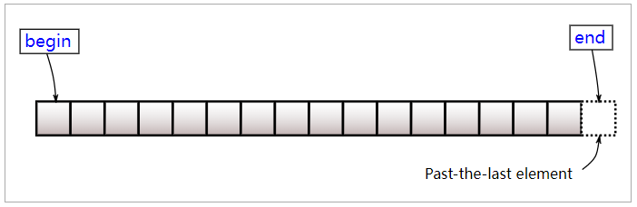

# 二分查找

### 模版

```c++
// 给定一数组 arr 和 一个数 target
int l=0, r=arr.size(), m;
while(l<r){
    m = l + (r - l  1)/2;            # -        # +
    if(arr[m] == target){
        return xxxxx；  // 看题意
    } else if(arr[m] < target){
        l = m  1;                  # +        # 空
    } else {
        r = m  1;                  # 空        # -
    }
    return r;
}
```


### 题目归类

https://leetcode.cn/problems/maximum-number-of-removable-characters/comments/1473892/

https://leetcode.cn/problems/search-insert-position/solution/te-bie-hao-yong-de-er-fen-cha-fa-fa-mo-ban-python-/


### 要重做的题（入门）

[704. 二分查找](https://leetcode.cn/problems/binary-search/)

[374. 猜数字大小](https://leetcode.cn/problems/guess-number-higher-or-lower/)

[35. 搜索插入位置](https://leetcode.cn/problems/search-insert-position/)

[852. 山脉数组的峰顶索引](https://leetcode.cn/problems/peak-index-in-a-mountain-array/)

[367. 有效的完全平方数](https://leetcode.cn/problems/valid-perfect-square/)

[1385. 两个数组间的距离值](https://leetcode.cn/problems/find-the-distance-value-between-two-arrays/)

[69. x 的平方根](https://leetcode.cn/problems/sqrtx/)

[744. 寻找比目标字母大的最小字母](https://leetcode.cn/problems/find-smallest-letter-greater-than-target/)

[278. 第一个错误的版本](https://leetcode.cn/problems/first-bad-version/)

[34. 在排序数组中查找元素的第一个和最后一](https://leetcode.cn/problems/find-first-and-last-position-of-element-in-sorted-array/)

[441. 排列硬币](https://leetcode.cn/problems/arranging-coins/)

[1539. 第 k 个缺失的正整数](https://leetcode.cn/problems/kth-missing-positive-number/)

[167. 两数之和 II - 输入有序数组](https://leetcode.cn/problems/two-sum-ii-input-array-is-sorted/)

[1608. 特殊数组的特征值](https://leetcode.cn/problems/special-array-with-x-elements-greater-than-or-equal-x/)

[1351. 统计有序矩阵中的负数](https://leetcode.cn/problems/count-negative-numbers-in-a-sorted-matrix/)

[74. 搜索二维矩阵](https://leetcode.cn/problems/search-a-2d-matrix/)

[1337. 矩阵中战斗力最弱的 K 行](https://leetcode.cn/problems/the-k-weakest-rows-in-a-matrix/)

[1346. 检查整数及其两倍数是否存在](https://leetcode.cn/problems/check-if-n-and-its-double-exist/)

[350. 两个数组的交集 II](https://leetcode.cn/problems/intersection-of-two-arrays-ii/)

[633. 平方数之和](https://leetcode.cn/problems/sum-of-square-numbers/)

[1855. 下标对中的最大距离](https://leetcode.cn/problems/maximum-distance-between-a-pair-of-values/)

[33. 搜索旋转排序数组](https://leetcode.cn/problems/search-in-rotated-sorted-array/)

[153. 寻找旋转排序数组中的最小值](https://leetcode.cn/problems/find-minimum-in-rotated-sorted-array/)


### 要重做的题（基础）

[209. 长度最小的子数组](https://leetcode.cn/problems/minimum-size-subarray-sum/)

[611. 有效三角形的个数](https://leetcode.cn/problems/valid-triangle-number/)

[658. 找到 K 个最接近的元素](https://leetcode.cn/problems/find-k-closest-elements/)

[1894. 找到需要补充粉笔的学生编号](https://leetcode.cn/problems/find-the-student-that-will-replace-the-chalk/)

[300. 最长递增子序列](https://leetcode.cn/problems/longest-increasing-subsequence/)

[1760. 袋子里最少数目的球](https://leetcode.cn/problems/minimum-limit-of-balls-in-a-bag/)

[875. 爱吃香蕉的珂珂](https://leetcode.cn/problems/koko-eating-bananas/)

[1552. 两球之间的磁力](https://leetcode.cn/problems/magnetic-force-between-two-balls/)

[287. 寻找重复数](https://leetcode.cn/problems/find-the-duplicate-number/)

[1283. 使结果不超过阈值的最小除数](https://leetcode.cn/problems/find-the-smallest-divisor-given-a-threshold/)

[1898. 可移除字符的最大数目](https://leetcode.cn/problems/maximum-number-of-removable-characters/)

[1482. 制作 m 束花所需的最少天数](https://leetcode.cn/problems/minimum-number-of-days-to-make-m-bouquets/)

[240. 搜索二维矩阵 II](https://leetcode.cn/problems/search-a-2d-matrix-ii/)

[540. 有序数组中的单一元素](https://leetcode.cn/problems/single-element-in-a-sorted-array/)

[436. 寻找右区间](https://leetcode.cn/problems/find-right-interval/)

[81. 搜索旋转排序数组 II](https://leetcode.cn/problems/search-in-rotated-sorted-array-ii/)

[162. 寻找峰值](https://leetcode.cn/problems/find-peak-element/)

[275. H 指数 II](https://leetcode.cn/problems/h-index-ii/)


### 还没做

[1870. 准时到达的列车最小时速](https://leetcode.cn/problems/minimum-speed-to-arrive-on-time/)

[1818. 绝对差值和](https://leetcode.cn/problems/minimum-absolute-sum-difference/)

[1838. 最高频元素的频数](https://leetcode.cn/problems/frequency-of-the-most-frequent-element/)

[222. 完全二叉树的节点个数](https://leetcode.cn/problems/count-complete-tree-nodes/)

[1712. 将数组分成三个子数组的方案数](https://leetcode.cn/problems/ways-to-split-array-into-three-subarrays/)

[826. 安排工作以达到最大收益](https://leetcode.cn/problems/most-profit-assigning-work/)

[154. 寻找旋转排序数组中的最小值 II](https://leetcode.cn/problems/find-minimum-in-rotated-sorted-array-ii/) 困难

[528. 按权重随机选择](https://leetcode.cn/problems/random-pick-with-weight/)

[1508. 子数组和排序后的区间和](https://leetcode.cn/problems/range-sum-of-sorted-subarray-sums/)

[1574. 删除最短的子数组使剩余数组有序](https://leetcode.cn/problems/shortest-subarray-to-be-removed-to-make-array-sorted/)

[1292. 元素和小于等于阈值的正方形的最大](https://leetcode.cn/problems/maximum-side-length-of-a-square-with-sum-less-than-or-equal-to-threshold/)

[1498. 满足条件的子序列数目](https://leetcode.cn/problems/number-of-subsequences-that-satisfy-the-given-sum-condition/)

[981. 基于时间的键值存储](https://leetcode.cn/problems/time-based-key-value-store/)

[1300. 转变数组后最接近目标值的数组和](https://leetcode.cn/problems/sum-of-mutated-array-closest-to-target/)

[1802. 有界数组中指定下标处的最大值](https://leetcode.cn/problems/maximum-value-at-a-given-index-in-a-bounded-array/)

[1901. 寻找峰值 II](https://leetcode.cn/problems/find-a-peak-element-ii/)

[1146. 快照数组](https://leetcode.cn/problems/snapshot-array/)

[1488. 避免洪水泛滥](https://leetcode.cn/problems/avoid-flood-in-the-city/)

[1562. 查找大小为 M 的最新分组](https://leetcode.cn/problems/find-latest-group-of-size-m/)

[1648. 销售价值减少的颜色球](https://leetcode.cn/problems/sell-diminishing-valued-colored-balls/)

[1201. 丑数 III](https://leetcode.cn/problems/ugly-number-iii/)


# 

# 贪心

绝了这题，我已经绕晕了😵😵😵，清醒了再想想吧

[714.买卖股票的最佳时机含手续费](https://leetcode.cn/problems/best-time-to-buy-and-sell-stock-with-transaction-fee/)

二叉树这题绝了

[968.监控二叉树](https://leetcode.cn/problems/binary-tree-cameras/)


# 

# 动态规划

## 背包问题


### 一维dp01背包完整C++

#### 01背包普通版


```c++
void test_2_wei_bag_problem1() {
    vector<int> weight = {1, 3, 4};
    vector<int> value = {15, 20, 30};
    int bagweight = 4;

    // 二维数组
    vector<vector<int>> dp(weight.size(), vector<int>(bagweight + 1, 0));

    // 初始化
    for (int j = weight[0]; j <= bagweight; j++) {
        dp[0][j] = value[0];
    }

    // weight数组的大小 就是物品个数
    for(int i = 1; i < weight.size(); i++) { // 遍历物品
        for(int j = 0; j <= bagweight; j++) { // 遍历背包容量
            if (j < weight[i]) dp[i][j] = dp[i - 1][j];
            else dp[i][j] = max(dp[i - 1][j], dp[i - 1][j - weight[i]] + value[i]);

        }
    }

    cout << dp[weight.size() - 1][bagweight] << endl;
}

int main() {
    test_2_wei_bag_problem1();
}
```


#### 滚动数组


```c++
void test_1_wei_bag_problem() {
    vector<int> weight = {1, 3, 4};
    vector<int> value = {15, 20, 30};
    int bagWeight = 4;

    // 初始化
    vector<int> dp(bagWeight + 1, 0);
    for(int i = 0; i < weight.size(); i++) { // 遍历物品
        // j >= weight[i]这句话是指当前背包可以装下此物品
        for(int j = bagWeight; j >= weight[i]; j--) { // 遍历背包容量
            dp[j] = max(dp[j], dp[j - weight[i]] + value[i]);
        }
    }
    cout << dp[bagWeight] << endl;
}

int main() {
    test_1_wei_bag_problem();
}
```


### 完全背包

#### 组合数 - 先遍历物品，再遍历背包

```c++
void test_CompletePack() {
    vector<int> weight = {1, 3, 4};
    vector<int> value = {15, 20, 30};
    int bagWeight = 4;
    vector<int> dp(bagWeight + 1, 0);
    for(int i = 0; i < weight.size(); i++) { // 遍历物品
        for(int j = weight[i]; j <= bagWeight; j++) { // 遍历背包容量
            dp[j] = max(dp[j], dp[j - weight[i]] + value[i]);
        }
    }
    cout << dp[bagWeight] << endl;
}
int main() {
    test_CompletePack();
}
```

#### 排列数- 先遍历背包，再遍历物品

```c++
void test_CompletePack() {
    vector<int> weight = {1, 3, 4};
    vector<int> value = {15, 20, 30};
    int bagWeight = 4;

    vector<int> dp(bagWeight + 1, 0);

    for(int j = 0; j <= bagWeight; j++) { // 遍历背包容量
        for(int i = 0; i < weight.size(); i++) { // 遍历物品
            if (j - weight[i] >= 0) dp[j] = max(dp[j], dp[j - weight[i]] + value[i]);
        }
    }
    cout << dp[bagWeight] << endl;
}
int main() {
    test_CompletePack();
}
```


### 多重背包

展开后其实就是个01背包


### 被难住了

[目标和](https://programmercarl.com/0494.%E7%9B%AE%E6%A0%87%E5%92%8C.html)

[一和零](https://programmercarl.com/0474.%E4%B8%80%E5%92%8C%E9%9B%B6.html)

[编辑距离](https://programmercarl.com/0072.%E7%BC%96%E8%BE%91%E8%B7%9D%E7%A6%BB.html)


# 

# C++

## vector

### begin(), end()



https://zh.cppreference.com/w/cpp/container/vector/begin


### max_element（）

*max_element(dp.begin(), dp.end());

​    // max_element（）函数和min_element（）函数，就是找最大值和最小值

*min_element() 同样的用法


### 建立数组

vector<int> dp(n, 0);     // n是数组大小，0是初始值（初始值可选，数组大小好像一定得有）

vector<vector<int>> que;  // 普通二维数组

vector<vector<int>> dp(m, vector<int>(n, 1));   // 规定了数组为m行n列，并且数组初始化所有元素为1


### 在数组最后加元素

**push_back( )**

result 是数组，然后push_back的括号里，再放{}，因为是二维嘛，有两个元素

```c++
result.push_back({intervals[m-1][0], intervals[m-1][1]});
```


### 求和函数

**accumulate(v.begin(), v.end(), 0)**

最后是初值


### pair类型

❤**vector<pair<int, int>> XXXX**

**pair 排序**  https://www.acwing.com/blog/content/5326/

```c++
sort(startIntervals.begin(), startIntervals.end());
// 默认升序，第一个元素作为第一关键字，先按第一个元素排，再按第二个元素排
```


pair是将2个数据组合成一个数据

1. 当需要这样的需求时就可以使用pair，如stl中的map就是将key和value放在一起来保存

2. 当一个函数需要返回2个数据的时候

```c++
vector<int> ans(n, -1);
	for(int i=0; i<n; ++i) {
	int l=0, r=n-1, targrt=-1;
	while(l<=r) {
        int mid = l+(r-l)/2;
        // vector的pair类型 第一个元素是.first 第二个是.second
        if(startIntervals[mid].first >= intervals[i][1]) {
            targrt = startIntervals[mid].second;
            r = mid-1;
        } else {
            l = mid+1;
        }
        ans[i] = targrt;
	}
}
return ans;
```


**emplace_back()**

直接在容器的尾部创建这个元素，省去了拷贝或移动元素的过程

ps：pair类型加元素的时候要加两个

```c++
for(int i=0; i<n; ++i) {
    // 拿出所有区间的的第一个元素 和 该区间的下标
    startIntervals.emplace_back(intervals[i][0], i);
}
```


## foreach ？

```c++
for(int a : nums)
```


## 排序的cmp

按照绝对值降序排列

```c++
static bool cmp(int a, int b) {
    return abs(a) > abs(b);
}

// 用法
sort(nums.begin(), nums.end(), cmp);
```


## 数据转换

int 👉 string

**to_string( )**      转成字符串之后就能像数组一样去取值了

```c++
string N = to_string(n);
```

string 👉 int

**stoi( )**

```c++
stoi(N);
```


# 

# 常见套路

## 数组

遇到数组，极有可能需要计算数组长度，这时，有一个**舍去数组长度为0**的表达式

```c++
int n = nums.size();
if(n==0) return 0;
```


## 数

### 向上取整

```C++
int curTime = (pile + speed - 1) / speed;
```
