# JS的刷题路

# 学剑篇

## 1.1 数组&链表

### 【数组】

2022.11.30

### 1 前缀和：

🌟 **原始数组不会被修改的情况下，频繁查询某个区间的累加和**

✔ **一次把所有从一开始到本数的累加值计算出来存在一个新数组里，区间的累加值通过减法得出**

[303.区域和检索 - 数组不可变](https://leetcode.cn/problems/range-sum-query-immutable/) 【简单】

就是利用前缀和，不用让代码每一个都遍历一次，直接后减前就行

1️⃣ js在定义一个函数之后，同时也得到了一个同名的类，这里的NumArray也是作为了一个类

2️⃣ js中类的方法都存在原型中，要修改类的原型就得用通过类.prototype属性去修改

3️⃣ 方法中的this代表的是实例化后的对象

[304.⼆维区域和检索 - 矩阵不可变](https://leetcode.cn/problems/range-sum-query-2d-immutable/) 【中等】

这道题和上面那道真是一模一样，只是变成二维的了，不能简单的后减前，要通过几块的和加加减减才能出来

和上一题一样，还不是很懂this

👇 **建立初值全为0的二维数组**

`this.sums = new Array(m+1).fill().map(()=> new Array(n+1).fill(0));`


2022.12.1

### 2 差分数组：

🌟 **频繁对原始数组的某个区间的元素进⾏增减**

✔ **把每个数与前一个数的差值计算出来存在一个新数组里，区间的加减通过把新数组中区间开始下标的值加/减，区间结束下标对应的值减/加（反一下，因为最后每个数都是通过前一个值得出的）**

[1109.航班预订统计](https://leetcode.cn/problems/corporate-flight-bookings/)

就是先定义一个差值数组，所有加的操作先在差值数组中进行，再利用这个差值数组通过第一项，继续推出后面的所有数

[1094.拼车](https://leetcode.cn/problems/car-pooling/)

先定义一个差值数组，所有加减操作先在差值数组中进行，再利用这个差值数组通过第一项，继续推出后面的所有数，只要所有元素都比capacity小就行

1️⃣ **const**

​	const声明的变量，不可以修改

​	const声明的数组，数组的元素是可以修改的

​	const声明的对象，对象的属性也是可以修改的

2️⃣ **新建数组**

`const 数组名 = new Array(数组长度).fill(初值);`

3️⃣ **[].every(条件)**

​	返回的是boolean


### 【链表】

2022.12.2

### 1 合并两个有序链表

[21.合并两个有序链表](https://leetcode.cn/problems/merge-two-sorted-lists/)

1 迭代

先定义一个哑结点dummy和一个和dummy相同的游标p，只要l1和l2不为空，比较l1和l2的值，较小的就拼接到结果链表的结尾，并让l1/l2指向下一节点，游标p同时也指向结果链表的结尾，以此类推…… 直到l1或l2一方为空，然后全部拼接到结果链表后面，最后返回dummy.next，意在跳过一开始的空节点

2 递归

如果l1或l2为空，就返回另外那个，如果l1小于l2，递归参数为l1.next和l2并赋给l1.next，反之同理

**🌟 哑结点dummy应用场景：**

**需要创造一条新链表（链表合并/链条分解……）**


2022.12.3

### 2 单链表的分解

[86.分隔链表](https://leetcode.cn/problems/partition-list/submissions/)

思路是先分开为两个新链表，然后再连成一个。所以先定义两个哑结点并分别对应两个游标，然后去遍历原始链表，如果小于设定值x就放到p1里面去，反之放p2，遍历完后，把p2.next置空，再把这两个链表相连，返回的是dummy1.next（因为要跳过一开始的哑结点）

🌟 **链表注意点：**

1、用 **const** 定义 **dummy** 这个哑结点，用 **let** 定义 **p** 这个游标（dummy是标记开头的，p是会往后的）

2、链表最后一定要记得**手动置空**，不然这道题有些地方会节点成环`p2.next = null`


2022.12.4/5

### 3 合并 k 个有序链表

[23.合并 k 个升序链表](https://leetcode.cn/problems/merge-k-sorted-lists/)

1 顺序合并，每次都看作合并两个有序链表，就是去遍历一遍链表数组，其余跟[21.合并两个有序链表](https://leetcode.cn/problems/merge-two-sorted-lists/)同

2 分治合并（归并），同上，只是不是按顺序的两两合并，也用到了递归，比上一种方法在时间上会更快一些

3 暴力求解，把所有链表的值拿出来放到一个数组里去，数组升序排序，再把数组的值连成一个新的链表

4 优先队列 😭😭😭 遗留！ **❌1**

感觉和暴力求解可能差不多❓❓❓ 实在解不出来，留个小问题在这里吧


2022.12.6

### 4 单链表的倒数第 k 个节点

[19.删除链表的倒数第N个结点](https://leetcode.cn/problems/remove-nth-node-from-end-of-list/)

要求：只遍历一遍，链表有多长未知

因为没有给头结点，我们就先定义一个哑结点，作为链表的头结点。要删除倒数第n个结点，就要先找到倒数第n+1个结点x，然后再用x.next = x.next.next删掉倒数第n个。

封装一个找倒数第k个结点的函数，传入头结点和k。先定义两个指针p1和p2都指向头结点，先让p1走k步，然后p1和p2一起走，直到p1===null，即两个指针一起走了n-k步，所以p2就指向了正数第n-k+1个结点，即为倒数第k个

🌟 **链表注意点：**

1、设链表有n个结点，倒数第k个结点，就是正数第n-k+1个结点

2、链表最后都会接一个空指针


### 5 单链表的中点

[876.链表的中间结点](https://leetcode.cn/problems/middle-of-the-linked-list/)

要求：只遍历一遍，链表有多长未知

【快慢指针】：

慢指针走一步，快指针走两步，当快指针走到链表末尾时，慢指针就走到了链表的中点

👉 **注意：**

**这里可以继续前进的条件是，当前快指针和当前快指针的下一个结点都非空** -> 当有两个中间结点时，找出来的是后一个

如果题目要求在两个中间结点的时候，返回前一个中间结点，此时快指针可以前进的条件改为：**当前快指针的下一个结点和当前快指针的下下一个结点都非空**


2022.12.7

### 6 判断链表是否包含环

还是用【快慢指针】，每当慢指针 slow 前进⼀步，快指针 fast 就前进两步
**如果 fast 最终遇到空指针，说明链表中没有环；如果 fast 最终和 slow 相遇，那肯定是 fast 超过了slow ⼀圈，说明链表中含有环**

```js
boolean hasCycle(ListNode head) {
// 快慢指针初始化指向 head
    let slow = head, fast = head;
    // 快指针⾛到末尾时停⽌
    while (fast != null && fast.next != null) {
        // 慢指针⾛⼀步，快指针⾛两步
        slow = slow.next;
        fast = fast.next.next;
        // 快慢指针相遇，说明含有环
        if (slow == fast) {
            return true;
        }
    }
    // 不包含环
    return false;
}
```

👇 计算环的起点

```js
ListNode detectCycle(ListNode head) {
    ListNode fast, slow;
    fast = slow = head;
    while (fast != null && fast.next != null) {
        fast = fast.next.next;
        slow = slow.next;
        if (fast == slow) break;
    }
    // 上⾯的代码类似 hasCycle 函数
    // 这里有两种情况运行到这里嘛 1 break 2 指向null了
    if (fast == null || fast.next == null) {
        // fast 遇到空指针说明没有环
        return null;
    }
    // 重新指向头结点
    slow = head;
    // 快慢指针同步前进，相交点就是环起点
    while (slow != fast) {
        fast = fast.next;
        slow = slow.next;
    }
    return slow;
}
```


2022.12.8

### 7 两个链表是否相交

[160.相交链表](https://leetcode.cn/problems/intersection-of-two-linked-lists/)

先定义p1和p2两个游标。当p1和p2不相等时，p1就遍历A链表，遍历完了就遍历B链表，p2同理遍历B链表，遍历完了就遍历A链表。因为p1和p2相等的话，只有有两种情况，一是有交点，指向交点，二是无交点，都指向null。

👉 这里有两个容易混乱的点：

1️⃣ 首先，要明确不论是否有交点，遍历完一条链表后转向遍历另一条，两个游标是会以同样进度遍历到有交点处或是遍历到最后的null节点的。

- 当两个链表有交点时，最后会同时指向交点终止循环

- 当两个链表无交点时，最后会同时指向null终止循环

2️⃣ 并且，这里的循环也只会改转向另一条链表一次，不会无限地转变


### 8 反转链表

#### 1）反转整个

[206.反转链表](https://leetcode.cn/problems/reverse-linked-list/)

#### 2）反转部分

[92.反转链表 II](https://leetcode.cn/problems/reverse-linked-list-ii/)

反转部分 = 递归成反转前n个

反转前n个的逻辑比较难想，举个例子👇

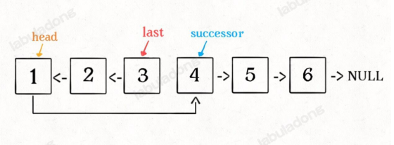

```js
var reverseBetween = function(head, left, right) {
    // 这里很好理解哦 就是一直递归 直到变成反转前n个链表元素的情况
    if(left === 1) {
        return reverseN(head, right)
    }
    head.next = reverseBetween(head.next, left-1, right-1)
    return head
};

// successor 就是记录后驱结点的 之后就可以连起来了
let successor = null
var reverseN = function(head, n) {
    // 这里就是head已经指向3了，让successor指向4
    if(n === 1) {
        // successor后面连着的4->5->6
        // 这步不写的话，最后返回的值就没有4->5->6了
        successor = head.next
        return head
        // 这里是3->4->5->6
    }
    // 递归成以head.next为起点，反转成前n-1个结点
    let last = reverseN(head.next, n-1)
    head.next.next = head
    head.next = successor
    return last
}
```


## 1.2【双指针】

2022.12.9

### 1 快慢指针

[26.删除有序数组中的重复项](https://leetcode.cn/problems/remove-duplicates-from-sorted-array/)

初始化快指针fast和慢指针slow

当fast指针小于数组长度时

​		判断fast指向的值和slow指向的值是否相等

​				如果相等，slow指针后移一位，并把fast指向的值给slow

​		fast的指针后移

返回的是slow+1（因为要的是数组长度）

注意：

1️⃣ 这里一定要提前判断数组是否为空，如果为空就直接返回0，如果不判断的话结果会出错返回1

2️⃣ 这道题可以这样做很大程度上是因为数组本身是有序的，可以体会一下

👉 **原地修改**

​		不要新建其他数组，在原数组上进行修改


[83.删除排序链表中的重复元素](https://leetcode.cn/problems/remove-duplicates-from-sorted-list/)

跟第26题的思路完全一模一样，只是从数组变成了链表

这里是返回链表，所以最后要断开slow之后的连接


2022.12.11

[27.移除元素](https://leetcode.cn/problems/remove-element/)

定义一个慢指针slow和一个快指针fast

当fast小于数组长度

​		fast不等于要删除的数

​				fast的值赋给当前的slow，slow后移一个

​		fast后移一个（不管fast是否等于要删除的数）

返回的数组长度就是slow


[283.移动零](https://leetcode.cn/problems/move-zeroes/)

跟上一题一样，利用上一题的算法，默认val就是0，移除数组中的所有0，再把数组中slow指针之后的全改成0


❗❗❗ 还可以用滑动窗口做，先遗留着 **❌2**


### 2 左右指针的常用算法

**1、二分查找**

```js
int binarySearch(int[] nums, int target) {
    // ⼀左⼀右两个指针相向⽽⾏
    int left = 0, right = nums.length - 1;
    while(left <= right) {
        int mid = (right + left) / 2;
        if(nums[mid] == target)
            return mid;
        else if (nums[mid] < target)
            left = mid + 1;
        else if (nums[mid] > target)
            right = mid - 1;
    }
    return -1;
}
```


**2、两数之和**

[167.两数之和2 - 输入有序数组](https://leetcode.cn/problems/two-sum-ii-input-array-is-sorted/)

两个指针一左一右

如果sum比target小，左边指针往右移

如果sum比target大，右边指针向左移

上面的right++和left-- 是要想象一下那个倒三角的搜索空间的


**3、反转数组**

[344.反转字符串](https://leetcode.cn/problems/reverse-string/)

左右两指针相向而行，前后交换，左指针右移，右指针左移，直到两指针重合


**4、回文串判断**

[5.最长回文子串](https://leetcode.cn/problems/longest-palindromic-substring/)

让左右指针从中心向两端扩展

先定义一个找回文串的函数，从中间开始判断，向两端扩展

会有两种情况：当l和r相同，回文串长度为奇数；当l和r为相邻两数，回文串长度为偶数

主函数中，定义一个变量记录最长的回文串，遍历给定的字符串的每个字符，按照两种情况都寻找，找到最长的就赋给记录变量


2022.12.26

### 3 滑动窗口

🌟 先上一个js模版：

```js
var slidingWindow = function(s) {
    const window = new Map()
    let left = 0, right = 0
    while(rigth < s.length) {
        // 拿到right的对应字符，并自增扩大窗口
        let c = s[right]
        right++
        // 对窗口的更新操作
        …………
        
        // 判断左侧窗口是否需要收缩
        while(window needs shink condition) {
            // 拿到left对应的字符，是要被移出去的，故left还需自减
            let d = s[left]
            left++
            // 对窗口的更新操作
            …………
        }
    }
}
```


[76.最小覆盖子串](https://leetcode.cn/problems/minimum-window-substring/)

1️⃣ 定义两个map对象，need用来存储字符串t每个字符的个数，window作为滑动窗口中的每个字符的个数

2️⃣ 遍历s，统计情况存储在need中

3️⃣ 定义左右指针left和right，变量valid记录几个字符达到need的数量了，start表示最优的滑动窗口开始处，len表示最优的滑动窗口的大小

4️⃣ 设置一个while循环，当右指针不到s的最后时：

​	自增窗口：

​		拿到right对应的字符，并扩大窗口

​		如果need里有该字符：

​			该字符在window中数量加1

​			如果该字符在window中的数量和在need中的数量相等：

​			valid自增，表示多一个字符达到了要求数量

​	自减窗口（当valid等于need的大小才进行以下步骤）：

​		先判断是否为此时最优解，滑动窗口大小小于len：

​			更新start和len值

​		拿到left对应的字符，并减小窗口

​		如果need中有该字符：

​			判断该字符在window中的数量和在need中的数量相等：（因为下一步就要把它的数量减少了）

​				valid自减，这遍循环结束就退出循环了

​			该字符在window中的数量减1

5️⃣ 如果len的值为初始设置的最大值，输出空字符串，否则截取最优的滑动窗口


2022.12.27

[567.字符串的排列](https://leetcode.cn/problems/permutation-in-string/)

[438.找到字符串中所有字母异位词](https://leetcode.cn/problems/find-all-anagrams-in-a-string/)

[3.无重复字符的最长子串](https://leetcode.cn/problems/longest-substring-without-repeating-characters/)


2023.1.2

[392.判断子序列](https://leetcode.cn/problems/is-subsequence/) 很简单


2022.12.28

## 【二分查找】

**框架：**

```js
var binarySearch = function(nums, target) {
    let left = 0, right = ...;
    while(...) {
        let mid = left + Math.floor((right - left) / 2);
        if (nums[mid] === target) {
            ...
        } else if (nums[mid] < target) {
            left = ...
        } else if (nums[mid] > target) {
            right = ...
        }
    }
    return ...;
}
```


### 1 寻找一个数

```js
var binarySearch = function(nums, target) {
    let left = 0;
    let right = nums.length - 1; // 注意
    while(left <= right) {
        let mid = left + (right - left) / 2;
        if(nums[mid] == target)
            return mid;
        else if (nums[mid] < target)
            left = mid + 1; // 注意
        else if (nums[mid] > target)
            right = mid - 1; // 注意
    }
    return -1;
}
```

[704.二分查找](https://leetcode.cn/problems/binary-search/)

1、通过right的赋值可以看出循环的搜索区间的开闭：

👉 `right = nums.length` 则说明是左闭右开，while里面就应该是<，while(left < right) 终⽌的条件是 left === right，此时搜索区间 [left, left) 为空，所以可以正确终⽌

这里应该是 left = mid + 1，right = mid。因为我们的「搜索区间」是 [left, right) 左闭右开，所以当 nums[mid] 被检测之
后，下⼀步应该去 mid 的左侧或者右侧区间搜索，即 [left, mid) 或 [mid + 1, right)

👉 `right = nums.length - 1` 则是左闭右闭，while里面就应该是<=，while(left <= right) 终⽌的条件是 left === right+1，此时搜索区间 [right+1, right) 为空，所以可以正确终⽌

这里应该是 left = mid + 1，right = mid - 1

2、怎样搜索左边界：

```js
if (nums[mid] === target)
    right = mid;
```

找到 target 时不要⽴即返回，⽽是缩⼩「搜索区间」的上界 right，在区间 [left, mid) 中继续搜索，即不断向左收缩，达到锁定左侧边界的⽬的


### 2 寻找左侧边界的二分搜索

```js
var left_bound = function(nums, target) {
    let left = 0, right = nums.length - 1;
    // 搜索区间为 [left, right]
    while (left <= right) {
        let mid = left + (right - left) / 2;
        if (nums[mid] < target) {
            // 搜索区间变为 [mid+1, right]
            left = mid + 1;
        } else if (nums[mid] > target) {
            // 搜索区间变为 [left, mid-1]
            right = mid - 1;
        } else if (nums[mid] == target) {
            // 收缩右侧边界
            right = mid - 1;
        }
    }
    // 判断 target 是否存在于 nums 中
    // 此时 target ⽐所有数都⼤，返回 -1
    if (left == nums.length) return -1;
    // 判断⼀下 nums[left] 是不是 target
    return nums[left] == target ? left : -1;
}
```


### 3 寻找右侧边界的二分搜索

```js
var right_bound = function(nums, target) {
    let left = 0, right = nums.length - 1;
    while (left <= right) {
        let mid = left + (right - left) / 2;
        if (nums[mid] < target) {
            left = mid + 1;
        } else if (nums[mid] > target) {
            right = mid - 1;
        } else if (nums[mid] == target) {
        // 这⾥改成收缩左侧边界即可
            left = mid + 1;
        }
    }
    // 最后改成返回 left - 1
    if (left - 1 < 0) return -1;
    return nums[left - 1] == target ? (left - 1) : -1;
}
```


ps：这里注意哦，寻找左右边界的循环结束条件都是`left === right+1`。寻找左边界最后返回left，就要单独判断一下是否向上越界；寻找右边界最后返回right，就要判断是否向下越界


### 1：

[704.二分查找](https://leetcode.cn/problems/binary-search/)

[852.山脉数组的封顶索引](https://leetcode.cn/problems/peak-index-in-a-mountain-array/)


### 2：

[35.搜索插入位置](https://leetcode.cn/problems/search-insert-position/)

[658.找到K个最接近的元素](https://leetcode.cn/problems/find-k-closest-elements/)

👇 这两题很像，要有敏锐的眼光看出来应该用二分。细节上有一些题意上的小差别，主要还是在f函数的定义上

[1011.在D天内送达包裹的能力](https://leetcode.cn/problems/capacity-to-ship-packages-within-d-days/)

[875.爱吃香蕉的珂珂](https://leetcode.cn/problems/koko-eating-bananas/)


### 2+3：

[34.在排序数组中查找元素的第一个和最后一个位置](https://leetcode.cn/problems/find-first-and-last-position-of-element-in-sorted-array/)

[剑指offer 53-I.在排序数组中查找数字 I](https://leetcode.cn/problems/zai-pai-xu-shu-zu-zhong-cha-zhao-shu-zi-lcof/) （统计出现次数）


### 3：

[剑指 Offer 53 - II. 0～n-1中缺失的数字](https://leetcode.cn/problems/que-shi-de-shu-zi-lcof/)


### 二维矩阵：

[240.搜索二维矩阵 II](https://leetcode.cn/problems/search-a-2d-matrix-ii/)

[74.搜索二维矩阵](https://leetcode.cn/problems/search-a-2d-matrix/)

74就是可以跟240一样，从右上角或者是从左下角一样开始搜索的，代码是完全一样的

74如果要用二分的话：

1️⃣ 可以转化为一个一维数组

2️⃣ 或者用两次二分，第一次找到行，第二次找


## 阶乘

[技巧](https://labuladong.github.io/algo/di-san-zha-24031/shu-xue-yu-659f1/jiang-lian-ae367/)

### 1、求阶乘后尾数0的数量

0的产生是一定是因为2*5产生的，所以就是找因数。并且，找的到因数5，必然找的到因数2与之搭配。题目转化为找因数5的个数

[172.阶乘后的零](https://leetcode.cn/problems/factorial-trailing-zeroes/)


### 2、求有几个阶乘的尾数为0的数量是k

[793.阶乘函数后K个零](https://leetcode.cn/problems/preimage-size-of-factorial-zeroes-function/)

这道题就是利用一个求阶乘尾数为0的数量的函数，再利用二分查找寻找到尾数为0的数量是k的左右边界，从而得出这样的数有多少个

`Number.MAX_VALUE` 表示 JS 中的 **最大值**


## 田忌赛马：

[870.优势洗牌](https://leetcode.cn/problems/advantage-shuffle/)

🌟 这道题有一个很巧妙的**排序下标**：

```js
const nums1 = [12, 24, 8, 32]
const n = nums1.length

let idx1 = new Array(n).fill(0)
for(let i=0; i<n; i++) {
  idx1[i] = i
}
idx1.sort((i, j) => nums1[i] - nums1[j])

console.log(idx1); // [2, 0, 1, 3]
```


---


# 遗留的---

二分+动态规划

[354.俄罗斯套娃信封问题](https://leetcode.cn/problems/russian-doll-envelopes/)

二分+链表双指针

[1201.丑数III](https://leetcode.cn/problems/ugly-number-iii/)


---


## 1.3 队列/栈

### 三道括号题

#### 1、判断有效括号

[20.有效的括号](https://leetcode.cn/problems/valid-parentheses/)

这道题的有一个很巧妙的地方，就是利用Map来判断左右括号是否匹配

遍历字符串s，如果存在右括号的键值c，根据这个键值去判断数组最后的元素是否为该键值对应的value值

因为js没有内置Stack，这里用数组模拟了一下栈的思想

```js
var isValid = function(s) {
    // Map 真的是用来判断是否配对的一个好工具哇
    const pairs = new Map([
        [')', '('],
        [']', '['],
        ['}', '{']
    ])
    const left = new Array()
    for(let c of s) {
        // 如果存在右括号的键值c，根据这个键值去判断数组最后的元素是否为该键值对应的value值
        // 这里的数组相当于栈了
        if(pairs.has(c)) {
            if(!left.length || left[left.length-1] !== pairs.get(c))
                return false
            left.pop()
        } else {
            left.push(c)
        }
    }
    return left.length === 0
};
```


#### 2、平衡括号串 I

[921.使括号有效的最少添加](https://leetcode.cn/problems/minimum-add-to-make-parentheses-valid/)

首先，千万不要思想简单，认为只要统计左右括号数，然后再计算差值的绝对值就行了。这里原字符串中的左括号一定是要在右括号之前的，否则都是需要插入的

所以思想还是栈，只是这里可以用计数来代替

以左括号为基准，计算对右括号的需求数need，并且统计不平衡时，需要插入的次数res


#### 3、平衡括号串 II

[1541.平衡括号字符串的最少插入次数](https://leetcode.cn/problems/minimum-insertions-to-balance-a-parentheses-string/)

这里基础思路跟上一题一样，以左括号为基准，计算对右括号的需求数need，遍历到一个左括号，need加2，遍历到一个右括号，need减一

但由于这道题也是一样，左括号必须在对应的两个连续右括号之前。所以当need的值为-1时，说明右括号多了，这里就需要在这个右括号之前加入一个左括号（res++），同时这里的的need值也要改为1，意思是这时还需要一个右括号

在遍历到左括号的时候，如果need为奇数，则说明这个左括号之前有一个右括号落单了，（其实也是上一段话的步骤后落下的那个右括号，没有找到第二右括号对应新添的**连续**左括号，这里的连续很重要，因为确定没有连续的了，所以必须会有要新插入的），所以这时需要插入一个右括号（res++），同时这个need的需求就没了（need--）


### 单调栈

#### 1、单调栈模版

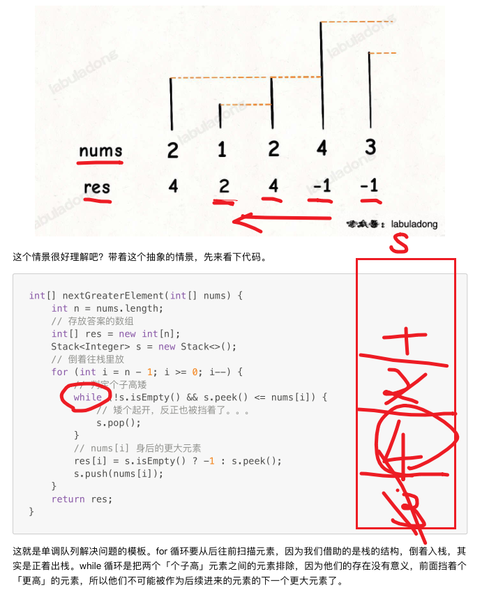

```js
var nextGreater = function (nums) {
    let n = nums.length
    let res = new Array() // 结果数组
    let stack = new Array() // 栈数组
    for(let i=n-1; i>=0; i--) {
        // 保证了这个栈数组一定是一个降序的数组
        // 经过这一步 保证了栈顶元素 要不比当前元素大 要不栈为空
        while(stack.length!==0 && stack[stack.length-1]<=nums[i])
            stack.pop()
        res[i] = stack.length===0 ? -1 : stack[stack.length-1]
        // 这里很聪明 一定要先赋值结果数组 再让当前元素入栈
        // 这里保证了每个元素 必入栈
        stack.push(nums[i])
    }
    return res
}
```


#### 2、下一个更大元素

这道题就是多了个nums1数组来迷惑你，其实跟模版是一样的

我们的思路就是找出nums2的结果数组，然后把nums1的每个数找到nums2的对应下标，从而在得出的结果数组中找出对应的数，重新组成一个数组

[496.下一个更大元素 I](https://leetcode.cn/problems/next-greater-element-i/)


#### 3、下一个更大元素的下标

这道题也是把模版稍微改动一下就行

模版要的是下一个更大的元素

这里要的是下一个更大的元素的下标，所以只要把模版里的stack用来存储下一个更大元素的下标就行了

[739.每日温度](https://leetcode.cn/problems/daily-temperatures/)


#### 4、循环数组中找下一个更大元素

这道题还是可以运用模版，很容易就能想到，只要在原数组后再补一段同样数组就行，也就是数组长度翻倍

[503.下一个更大元素 II](https://leetcode.cn/problems/next-greater-element-ii/)

截取数组前n个元素（左闭右开）

```
arr.slice(0, n)
```


[316.去除重复字母](https://leetcode.cn/problems/remove-duplicate-letters/)


### 单调队列解决滑动窗口问题

[239.滑动窗口最大值](https://leetcode.cn/problems/sliding-window-maximum/)


## 1.4 数据结构设计

### LRU缓存

[146.LRU缓存](https://leetcode.cn/problems/lru-cache/)

拿到Map的第一个键值：

```js
const map1 = new Map();

map1.set('0', 'foo');
map1.set(1, 'bar');

const iterator1 = map1.keys();

console.log(iterator1.next().value);
// expected output: "0" 迭代器的第一个元素的value 也就是map第一个键值

console.log(iterator1.next().value);
// expected output: 1
```


### LFU缓存

[460.LFU缓存](https://leetcode.cn/problems/lfu-cache/)


### O(1)时间插入、删除和获取随机元素

因为数组不可能在O(1)时间判断该元素是否存在，所以不能O(1)时间内完成插入和删除操作，但可以完成随机获取元素操作

哈希表可以在O(1)时间内完成插入和删除的操作，但是无法根据下标找到特定元素，所以不能在O(1)时间内完成获取随机元素操作

👉 数组可以根据下标获取元素 而哈希表可以根据元素获取下标

[380.O(1)时间插入、删除和获取随机元素](https://leetcode.cn/problems/insert-delete-getrandom-o1/)


JS随机数：

  `Math.random()`  生成一个0-1之间的随机数

​	生成 0-x之间的随机数：

  `Math.round(Math.random() * x)`

  `Math.floor(Math.random() * (x + 1))` ✔

​	生成 x-y 之间的随机数

  `Math.round(Math.random() * (上限y-下限x) + 下限x)`


### 避开黑名单的随机数

[710.黑名单中的随机数](https://leetcode.cn/problems/random-pick-with-blacklist/)

Solution函数：

初始化一个Map用来存放映射关系，bound变量为白名单的元素个数，再新建一个Set来存储在在[n-m, n)这个范围之内的黑名单元素

定义一个循环，给[0, n-m)这个范围内的黑名单元素添加映射关系

pick函数：

生成[0, bound)的随机数x，先去Map里找，找的到的话就返回映射后的值

找不到 就返回x本身


---


# 遗留的---

大顶堆小顶堆

[295.数据流的中位数](https://leetcode.cn/problems/find-median-from-data-stream/solution/-by-1105389168-3r4x/)


---


### 计算器

字符串去除空格： `str.trim()`


`a = Number(a)`

​	1、如果字符串不是合法数字，则转换为NaN

​	2、如果字符串是空串或纯空格的字符串，则转换为0

​	3、null 转换为 0     undefined 转换为 NaN


检索字符串中特定位置的字符的Unicode 值：

`string.charCodeAt([position]);`  position默认是0


去掉小数部分:

`~`符号用在JavaScript中有按位取反的作用，`~~`即是取反两次，而位运算的操作值要求是整数，其结果也是整数，所以经过位运算的都会自动变成整数，可以巧妙的去掉小数部分，类似于`parseInt()` 👇

```
let a = 1.23;
let b = -1.23;

console.log(~~a); // 1
console.log(~~b); // -1
```


没有懂 | 的意思 按位或

[227.基本计算器](https://leetcode.cn/problems/basic-calculator-ii/)

[224.基本计算器](https://leetcode.cn/problems/basic-calculator/)


# 仗剑篇

## 2.1 二叉树


我叛变了

我回到代码随想录


遍历的所有题肯定先要初始化一个结果数组的

### 1、递归遍历

👀：所有遍历必然是返回一个结果数组的

🌟：递归的三种是一样的，只要改变dfs函数里的顺序

👉：一个结果数组 + 一个dfs函数（记得跳出条件return）

#### 前序遍历：

[144.二叉树的前序遍历](https://leetcode.cn/problems/binary-tree-preorder-traversal/)

```javascript
var preorderTraversal = function(root) {
    let res = []
    const dfs = function(root){
     if(root === null) return
     res.push(root.val)
     dfs(root.left)
     dfs(root.right)
    }
    dfs(root)
    return res
};
```

#### 中序遍历：

[94.二叉树的中序遍历](https://leetcode.cn/problems/binary-tree-inorder-traversal/)

```javascript
var inorderTraversal = function(root) {
    let res = []
    const dfs = function(root){
        if(root === null) return
        dfs(root.left)
        res.push(root.val)
        dfs(root.right)
    }
    dfs(root)
    return res
};
```

#### 后序遍历：

[145.二叉树的后序遍历](https://leetcode.cn/problems/binary-tree-postorder-traversal/)

```javascript
var postorderTraversal = function(root) {
    let res = []
    const dfs = function(root){
        if(root === null) return
        dfs(root.left)
        dfs(root.right)
        res.push(root.val)
    }
    dfs(root)
    return res
};
```


### 2、迭代遍历（非递归）

👀：所有遍历必然是返回一个结果数组的

🌟：前后序遍历差不多，中序有点出入的（但这样比较好理解，改成统一写法反而没那么好理解）

👉：前序：利用栈，**一个结果数组 + 栈**（先判断root是否为空） + while(栈有长 -> **pop栈 -> 加到res** -> 右 -> 左)

👉：后序：利用栈，**一个结果数组 + 栈**（先判断root是否为空） + while(栈有长 -> **pop栈 -> 加到res** -> 左 -> 右) + reverse

👉：中序：利用指针cur访问，**一个结果数组 + 栈 + cur** + while(栈有长/有cur -> （有cur -> 进栈+找left）/（栈有长 -> **pop栈 -> 加到res** -> 找right）)

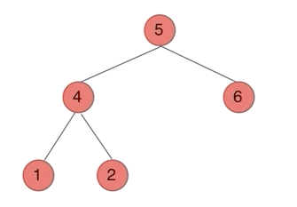

```js
前序遍历:

// 入栈 右 -> 左
// 出栈 中 -> 左 -> 右
// 利用栈控制
var preorderTraversal = function(root) {
    let res = []
    if(root === null) return res
    const stack = [root]
    while(stack.length) {
        let cur = stack.pop()
        res.push(cur.val)
        cur.right && stack.push(cur.right)
        cur.left && stack.push(cur.left)
    }
    return res
};


中序遍历:
// 入栈 左 -> 右
// 出栈 左 -> 中 -> 右
// 让指针cur去访问结点 用指针控制
var inorderTraversal = function(root) {
    let res = []
    const stack = []
    let cur = root
    while(stack.length || cur) {
        if(cur) { // 2
            stack.push(cur)
            cur = cur.left
        } else { // 3
            cur = stack.pop()
            res.push(cur.val)
            cur = cur.right
        }
    };
    return res;
};

后序遍历:

// 入栈 左 -> 右
// 出栈 中 -> 右 -> 左 结果翻转
// 利用栈
var postorderTraversal = function(root) {
    let res = []
    if(root === null) return res
    const stack = [root]
    while(stack.length) {
        let cur = stack.pop()
        res.push(cur.val)
        cur.left && stack.push(cur.left)
        cur.right && stack.push(cur.right)
    }
    return res.reverse()
};
```


### 3、层次遍历（bfs）

👀：所有遍历必然是返回一个结果数组的

🌟：借助队列来实现

👉：利用队列，**一个结果数组 + 队列**（先判断root是否为空）+ while(队列有长 -> 记录length -> while(length -> **shift队列 -> 加到res** -> 左 -> 右) )

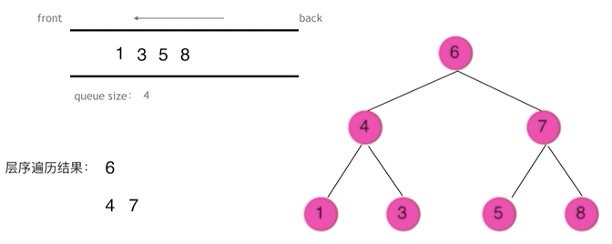

**队列先进先出，符合一层一层遍历的逻辑，而用栈先进后出适合模拟深度优先遍历也就是递归的逻辑**

```js
var levelOrder = function(root) {
    let res = []
    if(root === null) return res
    let queue = [root]
    while(queue.length) {
        let len = queue.length
        while(len>0) { // 这个循环是为了去找数的深度，如果只是遍历，就不用放在while循环里
            let cur = queue.shift()
            res.push(cur.val)
            cur.left && queue.push(cur.left)
            cur.right && queue.push(cur.right)
            len-- // 这步别忘了
        }
    }
    return res
};
```


[102.二叉树的层序遍历](https://leetcode.cn/problems/binary-tree-level-order-traversal/)

[107.二叉树的层序遍历 II](https://leetcode.cn/problems/binary-tree-level-order-traversal-ii/)

直接把上一题的push改成unshift就行了，可以省掉reverse操作

[199.二叉树的右视图](https://leetcode.cn/problems/binary-tree-right-side-view/)

还是层级遍历，判断一下是否是这一层的最后就行了（len的值为0就是最后一个元素了）

```js
var rightSideView = function(root) {
    let res = []
    if(root === null) return res
    let queue = [root]
    while(queue.length) {
        let len = queue.length
        while(len) {
            let cur = queue.shift()
            len--
            if(!len) res.push(cur.val)
            cur.left && queue.push(cur.left)
            cur.right && queue.push(cur.right)
        }
    }
    return res
};
```

[637.二叉树的层平均值](https://leetcode.cn/problems/average-of-levels-in-binary-tree/)

简单的

[429.N叉树的层序遍历](https://leetcode.cn/problems/n-ary-tree-level-order-traversal/)

把左右改成for of 去拿所有孩子  是cur.children！

[515.在每个树行中找最大值](https://leetcode.cn/problems/find-largest-value-in-each-tree-row/)

加个找最大值的就行了

[116.填充每个节点的下一个右侧节点指针](https://leetcode.cn/problems/populating-next-right-pointers-in-each-node/)

不用结果数组res，**增加指向关系.next**就行了，除了最后一个值（我借鉴了199里判断是否为最后一个的方法）

[117.填充每个节点的下一个右侧节点指针 II](https://leetcode.cn/problems/populating-next-right-pointers-in-each-node-ii/)

跟116完全一样，看了这道题就知道了，其实跟完不完全二叉树没关系，只要判断是不是最后一个值就行了

❗ LeetCode 出问题了 👆

🌟 [104.二叉树的最大深度](https://leetcode.cn/problems/maximum-depth-of-binary-tree/)

这题可太牛了啊

三种方法O~  其他到具体再看，层次遍历拿捏的

[111.二叉树的最小深度](https://leetcode.cn/problems/minimum-depth-of-binary-tree/)

的确只要在意层次就行了，跟上一题也差不多的，稍微改一改


### 4、翻转二叉树

[226.翻转二叉树](https://leetcode.cn/problems/invert-binary-tree/)

**只要把每一个节点的左右孩子翻转一下，就可以达到整体翻转的效果**

👉 注意这题，要求是要返回root，所以不要res，互换的也是结点，而不是入栈或者队列顺序

递归 -> 直接在递归的时候左右结点互换

层次和迭代 -> 多写一个结点互换的函数


### 5、对称二叉树

[101.对称二叉树](https://leetcode.cn/problems/symmetric-tree/)

👉 不需要返回res的，就不要写了啊

递归：在递归函数里，先把跳出递归的条件写了，如果都不满足，就继续进行递归

迭代（队列&栈）：思想完全一样的，只是借助了一下栈或队列的性质，同样，也是把判断条件写了，否则就push栈或队列中去


### 6、完全二叉树的节点个数

[222.完全二叉树的节点个数](https://leetcode.cn/problems/count-complete-tree-nodes/)

自己写出来了层次遍历和递归

还有一种利用完全二叉树性质的递归先放一边边吧


### 7、平衡二叉树

[110.平衡二叉树](https://leetcode.cn/problems/balanced-binary-tree/)

这题用递归的后序遍历很简单，有些题目的确就是递归简单点

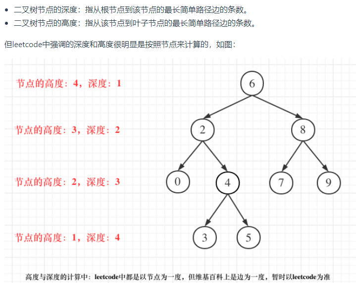


### 8、二叉树的所有路径

[257.二叉树的所有路径](https://leetcode.cn/problems/binary-tree-paths/)

递归的话，这里很巧妙，把要一步步加上的东西，用curPath参数来传递，就用递归吧


### 9、左叶子之和

[404.左叶子之和](https://leetcode.cn/problems/sum-of-left-leaves/)

抓住对左叶子节点的判断标准

其他就是遍历的事情了

层次遍历的两层while循环是为了让层次更好地体现出来，如果不用体现层次只要遍历的话，只要一层while就够了


### 10、找树左下角的值

[513.找树左下角的值](https://leetcode.cn/problems/find-bottom-left-tree-value/)

深挖题意，就会觉得这题必然是层次遍历简单，要找的就是最后一层中的第一个结点

递归要借助一下统计最大深度，巧妙的点在于要记录深度，递归用两个参数，由于 `curPath > maxPath` 一层中只需要记录最左边的那个节点，nice


### 11、路径总和

[112.路径总和](https://leetcode.cn/problems/path-sum/)

递归的方法有点绕的

感觉还是迭代的方法好，只要在原来的基础上加一个记录到当前位置的总和值的数组就行


[113.路径总和 ii](https://leetcode.cn/problems/path-sum-ii/)

**push方法的参数不能是数组，可以用扩展运算符的这种写法**

`tempArr.push([...curArr])`

只要在上一题的基础上加一个记录当前路径的队列数组，和一个记录最后结果的数组就行了


### 12、中序与后序遍历 / 前序与中序遍历 构造二叉树

[106.从中序与后序遍历序列构造二叉树](https://leetcode.cn/problems/construct-binary-tree-from-inorder-and-postorder-traversal/)

[105.从前序与中序遍历序列构造二叉树](https://leetcode.cn/problems/construct-binary-tree-from-preorder-and-inorder-traversal/)

每次找出根节点的值和位置，去递归分割已有的两个序列


### 13、最大二叉树

[654.最大二叉树](https://leetcode.cn/problems/maximum-binary-tree/)

写一个递归，传入数组和截取数组的左边位置和右边位置，找出最大值和所在位置，递归地去建立树，和上面两题很像


### 14、合并二叉树

[617.合并二叉树](https://leetcode.cn/problems/merge-two-binary-trees/)

就是一种前序递归的遍历


### 15、二叉搜索树中的搜索

[700.二叉搜索树中的搜索](https://leetcode.cn/problems/search-in-a-binary-search-tree/)

前序递归遍历


### 16、验证二叉搜索树

[98.验证二叉搜索树](https://leetcode.cn/problems/validate-binary-search-tree/)

辅助一个中序递归遍历二叉树的数组，若为二叉搜索树，肯定是单调递增的


### 17、二叉搜索树的最小绝对差

[530.二叉搜索树的最小绝对差](https://leetcode.cn/problems/minimum-absolute-difference-in-bst/)

这题关键点在于想清楚，把树的val存到一个数组里，让其递增，只要求相邻两个数最小的差值就行

🌟 **二叉搜索树的中序遍历是一个递增数组**


### 18、二叉搜索树中的众数

[501.二叉搜索树中的众数](https://leetcode.cn/problems/find-mode-in-binary-search-tree/)

#### 遍历map的key和value：

```js
 for(let [key,value] of map) {}
```

#### map统计个数：

```js
map.set(root.val,map.has(root.val)?map.get(root.val)+1:1)
```


### 19、二叉树的最近公共祖先

[236.二叉树的最近公共祖先](https://leetcode.cn/problems/lowest-common-ancestor-of-a-binary-tree/)


太绝了这题，就是按照上面这图

1 因为要从下到上，所以要后序遍历

2 如果左右都不为空，就返回该值

3 如果左节点为空返回右节点，……


### 20、二叉搜索树的最近公共祖先

[235. 二叉搜索树的最近公共祖先](https://leetcode.cn/problems/lowest-common-ancestor-of-a-binary-search-tree/)


如果 中间节点是 q 和 p 的公共祖先，那么 中节点的数组 一定是在 [p, q]区间的。即 中节点 > p && 中节点 < q 或者 中节点 > q && 中节点 < p

-> 找到第一个在这个区间内的节点


### 21、二叉搜索树中的插入操作

[701.二叉搜索树中的插入操作](https://leetcode.cn/problems/insert-into-a-binary-search-tree/)

递归，不要改变原来树的形态，待插入的节点只可能找空节点的位置插

所以先找到正确位置的空节点，按照传入的val值，建立节点，返回该节点


### 22、删除二叉搜索树中的节点


[450.删除二叉搜索树中的节点](https://leetcode.cn/problems/delete-node-in-a-bst/)

这题难得多了，先递归找到要删除的节点位置

然后再分情况

1 root为null，返回null

2 该节点是叶子节点，返回null删掉该节点

3 该节点有一个叶子节点不存在，返回存在的那个叶子节点删掉该节点

4 左右孩子都存在，找到该节点右子树的最小值（最左边的节点），去替换当前节点的值，再把右子树和右子树最小值进行递归，从而以删除叶子节点的方式删掉右子树的最小值


### 23、修剪二叉搜索树

[669.修剪二叉搜索树](https://leetcode.cn/problems/trim-a-binary-search-tree/)

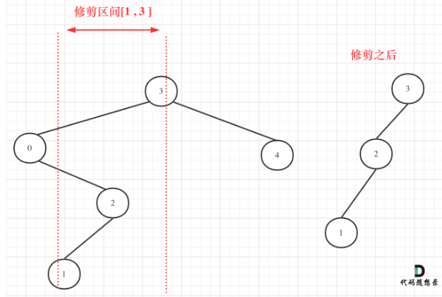

这道题就是当root的值小于low，返回右子树；当root的值大于high，返回左子树

在区间内的话就继续连上递归


### 24、将有序数组转换为二叉搜索树

[108.将有序数组转换为二叉搜索树](https://leetcode.cn/problems/convert-sorted-array-to-binary-search-tree/)

这道题特殊的地方在于构造一棵平衡二叉树，所以关键点在于找中间节点，然后再正常build就行了


### 25、把二叉搜索树转换为累加树

[538.把二叉搜索树转换为累加树](https://leetcode.cn/problems/convert-bst-to-greater-tree/)

这题奇奇怪怪的，就是用一个反中序遍历就行了

记得可以用一个pre来记录之前节点的值


## 回溯算法


```js
void backtracking(参数) {
    if (终止条件) {
        存放结果;
        return;
    }

    for (选择：本层集合中元素（树中节点孩子的数量就是集合的大小）) {
        处理节点;
        backtracking(路径，选择列表); // 递归
        回溯，撤销处理结果
    }
}
```


### 🌟 startIndex - 组合问题

一个集合来求组合的话，就需要startIndex（T1和T2要）

多个集合取组合，各个集合之间相互不影响，那么就不用（T3不用）


**👉 组合问题:**

**取过的元素不会重复取，写回溯算法的时候，for就要从startIndex开始，而不是从0开始**

**👉 排列问题:**

集合有序，不需要startIndex


### ✨组合总结

两个数组，一个result，一个path（过程）

递归函数中：

​	跳出递归：满足题目给出的条件（path到最下面一层了），push给result，return

​	for循环：push -> 递归函数 -> pop

👉 求总和，**for循环里总是要加一个大于给出和的return条件**，push后`+=`，pop后`-=`

👉 无限制重复取，递归的i不加1

👉 集合中有重复元素，但组合中不能有重复组合 -> 排序，for的每层循环判断一下是否和上一次的元素相同


### 1、纯组合

[77.组合](https://leetcode.cn/problems/combinations/)

🌟 定义一个result数组，和一个记录每个可行解的path数组

定义一个递归函数，一开始肯定是跳出递归的条件

然后用一个for控制横向，递归来控制纵向，横向的一种情况纵向递归完，就pop之后换另外一种情况


**剪枝条件：**

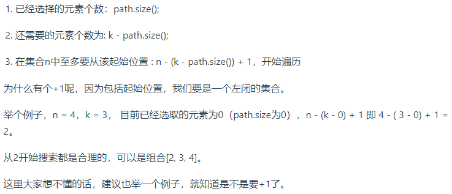

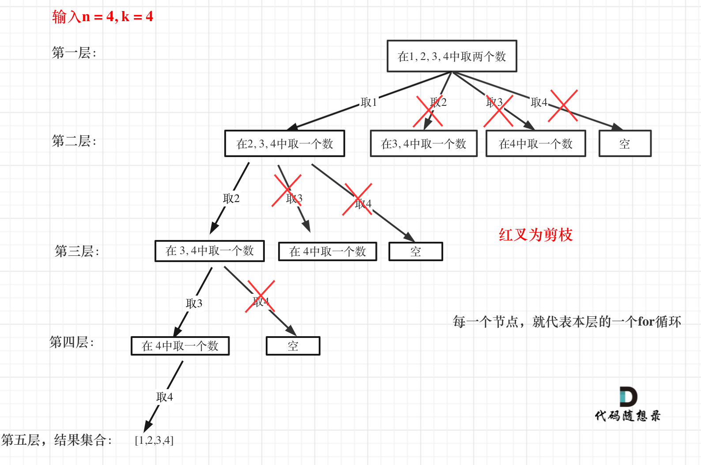

```js
var combine = function(n, k) {
    let result = []
    let path = []
    var backTracking = function(n, k, startIndex) {
        // 跳出递归的条件 - path的长度和k相等 终止本层递归
        if(path.length === k) {
            result.push([...path])
            return
        }
        // for控制横向
        // for(let i=startIndex; i<=n; i++) {
        // 剪枝条件
        for(let i=startIndex; i<=n-(k-path.length)+1; i++) {
            path.push(i)
            // 递归控制纵向
            backTracking(n, k, i+1)
            // 横向的一种情况纵向递归完 就pop之后换另外一种情况
            path.pop()
        }
    }
    backTracking(n, k, 1)
    return result
};
```


### 2、组合总和III

[216.组合总和 III](https://leetcode.cn/problems/combination-sum-iii/)

递归函数比上一题多了一个记录总和的参数，判断跳出递归的时候加一个判断总和的条件就行了

**剪枝条件：**

1、当sum已经大于n时，就不需要继续递归下去了

2、跟上一题一样

```js
var combinationSum3 = function(k, n) {
    let result = []
    let path = []
    var backtracking = function(k, n, startIndex, sum) {
        if(path.length===k && sum===n) {
            result.push([...path])
            return
        }
        for(let i=startIndex; i<=9-(k-path.length)+1; i++) {
            if(sum+i > n) return
            path.push(i)
            sum += i
            backtracking(k, n, i+1, sum)
            path.pop()
            sum -= i
        }
    }
    backtracking(k, n, 1, 0)
    return result
};
```


### 3、电话号码的字母组合

[17.电话号码的字母组合](https://leetcode.cn/problems/letter-combinations-of-a-phone-number/)

没想到这题还要自己建立数字和字母的映射表，不过这样也好

跟之前的题其实也差不多，递归函数三个参数，一个是输入的digits，和上几题的n差不多的，k也就是path数组的个数，最后一个是下标

#### **数组连成字符串**

```js
path.join("")
```

```js
var letterCombinations = function(digits) {
    const map = ["","","abc","def","ghi","jkl","mno","pqrs","tuv","wxyz"]
    let result = [], path = []
    // 这里的字符串长度是看digits的长度的
    let k = digits.length
    if(!k) return[]
    // 这里的index是下标
    var backtracking = function(digits, k, index) {
        if(path.length === k) {
            // 把数组里的连成字符串
            result.push(path.join(""))
            return
        }
        for(let v of map[digits[index]]) {
            path.push(v)
            backtracking(digits, k, index+1)
            path.pop()
        }
    }
    backtracking(digits, k, 0)
    return result
};
```


### 4、组合总和

[39.组合总和](https://leetcode.cn/problems/combination-sum/)


不用i+1了，表示可以重复读取当前的数

这里的递归函数还是需要startIndex的，和一个记录总和的sum参数

这里的总和大于target之后，一定要记得及时break/return掉

pop之后让sum也恢复正常，之前的就一直通过`sum+i`往下就行了，而这里的需要回退的

```js
var combinationSum = function(candidates, target) {
    let res = [], path = []
    candidates.sort((a,b)=>a-b) // 升序排序

    function backtracking(startIndex, sum) {
        if (sum === target) {
            res.push([...path])
            return
        }
        for(let i = startIndex; i < candidates.length; i++ ) {
            const temp = candidates[i]
            if(temp + sum > target) return
            path.push(temp)
            sum += temp
            backtracking(i, sum)
            path.pop()
            sum -= temp
        }
    }
    backtracking(0, 0)
    return res
};
```


### 5、组合总和 II

[40.组合总和 II](https://leetcode.cn/problems/combination-sum-ii/)

这题的难点在于**集合（数组candidates）有重复元素，但还不能有重复的组合**（和上一题对比）

要去掉一层中重复的，所以就需要加一个if判断一下当前取值是否和前一个一样，一样就continue掉


```js
var combinationSum2 = function(candidates, target) {
    let result = [], path = []
    candidates.sort((a,b) => a-b)
    var backtracking = function(startIndex, sum) {
        if(sum === target) {
            result.push([...path])
            return
        }
        for(let i=startIndex; i<candidates.length; i++) {
            let temp = candidates[i]
            if(i>startIndex && candidates[i]===candidates[i-1])
                continue
            if(temp + sum > target) return
            path.push(temp)
            sum += temp
            backtracking(i+1, sum)
            path.pop()
            sum -= temp
        }
    }
    backtracking(0, 0)
    return result
};
```


---

### ✨ 分割总结

要用到startIndex

递归结束条件是 `startIndex === s.length`


### 6、分割回文子串

[131.分割回文子串](https://leetcode.cn/problems/palindrome-partitioning/)


#### 判断是否是回文字符串

```js
var isPalindorme = function(str, left, right) {
    for(let i=left, j=right; i<j; i++,j--) {
        if(str[i] !== str[j]) return false
    }
    return true
}
```

for循环中先加一个判断是否是回文字符串，如果不是，就continue，这里不是return，还是有希望可以是的

用startIndex来记录截取的位置

```js
var partition = function(s) {
    let result = [], path = []
    var backtracking = function(startIndex) {
        if(startIndex === s.length) {
            result.push([...path])
            return
        }
        for(let i=startIndex; i<s.length; i++) {
            // 不是回文字符串也还是有机会是的啊 所以这里用continue
            if(!isPalindorme(s, startIndex, i)) continue
            path.push(s.slice(startIndex, i+1))
            backtracking(i+1)
            path.pop()
        }
    }
    backtracking(0)
    return result
};
var isPalindorme = function(str, left, right) {
    for(let i=left, j=right; i<j; i++,j--) {
        if(str[i] !== str[j]) return false
    }
    return true
}
```


### 7、复原IP地址

[93.复原IP地址](https://leetcode.cn/problems/restore-ip-addresses/)


参数需要startIndex记录下一次分割的起始位置

（pointNum记录添加点的个数，这个参数可以直接用数组的长度来等效替代）

记住，path是每一种可行解，分割完以后的结果

注意跳出循环的条件（满足+不满足的超过分割数量就跳出循环）

跟上一题还是很像的

```js
var restoreIpAddresses = function(s) {
    let result = [], path = []
    var backtracking = function(startIndex) {
        if(path.length > 4) return
        if(path.length === 4 && startIndex === s.length) {
            result.push(path.join("."))
            return
        }
        for(let i=startIndex; i<s.length; i++) {
            if(!validator(s.slice(startIndex, i+1))) return
            // 这里push的的确应该是一小串字符串啊，不是某个字符
            path.push(s.slice(startIndex, i+1))
            backtracking(i+1)
            path.pop()
        }
    }
    backtracking(0)
    return result
};
var validator = function(s) {
    if(s*1 > 255) return false
    if(s.length>1 && s[0]==='0') return false
    return true
}
```


---


### 8、子集问题

[78.子集](https://leetcode.cn/problems/subsets/)


🌟 **组合问题和分割问题都是收集树的叶子节点，而子集问题是找树的所有节点！**

其实就是push到result数组里的条件少了，全都push进去

```js
var subsets = function(nums) {
    let result = [], path = []
    var backtracking = function(startIndex) {
        // 来者不拒地记录
        result.push([...path])
        for(let i=startIndex; i<nums.length; i++) {
            path.push(nums[i])
            backtracking(i+1)
            path.pop()
        }
    }
    backtracking(0)
    return result
};
```


### 9、子集II

[90.子集 II](https://leetcode.cn/problems/subsets-ii/)


上一题给的测试用例不存在数组中有重复元素的，而这一题存在，还不能有重复的子集

跟之前的题一样，**不能包含重复的解集**，所以在每层for循环中去判断是否与之前那一层的一样，一样的话就跳过，continue！后面的值还是要的啊

还要记得先给数组排个序

其他感觉没什么了

```js
var subsetsWithDup = function(nums) {
    let result = [], path = []
    nums.sort((a,b) => a-b)
    var backtracking = function(startIndex) {
        result.push([...path])
        for(let i=startIndex; i<nums.length; i++) {
            // 这里是continue啊，每一层里后面的数字还是要的啊
            if(i>startIndex && nums[i-1]===nums[i]) continue
            path.push(nums[i])
            backtracking(i+1)
            path.pop()
        }
    }
    backtracking(0)
    return result
};
```


### 10、递增子序列

[491.递增子序列](https://leetcode.cn/problems/non-decreasing-subsequences/)


先注意两个条件： 1 至少有两个元素  2 递增

难点：数组有重复的元素，不能之前排个序与前一个对比的方法去重。所以就在for的每一层循环中加入一个uset的map，来判断一层中是否有重复元素

ps：`map.set` `map.has`

其他也都差不多的

```js
var findSubsequences = function(nums) {
    let result = [], path = []
    var backtracking = function(startIndex) {
        // 至少有两个元素
        if(path.length > 1) {
            result.push([...path])
        }
        // 利用map记录已经有的元素，每层更新
        let uset = new Map()
        for(let i=startIndex; i<nums.length; i++) {
            // 递增 并且 这一层中没出现过
            if(path.length>0 && nums[i]<path[path.length-1] || uset.has(nums[i]))
                continue
            uset.set(nums[i])
            path.push(nums[i])
            backtracking(i+1)
            path.pop()
        }
    }
    backtracking(0)
    return result
};
```


---

### ✨ 排列总结

加一个used的数组

push之后used中元素赋true，pop后赋false

跳出递归条件 `path.length === k`


### 11、全排列

不包含重复元素

[46.全排列](https://leetcode.cn/problems/permutations/)


首先不用startIndex了

给递归函数加一个used数组的参数，push后改变used中当前元素，pop之后再改回来 -> 用true和false改就行了

```js
var permute = function(nums) {
    let result = [], path = []
    // 递归函数的参数其实只要used就行了
    var backtracking = function(n, k, used) {
        if(path.length === k) {
            result.push([...path])
        }
        for(let i=0; i<k; i++) {
            if(used[nums[i]]) continue
            path.push(nums[i])
            used[nums[i]] = true
            backtracking(n, k, used)
            path.pop()
            used[nums[i]] = false
        }
    }
    backtracking(nums, nums.length, [])
    return result
};
```


### 12、全排列 II

数组包含重复元素

[47.全排列 II](https://leetcode.cn/problems/permutations-ii/)


这里又涉及到去重了，跟之前一样，按层去重的话，要注意：如果当前元素等于之前那个元素了，要判断之前那个元素有没有用过，一定是要没用过的（因为之前的层如果用过也是可以的，只要去重当前层的）

还有一个continue条件就是当前元素用过了，就去找下一个

其他也没什么了

```js
var permuteUnique = function(nums) {
    let result = [], path = []
    nums.sort((a,b) => a-b)
    var backtracking = function(n, k, used) {
        if(path.length === k) {
            result.push([...path])
        }
        for(let i=0; i<k; i++) {
            // 和没有重复元素的数组一样，首先当前元素在used里应该是false的
            // 这一层的used赋值还未开始，如果是之前的层用过也是可以的，只要去重当前层的，所以要!used[i-1]
            // 还需要排序后，跟前一个元素不一样
            if(i>0 && nums[i]===nums[i-1] && !used[i-1] || used[i]) continue
            path.push(nums[i])
            used[i] = true
            backtracking(n, k, used)
            path.pop()
            used[i] = false
        }
    }
    backtracking(nums, nums.length, [])
    return result
};
```


👉 如果要对树层中前一位去重，就用`used[i - 1] == false`，如果要对树枝前一位去重用`used[i - 1] == true`。

**对于排列问题，树层上去重和树枝上去重，都是可以的，但是树层上去重效率更高！**

树层上去重(used[i - 1] == false)，的树形结构如下：

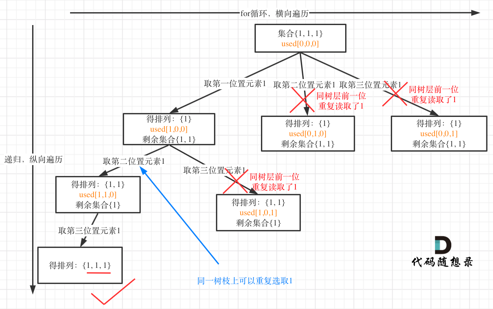

树枝上去重（used[i - 1] == true）的树型结构如下：


下面的都当扩宽眼界了

---


# 遗留的---

13、重新安排行程

[332.重新安排行程](https://leetcode.cn/problems/reconstruct-itinerary/)

困难啊


---


### 14、N皇后

[51.N皇后](https://leetcode.cn/problems/n-queens/)

这题也是困难啊

总结一下：

先定义一个函数，判断每次放置皇后的位置的合法性

递归函数：按行进行递归，结束条件是行的值已经等于n了，把结果push给result数组，记得都return一下

然后就是for循环按层遍历，位置合法就放置，递归到下一行，再回溯撤销放置

这里要注意格式化数组的函数，可以用 `array.join("")` 来连接数组成字符串


**👇 建立初值全为.的二维数组**

`let chessBoard = new Array(n).fill([]).map(() => new Array(n).fill('.'))`


### 15、解数独

[37.解数独](https://leetcode.cn/problems/sudoku-solver/)

**模板字符串在算法题中都可以妙用诶**

```js
for(let val=1; val<=9; val++) {
    // 模版字符串
    if(isValid(i, j, `{$val}`, board)) {
        board[i][j] = `{val}`
    }
}
```

就这种感觉奥


---


## 贪心


步骤：

- 将问题分解为若干个子问题
- 找出适合的贪心策略
- 求解每一个子问题的最优解
- 将局部最优解堆叠成全局最优解


### 1、分发饼干

[455.分发饼干](https://leetcode.cn/problems/assign-cookies/)

**这里的局部最优就是大饼干喂给胃口大的，充分利用饼干尺寸喂饱一个，全局最优就是喂饱尽可能多的小孩**。

👉 注意：这里千万千万不能先遍历饼干，再遍历胃口，这样的话需要多次遍历饼干，没必要的

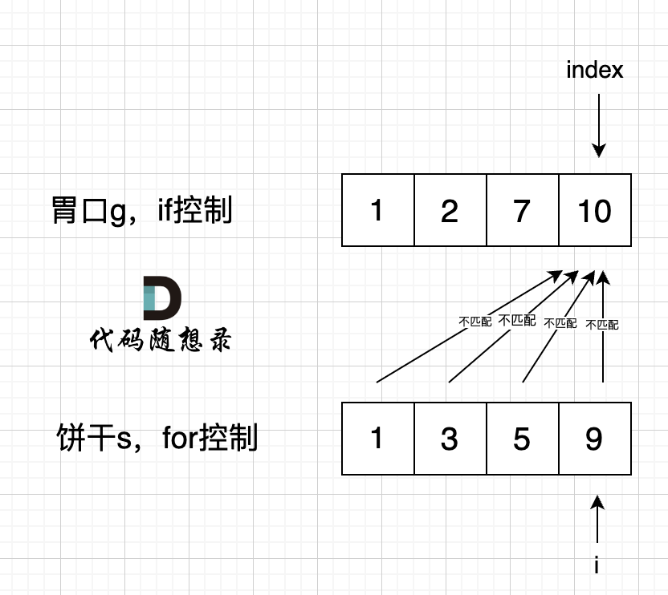

很简单呀，就先给两个数组升序排序，从后往前遍历就行，先遍历胃口

```js
var findContentChildren = function(g, s) {
    // 先排序
    g.sort((a,b) => a-b)
    s.sort((a,b) => a-b)
    let index = s.length-1
    let num = 0
    // 遍历胃口，把大饼干先满足大胃口
    for(let i=g.length; i>=0; i--) {
        if(s[index]>=g[i] && index>=0) {
            index--
            num++
        }
    }
    return num
};
```


### 2、摆动序列

[376.摆动序列](https://leetcode.cn/problems/wiggle-subsequence/)

**删除单调坡度上的节点（不包括单调坡度两端的节点）**

难点在于以下两种情况：


```js
var wiggleMaxLength = function(nums) {
    if(nums.length <= 1) return nums.length
    let preDiff = 0
    let curDiff = 0
    // 默认最右有一个峰值
    let res = 1
    for(let i=0; i<nums.length; i++) {
        curDiff = nums[i] - nums[i-1]
        if(preDiff<=0 && curDiff>0 || preDiff>=0 && curDiff<0) {
            res++
            preDiff = curDiff
        }
    }
    return res
};
```


### 3、最大子数组和

[53.最大子数组和](https://leetcode.cn/problems/maximum-subarray/)

连续子数组

当前“连续和”为负数的时候立刻放弃，从下一个元素重新计算“连续和”，因为负数加上下一个元素 “连续和”只会越来越小。

**`Number.MAX_VALUE`** 属性表示在 JavaScript 里所能表示的最大数值。

全局属性 **`Infinity`** 是一个数值，表示无穷大。

当然，infinity是大于Number.MAX_VALUE的

```js
var maxSubArray = function(nums) {
    let num = 0
    // res 的初始值一定要设为最小的负数，不然全部为负数的会出问题
    let res = -Number.MAX_VALUE
    for(let i=0; i<nums.length; i++) {
        num += nums[i]
        if(num > res) res = num
        if(num < 0) num = 0
    }
    return res
};
```

👉 注意：这里的初始result值一定要是最小的负数，上面两种都是可以的


### 4、买卖股票的最佳时机II

[122.买卖股票的最佳时机II](https://leetcode.cn/problems/best-time-to-buy-and-sell-stock-ii/)

太简单了啊，取相邻两数的差值，把正的差值全部加起来就行了

```js
var maxProfit = function(prices) {
    let res = 0
    for(let i=1; i<prices.length; i++) {
        res += Math.max(prices[i]-prices[i-1], 0)
    }
    return res
};
```


### 5、跳跃游戏

[55.跳跃游戏](https://leetcode.cn/problems/jump-game/)

这题还是很简单的，只要一直去更新最大覆盖范围，记得遍历的数组元素也要一直在更新的最大覆盖范围里就行，其他没什么了

```js
var canJump = function(nums) {
    let maxCover = 0
    let len = nums.length
    for(let i=0; i<=maxCover; i++) {
        maxCover = Math.max(maxCover, i+nums[i])
        if(maxCover >= len-1) return true
    }
    return false
};
```


### 6、跳跃游戏 II

[45.跳跃游戏 II](https://leetcode.cn/problems/jump-game-ii/)


这里的要借助`当前可覆盖最大范围`和`下一步可覆盖最大范围`这两个参数

这里只要 i 的下标触碰到当前可覆盖最大范围了，就需要去启用下一步了

👉 注意：这里的遍历只需要遍历到倒数第二个数就行了，因为最初始的时候多加了1

```js
var jump = function(nums) {
    let curCover = 0
    let nextCover = 0
    let step = 0
    let len = nums.length
    for(let i=0; i<len-1; i++) {
        // 下一步的范围是当前范围值中能取到的最大值
        nextCover = Math.max(i+nums[i], nextCover)
        // 如果i已经走到curCover这一步了，就需要启用下一步了
        if(i === curCover) {
            curCover = nextCover
            step++
        }
    }
    return step
};
```


### 7、K次取反后最大化的数组和

[1005.K次取反后最大化的数组和](https://leetcode.cn/problems/maximize-sum-of-array-after-k-negations/)

按绝对值降序排序，先把所有绝对值大的负数取反，累加

如果负数已经全部变正了，k的个数是奇数，再把已得出的数组和减去两倍数组中绝对值最小的数

```js
var largestSumAfterKNegations = function(nums, k) {
    let res = 0
    // 按绝对值降序排序
    nums.sort((a,b) => Math.abs(b) - Math.abs(a))
    // 遍历一遍 把所有负的先都转换为正的
    for(let i=0; i<nums.length; i++) {
        if(nums[i]<0 && k){
            nums[i] *= -1
            k--
        }
        res += nums[i]
    }
    if(k%2 !== 0) {
        res -= 2*nums[nums.length-1]
    }
    return res
};
```


### 8、加油站

[134.加油站](https://leetcode.cn/problems/gas-station/)


1、只要总油量大于总消耗油量，就一定能跑一圈，会有解；反之，没有

2、当从一个点开始计算的curSum一旦小于0了，从这个点开始的就不可能了

**👉 注意：小于零的数变成boolean，结果是true啊**

```js
var canCompleteCircuit = function(gas, cost) {
    let curSum = 0
    let totalSum = 0
    let startIndex = 0
    for(let i=0; i<gas.length; i++) {
        let rest = gas[i] - cost[i]
        curSum += rest
        totalSum += rest
        if(curSum < 0) {
            // 这里一定是i+1啊！！！
            startIndex = i + 1
            curSum = 0
        }
    }
    if(totalSum < 0) return -1
    return startIndex
};
```


### 9、分发糖果

[135.分发糖果](https://leetcode.cn/problems/candy/)


先确定右边评分大于左边的情况（**从前向后遍历**）

再确定左孩子大于右孩子的情况（**从后向前遍历**）

遍历顺序这里有同学可能会有疑问，为什么不能从前向后遍历呢？

因为如果从前向后遍历，根据 ratings[i + 1] 来确定 ratings[i] 对应的糖果，那么每次都不能利用上前一次的比较结果了。

所以确定左孩子大于右孩子的情况一定要从后向前遍历！

```js
var candy = function(ratings) {
    // 1 初始化一个初值全为1的数组
    let candies = new Array(ratings.length).fill(1)
    // 2 从前往后遍历 保证右边比左边大的加1
    for(let i=0; i<candies.length-1; i++) {
        if(ratings[i+1] > ratings[i])
            candies[i+1] = candies[i]+1
    }
    // 3 从后往前遍历 保证左边比右边大的再加1
    for(let i=candies.length-2; i>=0; i--) {
        if(ratings[i] > ratings[i+1])
            // 因为之前已经遍历过一遍了 所以这里要看的是本身的值和右边+1后值 取大的
            candies[i] = Math.max(candies[i], candies[i+1]+1)
    }
    let res = candies.reduce((a,b) => {
        return a+b
    })
    return res
};
```

> **[].reduce( () => {合并规则},  (初始值) )**
>
> - **将一个数组中的所有元素整合为一个值**
> - 参数：
>   1. 回调函数，通过回调函数来指定合并的规则
>   2. 可选参数，初始值


### 10、柠檬水找零

[860.柠檬水找零](https://leetcode.cn/problems/lemonade-change/)

- 情况一：账单是5，直接收下。
- 情况二：账单是10，消耗一个5，增加一个10
- 情况三：账单是20，优先消耗一个10和一个5，如果不够，再消耗三个5

遍历数组，用 if-else 依次判断是哪种情况，原来这道题那么单纯的

```js
var lemonadeChange = function(bills) {
    let fiveNum = 0
    let tenNum = 0
    for(let bill of bills) {
        if(bill === 5) {
            fiveNum++
        } else if(bill === 10) {
            if(fiveNum) {
                fiveNum--
                tenNum++
            } else {
                return false
            }
        } else {
            if(tenNum && fiveNum) {
                tenNum--
                fiveNum--
            } else if(fiveNum >= 3) {
                fiveNum -= 3
            } else {
                return false
            }
        }
    }
    return true
};
```


### 11、根据身高重建队列

[406.根据身高重建队列](https://leetcode.cn/problems/queue-reconstruction-by-height/)

**身高一定是从大到小排（身高相同的话则k小的站前面）**

排序完的people： [[7,0], [7,1], [6,1], [5,0], [5,2]，[4,4]]

插入的过程：

- 插入[7,0]：[[7,0]]
- 插入[7,1]：[[7,0],[7,1]]
- 插入[6,1]：[[7,0],[6,1],[7,1]]
- 插入[5,0]：[[5,0],[7,0],[6,1],[7,1]]
- 插入[5,2]：[[5,0],[7,0],[5,2],[6,1],[7,1]]
- 插入[4,4]：[[5,0],[7,0],[5,2],[6,1],[4,4],[7,1]]

👉 同样是两个维度，排好序之后，直接按照k中下标位置插入就行了

```js
var reconstructQueue = function(people) {
    let queue = []
    people.sort((a,b) => {
        if(a[0] !== b[0]) {
            // 先按身高降序排
            return b[0] - a[0]
        } else {
            // 身高相同，按k升序排
            return a[1] - b[1]
        }
    })
    // 直接按照k中的下标位置插入
    for(let i=0; i<people.length; i++) {
        queue.splice(people[i][1], 0, people[i])
    }
    return queue
};
```

> 二维数组的排序 eg：
>
> ```js
> people.sort((a,b) => {
>     if(a[0] !== b[0]) {
>         // 先按身高降序排
>         return b[0] - a[0]
>     } else {
>         // 身高相同，按k升序排
>         return a[1] - b[1]
>     }
> })
> ```


### 12、用最少数量的箭引爆气球

[452. 用最少数量的箭引爆气球](https://leetcode.cn/problems/minimum-number-of-arrows-to-burst-balloons/)

先按照左边界排序，更新后一个气球的区间为重叠区间

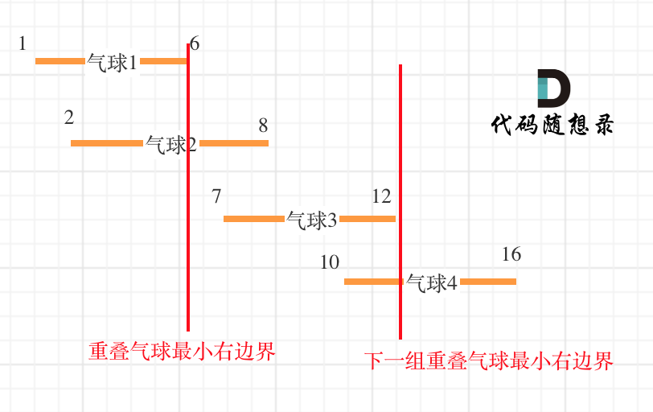

```js
var findMinArrowShots = function(points) {
    let res = 1
    // 按照左边界升序排列
    points.sort((a, b) => {
        return a[0] - b[0]
    })
    for(let i=1; i<points.length; i++) {
        if(points[i][0] > points[i-1][1]) {
            res++
        } else {
            // 更新为重叠区间
            points[i][1] = Math.min(points[i][1], points[i-1][1])
        }
    }
    return res
};
```


### 13、无重叠区间

[435.无重叠区间](https://leetcode.cn/problems/non-overlapping-intervals/)

按照右边界排序，从左向右记录非交叉区间的个数。最后用区间总数减去非交叉区间的个数就是需要移除的区间个数了


```js
var eraseOverlapIntervals = function(intervals) {
    // 右边界排序
    // 注意箭头函数的写法
    intervals.sort((a, b) => a[1] - b[1])

    // 记录没有重叠的区间的数量
    let count = 1
    let end = intervals[0][1]

    for(let i=1; i<intervals.length; i++) {
        if(intervals[i][0] >= end) {
            count++
            end = intervals[i][1]
        }
    }

    return intervals.length - count
};
```


### 14、划分字母区间

[763.划分字母区间](https://leetcode.cn/problems/partition-labels/)

可以分为如下两步：

- 统计每一个字符最后出现的位置
- 从头遍历字符，并更新字符的最远出现下标，如果找到字符最远出现位置下标和当前下标相等了，则找到了分割点


👉 散列表（Hash table，也叫***哈希表***），是根据关键码值(Key value)而直接进行访问的数据结构

借助object建立一个哈希表，来每个元素的最远出现下标

想清楚right的更新就行了

```js
var partitionLabels = function(s) {
    // 建立一个哈希表（根据键值来进行直接访问）
    // 记录每个字符的最远出现下标
    let hash = {}
    let left = 0
    let right = 0
    let res = []
    for(let i=0; i<s.length; i++) {
        hash[s[i]] = i
    }
    // 遍历字符串，当当前下标等于最远出现下标，就要记录一次
    for(let i=0; i<s.length; i++) {
        // 这里要想清楚right的更新诶 不要想当然
        right = Math.max(right, hash[s[i]])
        if(right === i) {
            res.push(right-left+1)
            left = i+1
        }
    }
    return res
};
```

👉 用map也是可以的

`map.set(key, value)`  向map中添加键值对

`map.get(key)`  根据key获取值


### 15、合并区间

[56.合并区间](https://leetcode.cn/problems/merge-intervals/)

自己写出来的呀，多考虑一下情况，用左右边界，easy啦~


```js
var merge = function(intervals) {
    // 先按左边界排序
    intervals.sort((a, b) => a[0] - b[0])

    let res = []
    let left = intervals[0][0]
    let right = intervals[0][1]
    for(let i=1; i<intervals.length; i++) {
        if(intervals[i][0] <= right) {
            // 这里要排除一些包含的情况
            right = Math.max(right, intervals[i][1])
        } else {
            res.push([left, right])
            left = intervals[i][0]
            right = intervals[i][1]
        }
    }
    // 最后还要push一下
    res.push([left, right])
    return res
};
```


### 🌟 箭头函数踩坑

吃了好几次亏了，写错咋就那么顺手捏

写法一：

```js
intervals.sort((a, b) => a[0] - b[0])
```

写法二：（不要忘记return！）

```js
intervals.sort((a, b) => {
	return a[0] - b[0]
})
```


### 16、单调递增的数字

[738.单调递增的数字](https://leetcode.cn/problems/monotone-increasing-digits/)

**遇到strNum[i - 1] > strNum[i]的情况，让strNum[i - 1]--，然后strNum[i]给为9，可以保证这两位变成最大单调递增整数**

所以从前后向遍历会改变已经遍历过的结果

嘿嘿，我已经感觉到要从后往前遍历了

👉 本题难点：感觉是**数据类型转换**诶

数字 -> 字符串：

`n = n.toString()`

字符串 -> 数字数组：

`n = n.split('').map(item => +item)`

数字数组 -> 字符串：

`n = n.join('')`

字符串 -> 数字：

`+n`

```js
var monotoneIncreasingDigits = function(n) {
    // 把n转为一个全是数字的数组
    n = n.toString()
    n = n.split('').map(item => +item)
    let flag = Infinity
    for(let i=n.length-1; i>0; i--) {
        if(n[i-1] > n[i]) {
            flag = i
            n[i-1]--
            n[i] = 9
        }
    }
    // 像100这种 预期结果应该是99 而不是90 所以还要多遍历一下
    for(let i=flag; i<n.length; i++) {
        n[i] = 9
    }
    // 把数字数组的元素连接成一个字符串
    n = n.join('')
    // 字符串转换成数字
    return +n
};
```


### 17、买卖股票的最佳时机含手续费

[714. 买卖股票的最佳时机含手续费](https://leetcode.cn/problems/best-time-to-buy-and-sell-stock-with-transaction-fee/)

因为有手续费了，所以什么时候买卖就重要了

买入日期就是更低价格的更新

卖出日期需要找找

👉 难点在于：万一不是获利区间的最后一天，不是真正的买卖的话，需要把当前的价格减去fee来更新一下最低价格

多想想就懂了啊，相当于把那天的手续费减掉了

```js
var maxProfit = function(prices, fee) {
    let res = 0
    let minPrice = prices[0]
    for(let i=0; i<prices.length; i++) {
        // 更新最低价格
        if(prices[i] < minPrice)
            minPrice = prices[i]
        
        if(prices[i] > minPrice + fee) {
            res += prices[i] - minPrice - fee
            // 这一步尤为重要啊 更新最低价格
            // 万一这一步不是获利区间的最后一天，更新为最低价格，不是真正的买卖，不影响之后的计算
            minPrice = prices[i] - fee
        }
    }
    return res
};
```


### 18、监控二叉树【困难】

[968.监控二叉树](https://leetcode.cn/problems/binary-tree-cameras/)

**让叶子节点的父节点安摄像头，所用摄像头最少，整体最优：全部摄像头数量所用最少！**

因为头结点放不放摄像头也就省下一个摄像头， 叶子节点放不放摄像头省下了的摄像头数量是指数阶别的

每个节点可能有几种状态：

- 0：该节点无覆盖
- 1：本节点有摄像头
- 2：本节点有覆盖

空节点的状态只能是有覆盖，这样就可以在叶子节点的父节点放摄像头了


## 动态规划

又见啦，动规！这次善待我 OK？

👉 动规是由前一个状态推导出来的，而贪心是局部直接选最优的

👀 步骤：

> 1. 确定dp数组（dp table）以及下标的含义
> 2. 确定递推公式
> 3. dp数组如何初始化
> 4. 确定遍历顺序
> 5. 举例推导dp数组


### 1、斐波那契数列

[509.斐波那契数列](https://leetcode.cn/problems/fibonacci-number/)

0、1、1、2、3、5、8、13、21……

经典啊

```js
// 动规
var fib = function(n) {
    // 我们只要维护两个序列就行了
    if(n <= 1) return n
    let dp = new Array(2)
    dp[0] = 0
    dp[1] = 1
    for(let i=2; i<=n; i++) {
        let sum = dp[0] + dp[1]
        dp[0] = dp[1]
        dp[1] = sum
    }
    return dp[1]
};

// 心血来潮 送你个递归叭
// var fib = function(n) {
//     if(n <= 1) return n
//     return fib(n-1) + fib(n-2)
// };
```


### 2、爬楼梯

[70. 爬楼梯](https://leetcode.cn/problems/climbing-stairs/)

dp[i] 可以有两个方向推出来

- 首先是dp[i - 1]，上i-1层楼梯，有dp[i - 1]种方法，那么再一步跳一个台阶不就是dp[i]了么。

- 还有就是dp[i - 2]，上i-2层楼梯，有dp[i - 2]种方法，那么再一步跳两个台阶不就是dp[i]了么。

那么dp[i]就是 dp[i - 1]与dp[i - 2]之和！

dp数组直接从1和2开始初始化就行了

给我爬！


👀 发现玄机了叭，就是斐波那契啊

```js
var climbStairs = function(n) {
    if(n <= 1) return n
    let dp = new Array(3)
    dp[1] = 1
    dp[2] = 2
    for(let i=3; i<=n; i++) {
        let sum = dp[1] + dp[2]
        dp[1] = dp[2]
        dp[2] = sum
    }
    return dp[2]
};
```


### 3、使用最小花费爬楼梯

[746.使用最小花费爬楼梯](https://leetcode.cn/problems/min-cost-climbing-stairs/)

dp[i]的定义：到达第i台阶所花费的最少体力为dp[i]

可以有两个途径得到dp[i]，一个是dp[i-1] 一个是dp[i-2]

dp[i - 1] 跳到 dp[i] 需要花费 dp[i - 1] + cost[i - 1]

dp[i - 2] 跳到 dp[i] 需要花费 dp[i - 2] + cost[i - 2]

选最小的，所以 `dp[i] = min(dp[i - 1] + cost[i - 1], dp[i - 2] + cost[i - 2]);`


```js
var minCostClimbingStairs = function(cost) {
    let dp = new Array(cost.length+1)
    // 根据题目意思 前两步都不花费体力的
    dp[0] = 0
    dp[1] = 0
    for(let i=2; i<=cost.length; i++) {
        dp[i] = Math.min(dp[i-1]+cost[i-1], dp[i-2]+cost[i-2])
    }
    return dp[cost.length]
};
```


### 4、不同路径

[62. 不同路径](https://leetcode.cn/problems/unique-paths/)


这题哦 就有点感觉了，高中排列组合好像也能做诶 还行还行~

```js
var uniquePaths = function(m, n) {
    // 初始化一个二维数组
    let dp = new Array(m).fill().map(item => new Array(n))

    for(let i=0; i<m; i++) dp[i][0] = 1

    for(let i=0; i<n; i++) dp[0][i] = 1

    for(let i=1; i<m; i++) {
        for(let j=1; j<n; j++) {
            dp[i][j] = dp[i-1][j] + dp[i][j-1]
        }
    }

    return dp[m-1][n-1]
};
```


👉 初始化一个二维数组：

`let dp = new Array(m).fill().map(item => new Array(n))`

👉 二维数组下标：

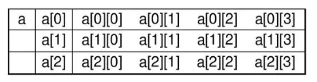


### 5、不同路径 II

[63. 不同路径 II](https://leetcode.cn/problems/unique-paths-ii/)

两种方法，一种借助dp数组，一种直接在原数组上操作

1️⃣ dp数组

考虑得相对简单，只要在数组初始化的时候，加个遇到障碍后的判断，之后的全是0


```js
var uniquePathsWithObstacles = function(obstacleGrid) {
    let m = obstacleGrid.length
    let n = obstacleGrid[0].length
    // 初始化二维数组
    let dp = new Array(m).fill().map(item => new Array(n).fill(0))
    
    // 遇到障碍后，之后的全是0
    for(let i=0; i<m&&!obstacleGrid[i][0]; i++) dp[i][0] = 1
    for(let i=0; i<n&&!obstacleGrid[0][i]; i++) dp[0][i] = 1

    // 只要不是障碍就差不多
    for(let i=1; i<m; i++) {
        for(let j=1; j<n; j++) {
            dp[i][j] = obstacleGrid[i][j]===1 ? 0 : dp[i-1][j]+dp[i][j-1] 
        }
    }

    return dp[m-1][n-1]
};
```

2️⃣ 直接操作原数组 ❌

这里初始化数组会比较有意思，用了两个新奇的运算符

不要被 0 1 搞混就是了

```js
var uniquePathsWithObstacles = function(obstacleGrid) {
    const m = obstacleGrid.length
    const n = obstacleGrid[0].length

    for (let i = 0; i < m; i++) {
        for (let j = 0; j < n; j++) {
            // 不是障碍物
            if (obstacleGrid[i][j] === 0) {
                if (i === 0) {
                    // 取左边的值
                    // 这里的 ?? 是在给 obstacleGrid[0][0] 初始化啊
                    obstacleGrid[i][j] = obstacleGrid[0][j - 1] ?? 1
                } else if (j === 0) {
                    // 取上边的值
                    // 这里也是这个意思
                    obstacleGrid[i][j] = obstacleGrid[i - 1]?.[0] ?? 1
                } else {
                    // 取左边和上边的和
                    obstacleGrid[i][j] = obstacleGrid[i - 1][j] + obstacleGrid[i][j - 1]
                }
            } else {
                // 如果是障碍物，则路径为0
                obstacleGrid[i][j] = 0
            }
        }
    }
    return obstacleGrid[m - 1][n - 1]
};
```

👉 **空值合并运算符**（**`??`**）是一个逻辑运算符，当左侧的操作数为 [`null`](https://developer.mozilla.org/zh-CN/docs/Web/JavaScript/Reference/Operators/null) 或者 [`undefined`](https://developer.mozilla.org/zh-CN/docs/Web/JavaScript/Reference/Global_Objects/undefined) 时，返回其右侧操作数，否则返回左侧操作数

左边是 假值（例如，`''` 或 `0`）时，也会返回左边的

https://developer.mozilla.org/zh-CN/docs/Web/JavaScript/Reference/Operators/Nullish_coalescing

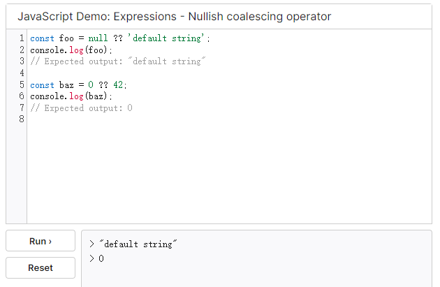

👉 **可选链运算符**（**`?.`**）允许读取位于连接对象链深处的属性的值，而不必明确验证链中的每个引用是否有效。`?.` 运算符的功能类似于 `.` 链式运算符，不同之处在于，在引用为空 ([nullish](https://developer.mozilla.org/zh-CN/docs/Glossary/Nullish) ) ([`null`](https://developer.mozilla.org/zh-CN/docs/Web/JavaScript/Reference/Operators/null) 或者 [`undefined`](https://developer.mozilla.org/zh-CN/docs/Web/JavaScript/Reference/Global_Objects/undefined)) 的情况下不会引起错误，该表达式短路返回值是 `undefined`。与函数调用一起使用时，如果给定的函数不存在，则返回 `undefined`

https://developer.mozilla.org/zh-CN/docs/Web/JavaScript/Reference/Operators/Optional_chaining

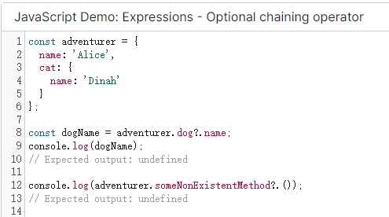


### 6、整数拆分

[343.整数拆分](https://leetcode.cn/problems/integer-break/)

定义 dp[i]：分拆数字i，可以得到的最大乘积为dp[i]

有两种渠道得到dp[i]

一个是j * (i - j) 直接相乘。

一个是j * dp[i - j]，dp[i - j]相当于是拆分(i - j)后得到的最大乘积，对这个拆分不理解的话，可以回想dp数组的定义

👉 递推公式：dp[i] = max(dp[i], max((i - j) * j, dp[i - j] * j));

```js
var integerBreak = function(n) {
    // 小细节注意吧
    let dp = new Array(n+1).fill(0)
    // 0 和 1 根本没有意义
    dp[2] = 1
    for(let i=3; i<=n; i++) {
        for(let j=1; j<=i/2; j++) {
            // 这里的dp[i]怎么能傻乎乎忘记哇
            // 之前的结果都得好好记录在这里啊
            dp[i] = Math.max(dp[i], j*dp[i-j], j*(i-j))
        }
    }
    return dp[n]
};
```

哦豁，突然发现js的取最大值的参数可以是多个诶，C++就不行😎


### 7、不同的二叉搜索树

[96.不同的二叉搜索树](https://leetcode.cn/problems/unique-binary-search-trees/)

dp[i] ： 1到i为节点组成的二叉搜索树的个数为dp[i]

eg：

dp[3]，就是 元素1为头结点搜索树的数量 + 元素2为头结点搜索树的数量 + 元素3为头结点搜索树的数量

元素1为头结点搜索树的数量 = 右子树有2个元素的搜索树数量 * 左子树有0个元素的搜索树数量

元素2为头结点搜索树的数量 = 右子树有1个元素的搜索树数量 * 左子树有1个元素的搜索树数量

元素3为头结点搜索树的数量 = 右子树有0个元素的搜索树数量 * 左子树有2个元素的搜索树数量

有2个元素的搜索树数量就是dp[2]。

有1个元素的搜索树数量就是dp[1]。

有0个元素的搜索树数量就是dp[0]。

所以dp[3] = dp[2] * dp[0] + dp[1] * dp[1] + dp[0] * dp[2]


```js
var numTrees = function(n) {
    // 像这种下标就是n的，一定要+1！
    let dp = new Array(n+1).fill(0)
    dp[0] = 1
    dp[1] = 1

    for(let i=2; i<=n; i++) {
        for(let j=0; j<i; j++) {
            dp[i] += dp[j] * dp[i-j-1]
        }
    }
    
    return dp[n]
};
```

找出这个关系挺难的诶 不大好想😒


---

**背包啦~**


### eg：01背包

|       | 重量 | 价值 |
| ----- | ---- | ---- |
| 物品0 | 1    | 15   |
| 物品1 | 3    | 20   |
| 物品2 | 4    | 30   |

#### 1）二维数组

`dp[i][j]`的含义：从下标为[0-i]的物品里任意取，放进容量为j的背包，价值总和最大是多少

`dp[i][j] = max(dp[i - 1][j], dp[i - 1][j - weight[i]] + value[i]);`


```js
function testWeightBagProblem (weight, value, size) {
    // 定义 dp 数组
    const len = weight.length,
          dp = Array(len).fill().map(() => Array(size + 1).fill(0));

    // 初始化
    for(let j = weight[0]; j <= size; j++) {
        dp[0][j] = value[0];
    }

    // weight 数组的长度len 就是物品个数
    for(let i = 1; i < len; i++) { // 遍历物品
        for(let j = 0; j <= size; j++) { // 遍历背包容量
            if(j < weight[i]) dp[i][j] = dp[i - 1][j];
            else dp[i][j] = Math.max(dp[i - 1][j], dp[i - 1][j - weight[i]] + value[i]);
        }
    }

    console.table(dp)

    return dp[len - 1][size];
}

function test () {
    console.log(testWeightBagProblem([1, 3, 4, 5], [15, 20, 30, 55], 6));
}

test();
```

#### 2）滚动数组

降维嘛

`dp[j] = max(dp[j], dp[j - weight[i]] + value[i]);`

👉 **遍历背包的顺序是倒序，是为了保证物品i只被放入一次！**

所以从后往前循环，每次取得状态不会和之前取得状态重合，这样每种物品就只取一次了，体会一下就懂了呀~

就是说，如果物品数量是无限的，就可以正序遍历了嘛😎

👉 二维为什么是正序嘞？ 对于二维dp，`dp[i][j]`都是通过上一层即`dp[i - 1][j]`计算而来，本层的`dp[i][j]`并不会被覆盖！

👉 **必须先遍历物品嵌套遍历背包容量哈**

```js
function testWeightBagProblem(wight, value, size) {
  const len = wight.length, 
    dp = Array(size + 1).fill(0);
  // 不大喜欢这里从1开始， 看下面那题的例子吧
  for(let i = 1; i <= len; i++) {
    // 不用到0的，之前的不会改变的
    for(let j = size; j >= wight[i - 1]; j--) {
      dp[j] = Math.max(dp[j], value[i - 1] + dp[j - wight[i - 1]]);
    }
  }
  return dp[size];
}


function test () {
  console.log(testWeightBagProblem([1, 3, 4, 5], [15, 20, 30, 55], 6));
}

test();
```


### 8、分割等和子集

[416.分割等和子集](https://leetcode.cn/problems/partition-equal-subset-sum/)


```js
var canPartition = function(nums) {
    // js里求数组和都用的reduc诶，拿捏
    let sum = nums.reduce((a, b) => a+b)
    if(sum & 1) return false
    let dp = new Array(sum/2+1).fill(0)
    // 先遍历物品 这里的i是下标啦
    for(let i=0; i<nums.length; i++) {
        // 倒序遍历背包
        for(let j=sum/2; j>=nums[i]; j--) {
            dp[j] = Math.max(dp[j], dp[j-nums[i]]+nums[i])
        }
    }
    return dp[sum/2] === sum/2
};
```


#### 👉 排除奇数和0：

只有0和奇数按位与1是1，偶数按位与1是0，妙啊

```js
if (sum & 1) return false
```


### 9、最后一块石头的重量II

[1049.最后一块石头的重量II](https://leetcode.cn/problems/last-stone-weight-ii/)

这一题其实跟上一题差不多诶，也是分为两堆，只是可以分为两堆重量不同但最接近的


```js
var lastStoneWeightII = function(stones) {
    let sum = stones.reduce((a,b) => a+b)
    let maxSize = Math.floor(sum/2)
    let dp = new Array(maxSize+1).fill(0)
    for(let i=0; i<stones.length; i++) {
        for(let j=maxSize; j>=stones[i]; j--) {
            dp[j] = Math.max(dp[j], dp[j-stones[i]]+stones[i])
        }
    }
    return sum - dp[maxSize]*2
};
```

呀呼，就是差不多嘛，就是这里不是整除了哦


### 10、目标和

[494.目标和](https://leetcode.cn/problems/target-sum/)

假设加法的总和为x，那么减法对应的总和就是sum - x

所以我们要求的是 x - (sum - x) = target

x = (target + sum) / 2

👉 所以说 target+sum 一定是个偶数呀~

`dp[j] += dp[j - nums[i]]`


输入：nums: [1, 1, 1, 1, 1], S: 3

bagSize = (S + sum) / 2 = (3 + 5) / 2 = 4


```js
var findTargetSumWays = function(nums, target) {
    let sum = nums.reduce((a,b) => a+b)
    let half = sum + target // 这个half一定是个偶数
    // target还可以是小于0的 或者 sum和target之和是奇数 都是无解的
    if(Math.abs(target) > sum || half & 1) return 0
    let dp = new Array(half+1).fill(0)
    // 这里一定要给一个初始值的
    dp[0] = 1
    for(let i=0; i<nums.length; i++) {
        for(let j=half/2; j>=nums[i]; j--) {
            dp[j] += dp[j-nums[i]]
        }
    }
    return dp[half/2]
};
```

这题有点难想啊，一个是转换为之前那两题的思想，去转换为一个背包问题，并且背包的最大容量是什么，都需要想一想啊

其次就是dp数组要有一个初值，是需要注意的诶

这题的确看了好多次题解才写出来的😒


### 11、一和零

[474.一和零](https://leetcode.cn/problems/ones-and-zeroes/)


👉 这题要把背包从两个维度想，都得从后往前遍历👍，难度的话会比之前那题好点儿~

```js
var findMaxForm = function(strs, m, n) {
    let dp = new Array(m+1).fill().map(item => new Array(n+1).fill(0))
    // 顺序遍历物品
    for(let str of strs) {
        let zeroNum = 0
        let oneNum = 0

        for(let c of str) {
            if(c === '0') zeroNum++
            else oneNum++
        }

        // 这里的i和j都是背包容量呀 只是有两个维度
        // 所以都是从后往前
        for(let i=m; i>=zeroNum; i--) {
            for(let j=n; j>=oneNum; j--) {
                dp[i][j] = Math.max(dp[i][j], dp[i-zeroNum][j-oneNum]+1)
            }
        }
    }
    return dp[m][n]
};
```


### eg：完全背包

👉 **每种物品有无限件，求凑成背包最大价值是多少**

背包最大重量为4。

物品为：

|       | 重量 | 价值 |
| ----- | ---- | ---- |
| 物品0 | 1    | 15   |
| 物品1 | 3    | 20   |
| 物品2 | 4    | 30   |


**在完全背包中，对于一维dp数组来说，其实两个for循环嵌套顺序是无所谓的！**

因为dp[j] 是根据 下标j之前所对应的dp[j]计算出来的。 只要保证下标j之前的dp[j]都是经过计算的就可以了。

👇 先遍历物品，再遍历背包容量（就都这样吧，只是这里不用倒序了哦）

```js
// 先遍历物品，再遍历背包容量
function test_completePack1() {
    let weight = [1, 3, 5]
    let value = [15, 20, 30]
    let bagWeight = 4 
    let dp = new Array(bagWeight + 1).fill(0)
    for(let i = 0; i <= weight.length; i++) {
        for(let j = weight[i]; j <= bagWeight; j++) {
            dp[j] = Math.max(dp[j], dp[j - weight[i]] + value[i])
        }
    }
    console.log(dp)
}
```


### 🌟 排列 组合

**求组合数 👉  先遍历物品，再遍历背包**

**求排列数 👉  先遍历背包，再遍历物品**

❗❗❗ 不管先遍历什么 都需要当前背包容量大于等于当前物品的

先遍历背包的话 就要加个if判断

先遍历物品的话 背包开始的初值是当前物品的重量


### 12、零钱兑换 II

[518.零钱兑换 II](https://leetcode.cn/problems/coin-change-ii/)


👉 首先题目中说硬币个数有无限个，确定本题是一个完全背包问题

这题求的是组合数，还真只能先遍历物品，再遍历背包诶

换一下顺序，求出来的就是排列数了，想一想确实啊 👇

https://programmercarl.com/0518.%E9%9B%B6%E9%92%B1%E5%85%91%E6%8D%A2II.html#%E6%80%9D%E8%B7%AF

```js
var change = function(amount, coins) {
    let dp = new Array(amount+1).fill(0)
    dp[0] = 1
    for(let i=0; i<coins.length; i++) {
        for(let j=coins[i]; j<=amount; j++) {
            dp[j] += dp[j-coins[i]]
        }
    }
    return dp[amount]
};
```

还挺简单的~耶


### 13、组合总和 IV

[377. 组合总和 Ⅳ](https://leetcode.cn/problems/combination-sum-iv/)

这道题跟上一题一样，就是变成排列了

👉 所以嘛，就是先遍历背包，再遍历物品就行了，不同顺序也会算是一种情况

```js
var combinationSum4 = function(nums, target) {
    let dp = new Array(target+1).fill(0)
    dp[0] = 1
    for(let i=0; i<=target; i++) {
        for(let j=0; j<nums.length; j++) {
            // 这里的i和j要注意诶 想清楚！
            if(i>=nums[j]) dp[i] += dp[i-nums[j]]
        }
    }
    return dp[target]
};
```


### 14、爬楼梯

[70.爬楼梯](https://leetcode.cn/problems/climbing-stairs/)

哇塞！这题我感觉用完全背包更容易想诶，easy

👉 一道求排列的完全背包，所以先遍历背包，再遍历物品

```js
var climbStairs = function(n) {
    let dp = new Array(n+1).fill(0)
    let choices = [1, 2]
    dp[0] = 1
    for(let i=0; i<=n; i++) {
        for(let j=0; j<choices.length; j++) {
            if(i>=choices[j]) dp[i] += dp[i-choices[j]]
        }
    }
    return dp[n]
}
```


### 15、零钱兑换 - 求最少硬币数

[322.零钱兑换](https://leetcode.cn/problems/coin-change/)

👉 这道题跟之前 [518.零钱兑换 II](https://leetcode.cn/problems/coin-change-ii/) 大大不一样了啊，不求组合数了，求的是最少硬币个数

所以啊，第一反应，肯定要用min，并且也不是 `dp[j] += ……` 这样所有情况累加了

这题遍历顺序不重要，重要的是dp递推公式和dp的初始值

我当然首当其冲选先遍历物品，再遍历背包的

递推公式：`p[j] = Math.min(dp[j], dp[j-coins[i]]+1)`

这也决定了初值应该全为Infinity，dp[0] = 0 就行了

```js
var coinChange = function(coins, amount) {
    if(amount === 0) return 0

    let dp = new Array(amount+1).fill(Infinity)
    dp[0] = 0
    for(let i=0; i<coins.length; i++) {
        // 这里的j直接从coins[i]开始就行了啊
        for(let j=coins[i]; j<=amount; j++) {
            dp[j] = Math.min(dp[j], dp[j-coins[i]]+1)
        }
    }
    // 题意是这样的
    return dp[amount] === Infinity ? -1 : dp[amount]
};
```


### 16、完全平方数

[279.完全平方数](https://leetcode.cn/problems/perfect-squares/)

这题啊，不是跟上一题简直一模一样嘛

不过 `i * i` 会不会改成 `i ** 2` 好一点

```js
var numSquares = function(n) {
    let dp = new Array(n+1).fill(Infinity)
    dp[0] = 0
    for(let i=0; i*i<=n; i++) {
        for(let j=i*i; j<=n; j++) {
            dp[j] = Math.min(dp[j], dp[j-i*i]+1)
        }
    }
    return dp[n]
};
```

吼吼吼，我真厉害~


### 17、单词拆分

[139.单词拆分](https://leetcode.cn/problems/word-break/)

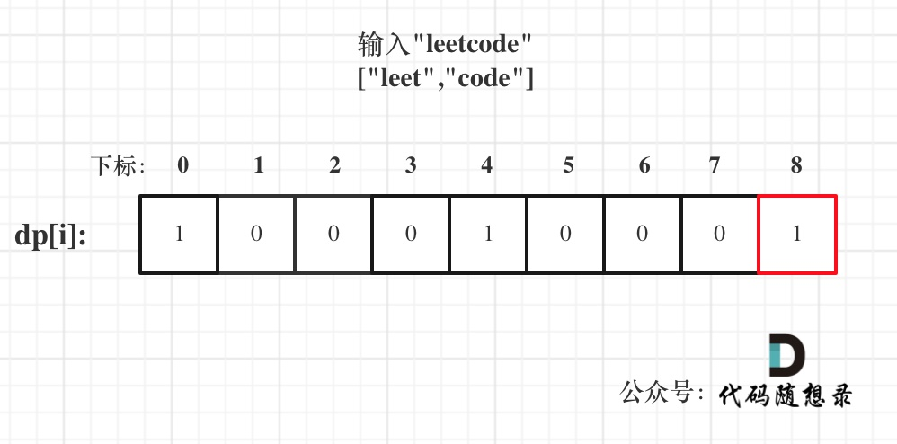

这题是会有顺序的嘛 第一感觉挺准的诶 就应该先遍历背包 再遍历物品

```js
var wordBreak = function(s, wordDict) {
    let dp = new Array(s.length+1).fill(false)
    dp[0] = true
    for(let i=0; i<=s.length; i++) {
        for(let j=0; j<wordDict.length; j++) {
            if(i >= wordDict[j].length) {
                if(dp[i-wordDict[j].length] && s.slice(i-wordDict[j].length, i) === wordDict[j])
                    dp[i] = true
            }
        }
    }
    return dp[s.length]
};
```

这题其实不难想诶，但还是看了题解再写的，可能难点在截取字符串再去比较那里吧😥，一开始还真的没有这种思路啊，学到了😏


---

### 18、打家劫舍

[198.打家劫舍](https://leetcode.cn/problems/house-robber/)

en我是一个专业小偷😎（狂酷拽


决定dp[i]的因素就是第i房间偷还是不偷。

如果偷第i房间，那么dp[i] = dp[i - 2] + nums[i] ，即：第i-1房一定是不考虑的，找出 下标i-2（包括i-2）以内的房屋，最多可以偷窃的金额为dp[i-2] 加上第i房间偷到的钱。

如果不偷第i房间，那么dp[i] = dp[i - 1]，即考 虑i-1房，（**注意这里是考虑，并不是一定要偷i-1房**）

然后dp[i]取最大值，即`dp[i] = max(dp[i - 2] + nums[i], dp[i - 1]);`

```js
var rob = function(nums) {
    let dp = new Array(nums.length)
    dp[0] = nums[0]
    dp[1] = Math.max(nums[0], nums[1])

    for(let i=2; i<nums.length; i++) {
        dp[i] = Math.max(dp[i-2]+nums[i], dp[i-1])
    }
    return dp[nums.length-1]
};
```

👉 初值稍微考虑一下就行了


### 19、打家劫舍 II

[213.打家劫舍 II](https://leetcode.cn/problems/house-robber-ii/)

跟上一题的区别，是成环了，做小偷的不易啊😗

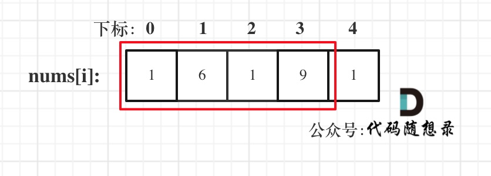


把上一题的逻辑抽成一个函数，分开两种情况考虑就行了，一种不考虑最后，一种不考虑最前，两种里取大的

```js
var rob = function(nums) {
    if(nums.length === 1) return nums[0]
    const nums1 = nums.slice(0, nums.length-1)
    const nums2 = nums.slice(1)
    var steal = function(nums) {
        let dp = new Array(nums.length)
        dp[0] = nums[0]
        dp[1] = Math.max(nums[0], nums[1])
        for(let i=2; i<nums.length; i++) {
            dp[i] = Math.max(dp[i-2]+nums[i], dp[i-1])
        }
        return dp[nums.length-1]
    }
    
    return Math.max(steal(nums1), steal(nums2))
};
```

我偷懒了，可能抽出来的函数加上start和end参数会更高端一点😐


### ✨ 整理一些字符串方法

心血来潮😉

> `str.concat()`   用来连接两个或多个字符串 - 但是直接用 `+` 连接更方便
>
> 
>
> `str.includes("字符串", (开始查找的起始位置))`   用来检查字符串中是否包含某个内容，有返回true，没有返回false
>
> `str.indexOf("字符串")`   有就返回第一次出现的位置 ✔
>
> `str.lastIndexOf("字符串")`   从后往前找
>
> 
>
> `str.startsWith("字符串")`   检查一个字符串是否以指定内容开头
>
> `str.endsWith("字符串")`   检查一个字符串是否以指定内容结尾
>
> 
>
> 对齐字符串：通过添加指定的内容，使字符串保持某个长度
>
> `str.padStart(保持的长度, 补充的内容)`
>
> `str.padEnd(保持的长度, 补充的内容)`
>
> 
>
> `str.replace("被替换的字符串", "去替换的字符串")`   使用一个新字符串替换*一个* 指定内容
>
> `str.replaceAll("被替换的字符串", "去替换的字符串")`   使用一个新字符串替换*所有* 指定内容
>
> 
>
> `str.slice(起始位置索引, 结束位置索引)`   对字符串进行切片【左闭右开】 ✔
>
> `str.substring(起始/结束位置索引, 结束/起始位置索引)`   截取字符串，聪明点会自动调其实和结束的位置
>
> `str.substr(起始位置索引, 数量)` ✔
>
> 
>
> `str.split("拆分标志")`   用来将一个字符串拆分为一个数组 ✔
>
> 和数组的 `数组名.join("")` 方法相反，join是把字符串数组连成一个字符串 ✔
>
> 
>
> `str.toLowerCase()`   将字符串转换为小写 ✔
>
> `str.toUpperCase()`   将字符串转换为大写
>
> 
>
> `str.trim()`   去除前后空格 ✔
>
> `str.trimStart()`   去除开始空格
>
> `str.trimEnd()`   去除结束空格


### 20、打家劫舍 III

[337.打家劫舍 III](https://leetcode.cn/problems/house-robber-iii/)

树形dp啊，那个树形贪心老难了（那题不管了

这题一定要后序遍历，还有就是如果当前节点不偷的话，左右孩子偷不偷无所谓的，取左右孩子里最大的相加就行了

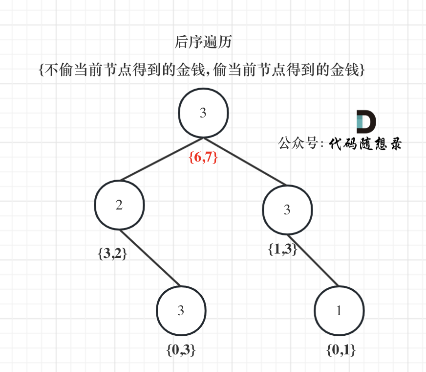

```js
var rob = function(root) {
    var traverse = function(cur) {
        if(!cur) return [0, 0]
        let left = traverse(cur.left)
        let right = traverse(cur.right)
        // 不偷
        let unsteal = Math.max(left[0], left[1]) + Math.max(right[0], right[1])
        // 偷
        let steal = cur.val + left[0] + right[0]
        return [unsteal, steal]
    }
    let res = traverse(root)
    return Math.max(...res)
};
```

👉 这题居然还好诶，就是得借助一个数组，记录一下偷和不偷

其他就是又稍稍复习了一下二叉树的递归遍历

取出数组最大元素：`Math.max(...res)`

赞👍


---


# 遗留的---

买股票的最佳时机一系列

https://programmercarl.com/0121.%E4%B9%B0%E5%8D%96%E8%82%A1%E7%A5%A8%E7%9A%84%E6%9C%80%E4%BD%B3%E6%97%B6%E6%9C%BA.html

最近手上基金还可以，找时机应该不成问题叭😏😏

哈哈不要毒奶，感觉贪心做也行的，有空我一定会回来的~


---


子序列问题~


### 21、最长递增子序列

[300.最长递增子序列](https://leetcode.cn/problems/longest-increasing-subsequence/)

外循环从第二个元素开始，内循环遍历外循环元素之前的所有元素

计算个数，懂！


```js
var lengthOfLIS = function(nums) {
    // 这里所有的初值肯定默认长度是1嘛
    let dp = new Array(nums.length).fill(1)
    if(nums.length === 1) return 1
    for(let i=1; i<nums.length; i++) {
        for(let j=0; j<i; j++) {
            if(nums[i] > nums[j])
                dp[i] = Math.max(dp[i], dp[j]+1)
        }
    }

    return Math.max(...dp)
};
```

👉 呀，这题踩坑了诶，最大值不一定是dp数组的最后一个元素呀


### 22、最长连续递增序列

[674. 最长连续递增序列](https://leetcode.cn/problems/longest-continuous-increasing-subsequence/)


```js
var findLengthOfLCIS = function(nums) {
    let dp = new Array(nums.length).fill(1)
    for(let i=1; i<nums.length; i++) {
        if(nums[i] > nums[i-1])
            dp[i] = dp[i-1] + 1
    }
    return Math.max(...dp)
};
```

👉 这题就更简单了啊，压根儿不用去管之前其他的了，只要管前一个就行了，循环一层就够了


### 23、最长重复子数组

[718. 最长重复子数组](https://leetcode.cn/problems/maximum-length-of-repeated-subarray/)

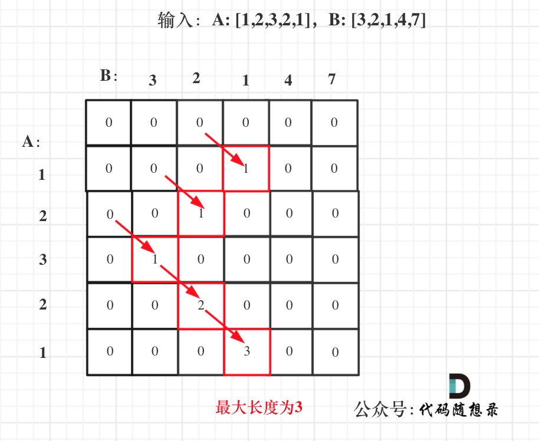

这里的子数组是连续的，脑子里有这张图就行了

```js
var findLength = function(nums1, nums2) {
    let len1 = nums1.length
    let len2 = nums2.length
    let dp = new Array(len1+1).fill().map(item => new Array(len2+1).fill(0))
    let res = 0
    for(let i=1; i<=len1; i++) {
        for(let j=1; j<=len2; j++) {
            if(nums1[i-1] === nums2[j-1]) {
                dp[i][j] = dp[i-1][j-1] + 1
            }
            if(dp[i][j] > res) res = dp[i][j]
        }
    }
    return res
};
```


### 24、最长公共子序列

[1143. 最长公共子序列](https://leetcode.cn/problems/longest-common-subsequence/)

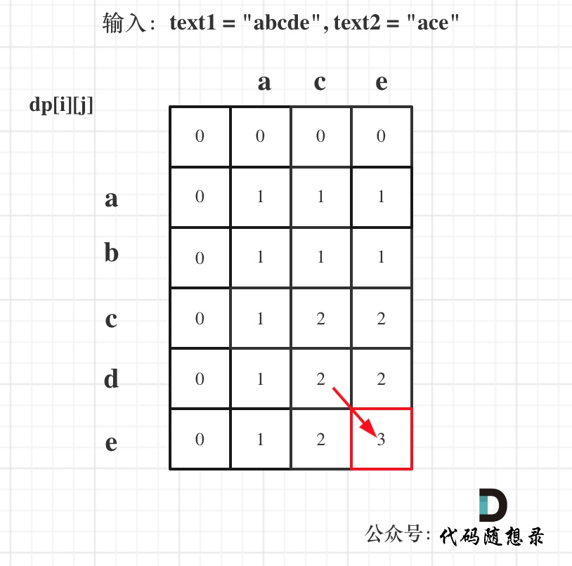

这道题可以不连续，所以当前的值还可以从上和下继承下来，图很重要啊

```js
var longestCommonSubsequence = function(text1, text2) {
    let len1 = text1.length
    let len2 = text2.length
    let dp = new Array(len1+1).fill().map(item => new Array(len2+1).fill(0))
    for(let i=1; i<=len1; i++) {
        for(let j=1; j<=len2; j++) {
            if(text1[i-1] === text2[j-1]) {
                dp[i][j] = dp[i-1][j-1] + 1
            } else {
                dp[i][j] = Math.max(dp[i-1][j], dp[i][j-1])
            }
        }
    }
    return dp[len1][len2]
};
```


### 25、不相交的线

[ 1035. 不相交的线](https://leetcode.cn/problems/uncrossed-lines/)

花里胡哨的 还强调顺序不相交

其实就是求最长公共子序列嘛

```js
var maxUncrossedLines = function(nums1, nums2) {
    let len1 = nums1.length
    let len2 = nums2.length
    let dp = new Array(len1+1).fill().map(item => new Array(len2+1).fill(0))
    for(let i=1; i<=len1; i++) {
        for(let j=1; j<=len2; j++) {
            if(nums1[i-1] === nums2[j-1]) {
                dp[i][j] = dp[i-1][j-1] + 1
            } else {
                dp[i][j] = Math.max(dp[i-1][j], dp[i][j-1])
            }
        }
    }
    return dp[len1][len2]
};
```


### 26、最大子序和

[53. 最大子序和](https://leetcode.cn/problems/maximum-subarray/)

怎么回事 我要叛变了 这题好像动规写起来也很顺手啊🤨

那我选动规了嘿嘿

```js
var maxSubArray = function(nums) {
    let dp = new Array(nums.length+1)
    dp[0] = nums[0]
    let res = nums[0]
    for(let i=1; i<nums.length; i++) {
        dp[i] = Math.max(nums[i], dp[i-1]+nums[i])
        if(dp[i] > res) res = dp[i]
    }
    return res
}
```


### 27、判断子序列

[392. 判断子序列](https://leetcode.cn/problems/is-subsequence/)

这题不纠结了，选贪心🥳

```js
var isSubsequence = function(s, t) {
    let i=0, j=0
    while(i<s.length && j<t.length) {
        if(s[i] === t[j]) {
            i++
        }
        j++
    }
    return i === s.length
};
```


### 28、不同的子序列

好好对比一下 23 和 24 ~

[115. 不同的子序列](https://leetcode.cn/problems/distinct-subsequences/)


这道题哦，有点难想的

👉 要分析两种情况

- s[i - 1] 与 t[j - 1]相等
- s[i - 1] 与 t[j - 1] 不相等

1️⃣ 当s[i - 1] 与 t[j - 1]相等时，`dp[i][j]`可以有两部分组成

一部分是用s[i - 1]来匹配，那么个数为`dp[i - 1][j - 1]`

一部分是不用s[i - 1]来匹配，个数为`dp[i - 1][j]`

​		前面如果有和s[i - 1]相同的，就可以不用s[i - 1]了

2️⃣ 当s[i - 1] 与 t[j - 1]不相等时，dp[i][j]只有一部分组成，不用s[i - 1]来匹配（就是模拟在s中删除这个元素），即：`dp[i - 1][j]`

👉 数组初始化也要好好思考，要匹配空串的话，肯定是会有一种方法，`dp[i][0]`一定都是1

`dp[0][j]`：空字符串s可以随便删除元素，出现以j-1为结尾的字符串t的个数，`dp[0][j]`一定都是0

`dp[0][0]`应该是1，空字符串s，可以删除0个元素，变成空字符串t

```js
var numDistinct = function(s, t) {
    let sLen = s.length
    let tLen = t.length
    let dp = new Array(sLen+1).fill().map(item => new Array(tLen+1).fill(0))
    for(let i=0; i<=sLen;i++) {
        dp[i][0] = 1
    }
    for(let i=1; i<=sLen; i++) {
        for(let j=1; j<=tLen; j++) {
            if(s[i-1] === t[j-1]) {
                // 这里包含着两种情况
                dp[i][j] = dp[i-1][j-1] + dp[i-1][j]
            } else {
                dp[i][j] = dp[i-1][j]
            }
        }
    }
    return dp[sLen][tLen]
};
```

真挺复杂的，不过是困难诶，可以悄咪咪……


### 29、两个字符串的删除操作

[583. 两个字符串的删除操作](https://leetcode.cn/problems/delete-operation-for-two-strings/)

反向思维嘛，就是求最长公共子序，然后减一减，哈哈 get！😎

```js
var minDistance = function(word1, word2) {
    // 先求最长公共子序
    let len1 = word1.length
    let len2 = word2.length
    let dp = new Array(len1+1).fill().map(item => new Array(len2+1).fill(0))
    for(let i=1; i<=len1; i++) {
        for(let j=1; j<=len2; j++) {
            if(word1[i-1] === word2[j-1]) {
                dp[i][j] = dp[i-1][j-1] + 1
            } else {
                dp[i][j] = Math.max(dp[i-1][j], dp[i][j-1])
            }
        }
    }
    return len1 + len2 - dp[len1][len2] * 2
};
```


---


# 遗留的---

[72.  编辑距离](https://leetcode.cn/problems/edit-distance/)

这题浅想了一下，有点复杂啊，困难，留着了


---


### 30、回文子串

[647. 回文子串](https://leetcode.cn/problems/palindromic-substrings/)


**从下到上，从左到右遍历**

就是这种感觉

👉 `dp[i][j]`：表示区间范围[i,j] （注意是左闭右闭）的子串是否是回文子串

👉 当s[i]与s[j]相等时：

- 情况一：下标i 与 j相同，同一个字符例如a，当然是回文子串
- 情况二：下标i 与 j相差为1，例如aa，也是回文子串
- 情况三：下标：i 与 j相差大于1的时候，例如cabac，此时s[i]与s[j]已经相同了，我们看i到j区间是不是回文子串就看aba是不是回文就可以了，那么aba的区间就是`dp[i + 1][j - 1]`是否为1

是一个上三角数组啊

eg：

|      | c    | b    | a    | b    | c    |
| ---- | ---- | ---- | ---- | ---- | ---- |
| c    | 1    | 0    | 0    | 0    | 1    |
| b    |      | 1    | 0    | 1    | 0    |
| a    |      |      | 1    | 0    | 0    |
| b    |      |      |      | 1    | 0    |
| c    |      |      |      |      | 1    |

```js
var countSubstrings = function(s) {
    let len = s.length
    let dp = new Array(len).fill().map(item => new Array(len).fill(0))
    let res = 0
    for(let i=len-1; i>=0; i--) {
        for(let j=i; j<len; j++) {
            if(s[i] === s[j]) {
                if(i-j <=1) {
                    dp[i][j] = 1
                } else if(dp[i+1][j-1]){
                    dp[i][j] = dp[i+1][j-1]
                }
                res++
            }
        }
    }
    return res
};
```

好吧，偷偷看题解了🥴

有点难想，抓住dp数组的定义叭


### 31、最长回文子序列

[516. 最长回文子序列](https://leetcode.cn/problems/longest-palindromic-subsequence/)


```js
var longestPalindromeSubseq = function(s) {
    let len = s.length
    let dp = new Array(len).fill().map(item => new Array(len).fill(0))
    for(let i=0; i<len; i++) {
        dp[i][i] = 1
    }
    for(let i=len; i>=0; i--) {
        for(let j=i+1; j<len; j++) {
            if(s[i] === s[j]) {
                dp[i][j] = dp[i+1][j-1] + 2
            } else {
                // 这里的下标注意一下
                dp[i][j] = Math.max(dp[i+1][j], dp[i][j-1])
            }
        }
    }
    return dp[0][len-1]
};
```

👉 经过上一题的迷糊，这题不要求连续了，还可以

这类题一定一定牢记dp的含义，就行了

**`dp[i][j]`：字符串s在[i, j]范围内最长的回文子序列的长度为`dp[i][j]`**

再注意一下不相等时的下标


---


# Mixedddd 😆

### 2023-2-17

[1. 两数之和](https://leetcode.cn/problems/two-sum/submissions/)

哦莫 第一题我居然没做过

这题说实话，暴力很香

虽然我转念一想 想到了哈希表

但还是踩坑了，当然不能先把数组遍历一遍放进去，再排序遍历输出下标，重复set会覆盖的呀 单纯

👉 遍历一遍就行了，匹配不上就放到map里，匹配上了直接返回

```js
// 1
var twoSum = function(nums, target) {
    let map = {}
    for(let i=0; i<nums.length; i++) {
        let curNum = nums[i]
        let targetNum = target - curNum
        let targetIndex = map[targetNum]
        if(targetIndex !== undefined) {
            return [targetIndex, i]
        } else {
            map[curNum] = i
        }
    }
};

// 2
var twoSum = function(nums, target) {
    let map = new Map()
    for(let i=0; i<nums.length; i++) {
        let curNum = nums[i]
        let targetNum = target - curNum
        let targetIndex = map.get(targetNum)
        if(targetIndex !== undefined) {
            return [targetIndex, i]
        } else {
            map.set(curNum, i)
        }
    }
};

```

map.get() 找不到 返回undefined


[15.三数之和](https://leetcode.cn/problems/3sum/)

居然能调那么久，救命啊🤯

👉 思路就是排个序，遍历数组（确定三元组中的一个），其他两个再靠双指针去找，注意一下去重的情况

```js
var threeSum = function(nums) {
    let res = []
    let len = nums.length
    nums.sort((a,b) => a-b)
    for(let i=0; i<len; i++) {
        let left = i+1
        let right = len -1
        if(i>0 && nums[i]===nums[i-1]) continue
        if(nums[i] > 0) break
        while(left < right) {
            let sum = nums[i] + nums[left] + nums[right]
            if(sum === 0) {
                res.push([nums[i], nums[left], nums[right]])
                while(left<right && nums[left]===nums[left+1]) left++
                while(left<right && nums[right]===nums[right-1]) right--
                left++
                right--
            } else if(sum < 0) {
                left++
            } else {
                right--
            }
        }
    }
    return res
};
```


### 2023-2-18

[18. 四数之和](https://leetcode.cn/problems/4sum/)

救命 终于！ 我好感动 wwww

思路跟上一题完全一样滴

```js
var fourSum = function(nums, target) {
    let res = []
    let len = nums.length
    nums.sort((a,b) => a-b)
    if(nums.length < 4) return []
    for(let i=0; i<len-3; i++) {
        if(i>0 && nums[i]===nums[i-1]) continue
        for(let j=i+1; j<len-2; j++) {
            if(j>i+1 && nums[j]===nums[j-1]) continue
            let left = j+1
            let right = len-1
            while(left < right) {
                let sum = nums[i] + nums[j] + nums[left] + nums[right]
                if(sum === target) {
                    res.push([nums[i], nums[j], nums[left], nums[right]])
                    while(left<right && nums[left]===nums[left+1]) left++
                    while(left<right && nums[right]===nums[right-1]) right--
                    left++
                    right--
                } else if(sum < target) {
                    left++
                } else {
                    right--
                }
            }
        }
    }
    return res
};
```


[199. 二叉树的右视图](https://leetcode.cn/problems/binary-tree-right-side-view/submissions/)

当然 这题要用我第二喜欢的层序遍历

队列队列队列！

```js
var rightSideView = function(root) {
    let res = []
    if(root === null) return res
    let queue = [root]
    while(queue.length) {
        let len = queue.length
        while(len--) {
            let cur = queue.shift()
            if(!len) res.push(cur.val)
            cur.left && queue.push(cur.left)
            cur.right && queue.push(cur.right)
        }
    }
    return res
};
```


[322.零钱兑换](https://leetcode.cn/problems/coin-change/)

还可以哦

就是那个无解的情况卡了一下下

完全背包呀~

```js
var coinChange = function(coins, amount) {
    if(amount === 0) return 0
    let dp = new Array(amount+1).fill(Infinity)
    dp[0] = 0
    for(let i=0; i<coins.length; i++) {
        for(let j=coins[i]; j<=amount; j++) {
            dp[j] = Math.min(dp[j], dp[j-coins[i]]+1)
        }
    }
    return dp[amount] === Infinity ? -1 : dp[amount]
};
```


### 2023-2-19

[141. 环形链表](https://leetcode.cn/problems/linked-list-cycle/)

链表找环就用快慢指针啊，欧克~

```js
var hasCycle = function(head) {
    if(head === null) return false
    // 快慢指针判断是否成环
    let slow = head, fast = head.next
    while(fast !== null && fast.next !==null) {
        slow = slow.next
        fast = fast.next.next
        if(slow === fast) return true
    }
    return false
};
```


[165. 比较版本号](https://leetcode.cn/problems/compare-version-numbers/)

这题看到那么多 . ，就能想到要split分割呀

然后parseInt一下，绝绝

```js
var compareVersion = function(version1, version2) {
    let nums1 = version1.split(".")
    let nums2 = version2.split(".")
    for(let i=0; i<nums1.length || i<nums2.length; i++) {
        let x = 0, y = 0
        if(i<nums1.length) {
            x = parseInt(nums1[i])
        }
        if(i<nums2.length) {
            y = parseInt(nums2[i])
        }
        if(x < y) {
            return -1
        } else if(x > y) {
            return 1
        }
    }
    return 0
};
```


[232. 用栈实现队列](https://leetcode.cn/problems/implement-queue-using-stacks/)

这题太绝了啊

用数组当栈，只能使用push和pop方法

其实就是用push和pop去实现push和unshift叭

所以需要一个倒序

inStack 用来push

在pop和peak的时候，都要先把inStack里的移到outStack里

```js
var MyQueue = function() {
    this.inStack = []
    this.outStack = []
};

/** 
 * @param {number} x
 * @return {void}
 */
MyQueue.prototype.push = function(x) {
    this.inStack.push(x)
};

/**
 * @return {number}
 */
MyQueue.prototype.pop = function() {
    if(!this.outStack.length) {
        this.in2out()
    }
    return this.outStack.pop()
};

/**
 * @return {number}
 */
MyQueue.prototype.peek = function() {
    if(!this.outStack.length) {
        this.in2out()
    }
    return this.outStack[this.outStack.length-1]
};

/**
 * @return {boolean}
 */
MyQueue.prototype.empty = function() {
    return this.inStack.length === 0 && this.outStack.length === 0
};

// 换个顺序
MyQueue.prototype.in2out = function() {
    while(this.inStack.length) {
        this.outStack.push(this.inStack.pop())
    }
}

/**
 * Your MyQueue object will be instantiated and called as such:
 * var obj = new MyQueue()
 * obj.push(x)
 * var param_2 = obj.pop()
 * var param_3 = obj.peek()
 * var param_4 = obj.empty()
 */
```


### 2023-2-20

[2. 两数相加](https://leetcode.cn/problems/add-two-numbers/)

复习一波

const dummy 哑结点

let p 游标

js 和 c++不一样啊，除法要取整！勿忘

```js
var addTwoNumbers = function(l1, l2) {
    const dummy = new ListNode(-1)
    let p = dummy
    let v1 = l1, v2 = l2
    // 记录进位
    let pre = 0
    while(v1 !== null || v2 !== null || pre > 0) {
        let val = 0
        if(v1 !== null) {
            pre += v1.val
            v1 = v1.next
        } 
        if(v2 !== null) {
            pre += v2.val
            v2 = v2.next
        }
        val = pre % 10
        pre = Math.floor(pre / 10)
        p.next = new ListNode(val)
        p = p.next
    }
    return dummy.next
};
```


[20. 有效的括号](https://leetcode.cn/problems/valid-parentheses/)

嘿嘿 又复习了一下map的妙用

```js
var isValid = function(s) {
    // 利用map来找对应的括号
    let pairs = new Map([
        [')', '('],
        ['}', '{'],
        [']', '['],
    ])
    // 利用数组来模拟栈
    let stack = []
    for(let c of s) {
        if(pairs.has(c)) {
            // 右括号
            if(pairs.get(c) !== stack[stack.length-1]) {
                return false
            }
            stack.pop()
        } else {
            // 左括号都进栈
            stack.push(c)
        }
    }
    return stack.length === 0
};
```


[912.排序数组](https://leetcode.cn/problems/sort-an-array/)

- **归并排序**

反正就是很奇怪 用两个while就超时

用展开运算符就行诶

... 确实nb

```js
var sortArray = function(nums) {
    let len = nums.length
    if(len < 2) return nums
    let mid = Math.floor(nums.length / 2)
    let left = nums.slice(0, mid)
    let right = nums.slice(mid)
    return merge(sortArray(left), sortArray(right))
}

var merge = function(left, right) {
    let res = []
    while(left.length && right.length) {
        if(left[0] <= right[0]) {
            res.push(left.shift())
        } else {
            res.push(right.shift())
        }
    }
    // while(left.length) {
    //     res.push(left.shift())
    // }
    // while(right.length) {
    //     res.push(right.shift())
    // }

    res.push(...left, ...right)
    return res
}
```


### 2023-2-21

### 🌟 js 交换数组中的两个元素可以这样写：

1、救了个大命，es6解构赋值啊

```js
if(nums[j] < nums[j-1]) {
    [nums[j-1], nums[j]] = [nums[j], nums[j-1]]
}
```

2、splice

`array.splice(index1, 1 , array[index2])` 会将index1位置上的元素替换为index2位置的元素，同时返回[array[index1]]

3、temp


[排序概况](https://www.conardli.top/docs/algorithm/%E6%8E%92%E5%BA%8F/%E6%8E%92%E5%BA%8F.html)


[912.排序数组](https://leetcode.cn/problems/sort-an-array/)

- **冒泡排序**

从后往前，两两比较，一次往前冒（想发科的信技课www）

加个flag优化一下，但还是超时诶🤨

```js
var sortArray = function (nums) {
    let len = nums.length
    for(let i=0; i<len-1; i++) {
        let flag = true
        for(let j=len-1; j>i; j--) {
            if(nums[j] < nums[j-1]) {
                [nums[j-1], nums[j]] = [nums[j], nums[j-1]]
                flag = false
            }
        }
        if(flag) {
            break
        }
    }
    return nums
}
```


- **选择排序**

逐个比较，找到最小，一次完成对调

```js
var sortArray = function (nums) {
    let len = nums.length
    for(let i=0; i<len-1; i++) {
        let minIndex = i
        for(let j=i+1; j<len; j++) {
            if(nums[j] < nums[minIndex]) {
                minIndex = j
            }
        }
        [nums[i], nums[minIndex]] = [nums[minIndex], nums[i]]
    }
    return nums
}
```


- **插入排序**

左侧有序，右侧一个一个往左边去找位置插入

换完位置，target也要换啊！

```js
var sortArray = function (nums) {
    let len = nums.length
    for(let i=1; i<len; i++) {
        let target = i
        for(let j=i-1; j>=0; j--) {
            if(nums[target] < nums[j]) {
                [nums[target], nums[j]] = [nums[j], nums[target]]
                // 这步一定要的呀
                target = j
            } else {
                break
            }
        }
    }
    return nums
}
```


ohno这段时间哇

可以调整过来！🥺

明天再来一遍好嘛

还有堆 和 快排


