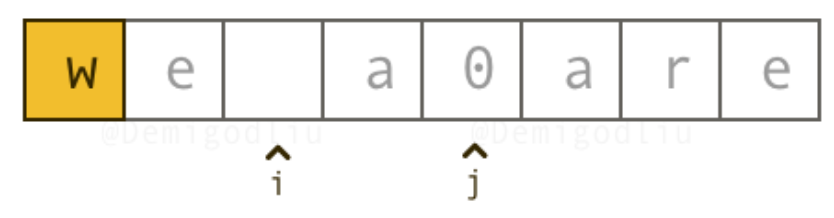
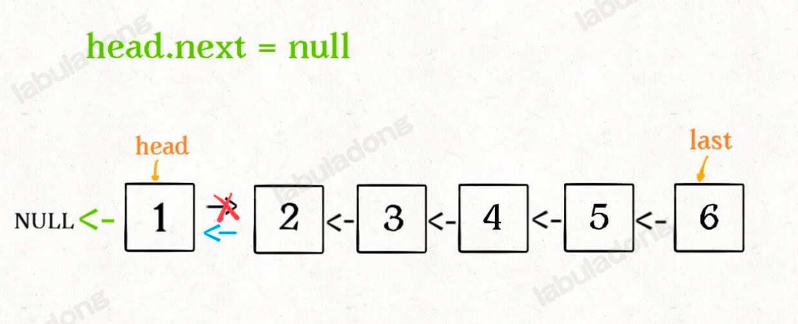

# 2023.7.2

[剑指 Offer 05. 替换空格](https://leetcode.cn/problems/ti-huan-kong-ge-lcof/) 【简单】

请实现一个函数，把字符串 `s` 中的每个空格替换成"%20"。



```js
var replaceSpace = function(s) {
    s = s.split('')
    let originLen = s.length
    count = 0
    for (let i of s) {
        if(i === ' ') count++
    }
    let newLen = originLen + count*2
    for(let i=originLen-1, j=newLen-1; i>=0; i--, j--) {
        if(s[i] === ' ') {
            s[j] = '0'
            s[j-1] = '2'
            s[j-2] = '%'
            j -=2
        } else {
            s[j] = s[i]
        }
    }
    return s.join('')
};
```

```js
var replaceSpace = function(s) {
    return s.split(' ').join('%20')
};
```

```js
var replaceSpace = function(s) {
    let newS = ''
    for (let i of s) {
        if(i === ' ') {
            newS += '%20'
        } else {
            newS += i
        }
    }
    return newS
};
```


# 2023.7.3

[剑指 Offer 58 - II. 左旋转字符串](https://leetcode.cn/problems/zuo-xuan-zhuan-zi-fu-chuan-lcof/) 【简单】

字符串的左旋转操作是把字符串前面的若干个字符转移到字符串的尾部。请定义一个函数实现字符串左旋转操作的功能。比如，输入字符串"abcdefg"和数字2，该函数将返回左旋转两位得到的结果"cdefgab"。

```javascript
var reverseLeftWords = function(s, n) {
    let len = s.length
    s = s+s
    return s.slice(n, n+len)
};
```

```javascript
var reverseLeftWords = function(s, n) {
    return s.slice(n) + s.slice(0,n)
};
```


[剑指 Offer 20. 表示数值的字符串](https://leetcode.cn/problems/biao-shi-shu-zhi-de-zi-fu-chuan-lcof/) 【中等】

请实现一个函数用来判断字符串是否表示数值（包括整数和小数）。

- 数值（按顺序）可以分成以下几个部分：

若干空格
一个 小数 或者 整数
（可选）一个 'e' 或 'E' ，后面跟着一个 整数
若干空格

- 小数（按顺序）可以分成以下几个部分：

（可选）一个符号字符（'+' 或 '-'）
下述格式之一：
至少一位数字，后面跟着一个点 '.'
至少一位数字，后面跟着一个点 '.' ，后面再跟着至少一位数字
一个点 '.' ，后面跟着至少一位数字

- 整数（按顺序）可以分成以下几个部分：

（可选）一个符号字符（'+' 或 '-'）
至少一位数字

- 部分数值列举如下：

["+100", "5e2", "-123", "3.1416", "-1E-16", "0123"]

- 部分非数值列举如下：

["12e", "1a3.14", "1.2.3", "+-5", "12e+5.4"]

```javascript
var isNumber = function(s) {
    let numFlag = false, dotFlag = false, eFlag = false
    s = s.trim()
    for(let i=0; i<s.length; i++) {
        if(s[i]>='0' && s[i]<='9') {
            numFlag = true
        } else if(s[i]==='.' && !dotFlag && !eFlag) {
            dotFlag = true
        } else if((s[i]==='e' || s[i]==='E') && !eFlag && numFlag) {
            eFlag = true
            numFlag = false // e后面必有数字
        } else if((s[i]==='+' || s[i]==='-') && (i===0 || s[i-1]==='e' || s[i-1]==='E')) {
            continue
        } else {
            return false
        }
    }
    return numFlag
};
```

暴力枚举


# 2023.7.4

[剑指 Offer 67. 把字符串转换成整数](https://leetcode.cn/problems/ba-zi-fu-chuan-zhuan-huan-cheng-zheng-shu-lcof/) 【中等】

写一个函数 StrToInt，实现把字符串转换成整数这个功能。不能使用 atoi 或者其他类似的库函数。

首先，该函数会根据需要丢弃无用的开头空格字符，直到寻找到第一个非空格的字符为止。

当我们寻找到的第一个非空字符为正或者负号时，则将该符号与之后面尽可能多的连续数字组合起来，作为该整数的正负号；假如第一个非空字符是数字，则直接将其与之后连续的数字字符组合起来，形成整数。

该字符串除了有效的整数部分之后也可能会存在多余的字符，这些字符可以被忽略，它们对于函数不应该造成影响。

注意：假如该字符串中的第一个非空格字符不是一个有效整数字符、字符串为空或字符串仅包含空白字符时，则你的函数不需要进行转换。

在任何情况下，若函数不能进行有效的转换时，请返回 0。

说明：

假设我们的环境只能存储 32 位大小的有符号整数，那么其数值范围为 [−231,  231 − 1]。如果数值超过这个范围，请返回  INT_MAX (231 − 1) 或 INT_MIN (−231) 。

```javascript
var strToInt = function(str) {
    str = str.trim()
    let len = 0, flag = 1, start = 0, res=0
    if(str[0]==='-' || str[0]==='+') {
        start = 1
        if(str[0]==='-') {
            flag = -1
        }
    } else if(str[0]<'0' || str[0]>'9') {
        return 0
    }
    for(let i=start; i<=str.length; i++) {
        if(str[i]>='0' && str[i]<='9') {
            if(len<1 && str[i]==='0') start++
            else len++
        } else {
            break
        }
    }
    if(len>=1) res = flag*(str.slice(start,start+len))
    if(res>Math.pow(2,31)-1) return Math.pow(2,31)-1
    else if(res<-Math.pow(2,31)) return -Math.pow(2,31)
    return res
};
```

暴力枚举


[206. 反转链表](https://leetcode.cn/problems/reverse-linked-list/) 【简单】

给你单链表的头节点 `head` ，请你反转链表，并返回反转后的链表。



```javascript
/**
 * Definition for singly-linked list.
 * function ListNode(val, next) {
 *     this.val = (val===undefined ? 0 : val)
 *     this.next = (next===undefined ? null : next)
 * }
 */
/**
 * @param {ListNode} head
 * @return {ListNode}
 */
var reverseList = function(head) {
    if(head === null || head.next === null) {
        return head
    }
    let last = reverseList(head.next)
    head.next.next = head
    head.next = null
    return last
};
```

又是你！可以


# 2023.7.5

[剑指 Offer 06. 从尾到头打印链表](https://leetcode.cn/problems/cong-wei-dao-tou-da-yin-lian-biao-lcof/) 【简单】

输入一个链表的头节点，从尾到头反过来返回每个节点的值（用数组返回）。

```javascript
/**
 * Definition for singly-linked list.
 * function ListNode(val) {
 *     this.val = val;
 *     this.next = null;
 * }
 */
/**
 * @param {ListNode} head
 * @return {number[]}
 */
var reversePrint = function(head) {
    let res = []
    while(head!==null) {
        res.unshift(head.val)
        head = head.next
    }
    return res
};
```

唯一区别，这里需要返回的是一个数组


❗️[剑指 Offer 35. 复杂链表的复制](https://leetcode.cn/problems/fu-za-lian-biao-de-fu-zhi-lcof/) 【中等】 😱🤯我不会❗️救

请实现 copyRandomList 函数，复制一个复杂链表。在复杂链表中，每个节点除了有一个 next 指针指向下一个节点，还有一个 random 指针指向链表中的任意节点或者 null。

```javascript
 * // Definition for a Node.
 * function Node(val, next, random) {
 *    this.val = val;
 *    this.next = next;
 *    this.random = random;
 * };
 */

/**
 * @param {Node} head
 * @return {Node}
 */
var copyRandomList = function(head, cachedNode=new Map()) {
    if (head === null) {
        return null;
    }
    if (!cachedNode.has(head)) {
        cachedNode.set(head, {val: head.val}), Object.assign(cachedNode.get(head), {next: copyRandomList(head.next, cachedNode), random: copyRandomList(head.random, cachedNode)})
    }
    return cachedNode.get(head)
};
```


# 2023.7.6

[剑指 Offer 03. 数组中重复的数字](https://leetcode.cn/problems/shu-zu-zhong-zhong-fu-de-shu-zi-lcof/) 【简单】

找出数组中重复的数字。


在一个长度为 n 的数组 nums 里的所有数字都在 0～n-1 的范围内。数组中某些数字是重复的，但不知道有几个数字重复了，也不知道每个数字重复了几次。请找出数组中任意一个重复的数字。

```javascript
var findRepeatNumber = function(nums) {
    let map = new Map()
    for (let i of nums) {
        if(map.has(i)) return i
        map.set(i,1)
    }
    return
};
```


[剑指 Offer 53 - I. 在排序数组中查找数字 I](https://leetcode.cn/problems/zai-pai-xu-shu-zu-zhong-cha-zhao-shu-zi-lcof/) 【简单】

统计一个数字在排序数组中出现的次数。

```javascript
/**
 * @param {number[]} nums
 * @param {number} target
 * @return {number}
 */
var search = function(nums, target) {
    function searchleftBinary(nums, target) {
        let left = 0, right = nums.length-1
        while(left<=right) {
            let mid = left+Math.floor((right-left)/2)
            if(nums[mid] === target) {
                right = mid -1
            } else if(nums[mid] < target) {
                left = mid + 1
            } else {
                right = mid - 1
            }
        }
        return left
    }
    let left = searchleftBinary(nums, target)
    if(nums[left] === target) {
        for(let i = left; i<=nums.length; i++) {
            if(nums[i] !== target) {
            return i - left
            }
        }
    }
    return 0
};
```

也可以在定义一个找有边界的函数


[剑指 Offer 53 - II. 0～n-1中缺失的数字](https://leetcode.cn/problems/que-shi-de-shu-zi-lcof/) 【简单】

一个长度为n-1的递增排序数组中的所有数字都是唯一的，并且每个数字都在范围0～n-1之内。在范围0～n-1内的n个数字中有且只有一个数字不在该数组中，请找出这个数字。

```javascript
/**
 * @param {number[]} nums
 * @return {number}
 */
var missingNumber = function(nums) {
    let left = 0, right = nums.length-1
    while (left <= right) {
        let mid = left + Math.floor((right-left)/2)
        if(nums[mid] <= mid) {
            left = mid + 1
        } else if (nums[mid] > mid) {
            right = mid - 1
        }
    }
    return left
};
```


# 2023.7.7

[剑指 Offer 04. 二维数组中的查找](https://leetcode.cn/problems/er-wei-shu-zu-zhong-de-cha-zhao-lcof/) 【中等】

在一个 n * m 的二维数组中，每一行都按照从左到右 非递减 的顺序排序，每一列都按照从上到下 非递减 的顺序排序。请完成一个高效的函数，输入这样的一个二维数组和一个整数，判断数组中是否含有该整数。

[
  [1,   4,  7, 11, 15],
  [2,   5,  8, 12, 19],
  [3,   6,  9, 16, 22],
  [10, 13, 14, 17, 24],
  [18, 21, 23, 26, 30]
]
给定 target = 5，返回 true

给定 target = 20，返回 false

```javascript
/**
 * @param {number[][]} matrix
 * @param {number} target
 * @return {boolean}
 */
var findNumberIn2DArray = function(matrix, target) {
    let m = matrix.length, n = matrix[0]?.length
    let x = 0, y = n - 1
    while(x<m && y>=0) {
        if(matrix[x][y] === target) {
            return true
        } else if(matrix[x][y] > target) {
            y--
        } else {
            x++
        }
    }
    return false
};
```


[剑指 Offer 11. 旋转数组的最小数字](https://leetcode.cn/problems/xuan-zhuan-shu-zu-de-zui-xiao-shu-zi-lcof/) 【简单】

把一个数组最开始的若干个元素搬到数组的末尾，我们称之为数组的旋转。

给你一个可能存在 重复 元素值的数组 numbers ，它原来是一个升序排列的数组，并按上述情形进行了一次旋转。请返回旋转数组的最小元素。例如，数组 [3,4,5,1,2] 为 [1,2,3,4,5] 的一次旋转，该数组的最小值为 1。  

注意，数组 [a[0], a[1], a[2], ..., a[n-1]] 旋转一次 的结果为数组 [a[n-1], a[0], a[1], a[2], ..., a[n-2]] 。

```javascript
/**
 * @param {number[]} numbers
 * @return {number}
 */
var minArray = function(numbers) {
    let left = 0, right = numbers.length-1
    while(left < right) {
        let mid = left + Math.floor((right - left)/2)
        if(numbers[mid] < numbers[right]) {
            right = mid
        } else if(numbers[mid] > numbers[right]) {
            left = mid + 1
        } else {
            right -= 1
        }
    }
    return numbers[left]
};
```

这题真还得想想


# 2023.7.8

[剑指 Offer 50. 第一个只出现一次的字符](https://leetcode.cn/problems/di-yi-ge-zhi-chu-xian-yi-ci-de-zi-fu-lcof/) 【简单】

在字符串 s 中找出第一个只出现一次的字符。如果没有，返回一个单空格。 s 只包含小写字母。

```javascript
/**
 * @param {string} s
 * @return {character}
 */
var firstUniqChar = function(s) {
    let map = new Map()
    let len = s.length
    for(let [i,ch] of Array.from(s).entries()) {
        if(map.has(ch)) {
            map.set(ch, -1)
        } else {
            map.set(ch, i)
        }
    }
    let first = len
    for(let index of map.values()) {
        if(index !== -1 && index<first) {
            first = index
        }
    }
    return first===len ? ' ' :s[first]
};
```

怎么这里还可以用lodash的呀

```javascript
var firstUniqChar = function(s) {
    const frequency = _.countBy(s);
    for (const ch of s) {
        if (frequency[ch] === 1) {
            return ch;
        }
    }
    return ' ';
};
```


[剑指 Offer 32 - I. 从上到下打印二叉树](https://leetcode.cn/problems/cong-shang-dao-xia-da-yin-er-cha-shu-lcof/) 【简单】

从上到下打印出二叉树的每个节点，同一层的节点按照从左到右的顺序打印。

```javascript
/**
 * Definition for a binary tree node.
 * function TreeNode(val) {
 *     this.val = val;
 *     this.left = this.right = null;
 * }
 */
/**
 * @param {TreeNode} root
 * @return {number[]}
 */
var levelOrder = function(root) {
    let res  = []
    if(root === null) return res
    let queue = [root]
    while(queue.length) {
        let n = queue.length
        while(n--) {
            let cur = queue.shift()
            res.push(cur.val)
            cur.left && queue.push(cur.left)
            cur.right && queue.push(cur.right)
        }
    }
    return res
};
```

就是喜欢层次遍历


# 2023.7.9

[剑指 Offer 32 - II. 从上到下打印二叉树 II](https://leetcode.cn/problems/cong-shang-dao-xia-da-yin-er-cha-shu-ii-lcof/) 【简单】

从上到下按层打印二叉树，同一层的节点按从左到右的顺序打印，每一层打印到一行。

```javascript
/**
 * Definition for a binary tree node.
 * function TreeNode(val) {
 *     this.val = val;
 *     this.left = this.right = null;
 * }
 */
/**
 * @param {TreeNode} root
 * @return {number[][]}
 */
var levelOrder = function(root) {
    let res = []
    if(root === null) return res
    let queue = [root]
    while(queue.length) {
        let n = queue.length
        let level = []
        while(n--) {
            let cur = queue.shift()
            level.push(cur.val)
            cur.left && queue.push(cur.left) 
            cur.right && queue.push(cur.right) 
        }
        res.push(level)
    }
    return res
};
```


[剑指 Offer 32 - III. 从上到下打印二叉树 III](https://leetcode.cn/problems/cong-shang-dao-xia-da-yin-er-cha-shu-iii-lcof/) 【简单】

请实现一个函数按照之字形顺序打印二叉树，即第一行按照从左到右的顺序打印，第二层按照从右到左的顺序打印，第三行再按照从左到右的顺序打印，其他行以此类推。

```javascript
/**
 * Definition for a binary tree node.
 * function TreeNode(val) {
 *     this.val = val;
 *     this.left = this.right = null;
 * }
 */
/**
 * @param {TreeNode} root
 * @return {number[][]}
 */
var levelOrder = function(root) {
    let res = []
    let isLeft = true
    if(root === null) return res
    let queue = [root]
    while(queue.length) {
        let n = queue.length
        let level = []
        while(n--) {
            let cur = queue.shift()
            if(isLeft) {
                level.push(cur.val)
            } else {
                level.unshift(cur.val)
            }
            cur.left && queue.push(cur.left)
            cur.right && queue.push(cur.right)
        }
        res.push(level)
        isLeft = !isLeft
    }
    return res
};
```


[剑指 Offer 26. 树的子结构](https://leetcode.cn/problems/shu-de-zi-jie-gou-lcof/) 【中等】

输入两棵二叉树A和B，判断B是不是A的子结构。(约定空树不是任意一个树的子结构)

B是A的子结构， 即 A中有出现和B相同的结构和节点值。

```javascript
/**
 * Definition for a binary tree node.
 * function TreeNode(val) {
 *     this.val = val;
 *     this.left = this.right = null;
 * }
 */
/**
 * @param {TreeNode} A
 * @param {TreeNode} B
 * @return {boolean}
 */
var isSubStructure = function(A, B) {
    if(!A || !B) return false
    function dfs(A, B) {
        if(B === null) return true
        return A ? A.val===B.val && dfs(A.left, B.left) && dfs(A.right, B.right):false
    }
    return dfs(A,B) || isSubStructure(A.left, B) || isSubStructure(A.right, B)
};
```

❗️看了题解的


# 2023.7.10

[剑指 Offer 27. 二叉树的镜像](https://leetcode.cn/problems/er-cha-shu-de-jing-xiang-lcof/) 【简单】

请完成一个函数，输入一个二叉树，该函数输出它的镜像。

```javascript
/**
 * Definition for a binary tree node.
 * function TreeNode(val) {
 *     this.val = val;
 *     this.left = this.right = null;
 * }
 */
/**
 * @param {TreeNode} root
 * @return {TreeNode}
 */
var mirrorTree = function(root) {
    if(root === null) return null
    let left = mirrorTree(root.left)
    let right = mirrorTree(root.right)
    root.left = right
    root.right = left
    return root
};
```


[剑指 Offer 28. 对称的二叉树](https://leetcode.cn/problems/dui-cheng-de-er-cha-shu-lcof/) 【中等】

请实现一个函数，用来判断一棵二叉树是不是对称的。如果一棵二叉树和它的镜像一样，那么它是对称的。

```javascript
/**
 * Definition for a binary tree node.
 * function TreeNode(val) {
 *     this.val = val;
 *     this.left = this.right = null;
 * }
 */
/**
 * @param {TreeNode} root
 * @return {boolean}
 */
var isSymmetric = function(root) {
    return check(root, root)
    function check(left, right) {
        if(left === null && right === null) return true
        else if(left === null || right === null) return false
        return left.val===right.val && check(left.left,right.right) && check(left.right, right.left)
    }
};
```


# 2023.7.11

[剑指 Offer 12. 矩阵中的路径](https://leetcode.cn/problems/ju-zhen-zhong-de-lu-jing-lcof/) 【中等】

给定一个 m x n 二维字符网格 board 和一个字符串单词 word 。如果 word 存在于网格中，返回 true ；否则，返回 false 。

单词必须按照字母顺序，通过相邻的单元格内的字母构成，其中“相邻”单元格是那些水平相邻或垂直相邻的单元格。同一个单元格内的字母不允许被重复使用。


```javascript
/**
 * @param {character[][]} board
 * @param {string} word
 * @return {boolean}
 */
var exist = function(board, word) {
    function dfs(i, j, k) {
        if(i>=m || i<0 || j>=n || j<0 || board[i][j]!==word[k]) {
            return false
        } else if(k === word.length-1) {
            return true
        }
        board[i][j] = ''
        let res = dfs(i+1, j, k+1) || dfs(i-1, j, k+1) || dfs(i, j+1, k+1) || dfs(i, j-1, k+1)
        board[i][j] = word[k]
        return res
    }
    let m = board.length, n = board[0].length
    for(let i=0; i<m; i++) {
        for(let j=0; j<n; j++) {
            if(dfs(i, j, 0)) {
                return true
            }
        }
    }
    return false
};
```


# 2023.7.12

[剑指 Offer 13. 机器人的运动范围](https://leetcode.cn/problems/ji-qi-ren-de-yun-dong-fan-wei-lcof/) 【中等】

地上有一个m行n列的方格，从坐标 [0,0] 到坐标 [m-1,n-1] 。一个机器人从坐标 [0, 0] 的格子开始移动，它每次可以向左、右、上、下移动一格（不能移动到方格外），也不能进入行坐标和列坐标的数位之和大于k的格子。例如，当k为18时，机器人能够进入方格 [35, 37] ，因为3+5+3+7=18。但它不能进入方格 [35, 38]，因为3+5+3+8=19。请问该机器人能够到达多少个格子？

```javascript
/**
 * @param {number} m
 * @param {number} n
 * @param {number} k
 * @return {number}
 */
var movingCount = function(m, n, k) {
    let visited = Array(m).fill().map(()=> Array(n).fill(false))
    function sum(n) {
        return n % 10 + Math.floor(n/10)
    }
    function dfs(i, j){
        if(i>=m || j>=n || sum(i)+sum(j)>k || visited[i][j]) {
            return 0
        } else {
            visited[i][j] = true
            return dfs(i+1, j) + dfs(i, j+1) + 1
        }
    }
    return dfs(0, 0)
};
```


[剑指 Offer 42. 连续子数组的最大和](https://leetcode.cn/problems/lian-xu-zi-shu-zu-de-zui-da-he-lcof/) 【简单】

输入一个整型数组，数组中的一个或连续多个整数组成一个子数组。求所有子数组的和的最大值。

要求时间复杂度为O(n)。

```javascript
/**
 * @param {number[]} nums
 * @return {number}
 */
var maxSubArray = function(nums) {
    let res = 0, max = nums[0]
    for(let num of nums) {
        res += num
        if(res > max) max = res
        if(res<0) res = 0
    }
    return max
};
```


# 2023.7.13

[剑指 Offer 39. 数组中出现次数超过一半的数字](https://leetcode.cn/problems/shu-zu-zhong-chu-xian-ci-shu-chao-guo-yi-ban-de-shu-zi-lcof/) 【简单】

数组中有一个数字出现的次数超过数组长度的一半，请找出这个数字。

你可以假设数组是非空的，并且给定的数组总是存在多数元素。

```javascript
/**
 * @param {number[]} nums
 * @return {number}
 */
var majorityElement = function(nums) {
    let len = Math.floor(nums.length / 2)+1
    let map = new Map()
    for(let num of nums) {
        if(map.has(num)) {
            let cur = map.get(num)+1
            if(cur >= len) return num
            map.set(num, cur)
        } else {
            map.set(num, 1)
        }
    }
    return nums[0]
};
```


[剑指 Offer 66. 构建乘积数组](https://leetcode.cn/problems/gou-jian-cheng-ji-shu-zu-lcof/) 【中等】

给定一个数组 A[0,1,…,n-1]，请构建一个数组 B[0,1,…,n-1]，其中 B[i] 的值是数组 A 中除了下标 i 以外的元素的积, 即 B[i]=A[0]×A[1]×…×A[i-1]×A[i+1]×…×A[n-1]。不能使用除法。

```javascript
/**
 * @param {number[]} a
 * @return {number[]}
 */
var constructArr = function(a) {
    let prefix = [1], suffix = [], res = []
    suffix[a.length-1] = 1
    for(let i=1; i<a.length; i++) {
        prefix[i] = a[i-1] * prefix[i-1]
    }
    for(let i=a.length-2; i>=0; i--) {
        suffix[i] = a[i+1] * suffix[i+1]
    }
    for(let i=0; i<a.length; i++) {
        res[i] = prefix[i] * suffix[i]
    }
    return res
};
```

这个真的有意思啊 前缀和&后缀和


# 2023.7.14

[剑指 Offer 29. 顺时针打印矩阵](https://leetcode.cn/problems/shun-shi-zhen-da-yin-ju-zhen-lcof/) 【简单】

输入一个矩阵，按照从外向里以顺时针的顺序依次打印出每一个数字。

```javascript
/**
 * @param {number[][]} matrix
 * @return {number[]}
 */
var spiralOrder = function(matrix) {
    let res = []
    if(!matrix.length) return res
    let left = 0, right = matrix[0].length-1, top = 0, bottom = matrix.length-1
    while(left<=right && top<=bottom) {
        for(let i=left; i<=right; i++) {
            res.push(matrix[top][i])
        }
        for(let i=top+1; i<=bottom; i++) {
            res.push(matrix[i][right])
        }
        if(left<right && top<bottom) {
            for(let i=right-1; i>=left; i--) {
                res.push(matrix[bottom][i])
            }
            for(let i=bottom-1; i>=top+1; i--) {
                res.push(matrix[i][top])
            }
        }
        [left, right, top, bottom] = [left+1, right-1, top+1, bottom-1]
    }
    return res
};
```

举个例子就出来了😎


[剑指 Offer 61. 扑克牌中的顺子](https://leetcode.cn/problems/bu-ke-pai-zhong-de-shun-zi-lcof/) 【简单】

从若干副扑克牌中随机抽 5 张牌，判断是不是一个顺子，即这5张牌是不是连续的。2～10为数字本身，A为1，J为11，Q为12，K为13，而大、小王为 0 ，可以看成任意数字。A 不能视为 14。

```javascript
/**
 * @param {number[]} nums
 * @return {boolean}
 */
var isStraight = function(nums) {
    let set = new Set()
    let max = -Infinity, min = Infinity
    for(let num of nums) {
        if(num === 0) {
            continue
        } else {
            if(set.has(num)) {
                return false
            }
            set.add(num)
        }
        max = Math.max(max, num)
        min = Math.min(min, num)
    }
    return (max-min) <= 4
};
```


# 2023.7.15

[剑指 Offer 45. 把数组排成最小的数](https://leetcode.cn/problems/ba-shu-zu-pai-cheng-zui-xiao-de-shu-lcof/) 【中等】

输入一个非负整数数组，把数组里所有数字拼接起来排成一个数，打印能拼接出的所有数字中最小的一个。

```javascript
/**
 * @param {number[]} nums
 * @return {string}
 */
var minNumber = function(nums) {
    nums = nums.sort((a,b) => {
        return Number(String(a)+b) - Number(String(b)+a)
    })
    return nums.join("")
};
```


[剑指 Offer 47. 礼物的最大价值](https://leetcode.cn/problems/li-wu-de-zui-da-jie-zhi-lcof/) 【中等】

在一个 m*n 的棋盘的每一格都放有一个礼物，每个礼物都有一定的价值（价值大于 0）。你可以从棋盘的左上角开始拿格子里的礼物，并每次向右或者向下移动一格、直到到达棋盘的右下角。给定一个棋盘及其上面的礼物的价值，请计算你最多能拿到多少价值的礼物？

```javascript
/**
 * @param {number[][]} grid
 * @return {number}
 */
var maxValue = function(grid) {
    const m = grid.length, n = grid[0].length
    const res = new Array(m).fill(0).map(() => new Array(n).fill(0))
    for (let i = 0; i < m; i++) {
        for (let j = 0; j < n; j++) {
            if (i > 0) {
                res[i][j] = res[i - 1][j]
            }
            if (j > 0) {
                res[i][j] = Math.max(res[i][j], res[i][j - 1])
            }
            res[i][j] += grid[i][j]
        }
    }
    return res[m - 1][n - 1]
};
```


# 2023.7.16

[剑指 Offer 55 - I. 二叉树的深度](https://leetcode.cn/problems/er-cha-shu-de-shen-du-lcof/) 【简单】

输入一棵二叉树的根节点，求该树的深度。从根节点到叶节点依次经过的节点（含根、叶节点）形成树的一条路径，最长路径的长度为树的深度。

```javascript
/**
 * Definition for a binary tree node.
 * function TreeNode(val) {
 *     this.val = val;
 *     this.left = this.right = null;
 * }
 */
/**
 * @param {TreeNode} root
 * @return {number}
 */
var maxDepth = function(root) {
    let depth = 0
    if(root === null) return depth
    let queue = [root]
    while(queue.length) {
        let num = queue.length
        depth++
        while(num--) {
            let cur = queue.shift()
            cur.left && queue.push(cur.left)
            cur.right && queue.push(cur.right)
        }
    }
    return depth
};
```


[剑指 Offer 54. 二叉搜索树的第k大节点](https://leetcode.cn/problems/er-cha-sou-suo-shu-de-di-kda-jie-dian-lcof/) 【简单】

给定一棵二叉搜索树，请找出其中第 `k` 大的节点的值。

```javascript
/**
 * Definition for a binary tree node.
 * function TreeNode(val) {
 *     this.val = val;
 *     this.left = this.right = null;
 * }
 */
/**
 * @param {TreeNode} root
 * @param {number} k
 * @return {number}
 */
var kthLargest = function(root, k) {
    let res = []
    let queue = [root]
    while(queue.length) {
        let num = queue.length
        while(num--) {
            let cur = queue.shift()
            res.push(cur.val)
            cur.left && queue.push(cur.left)
            cur.right && queue.push(cur.right)
        }
    }
    res.sort((a,b) => b-a)
    return res[k-1]
};
```


[剑指 Offer 10- II. 青蛙跳台阶问题](https://leetcode.cn/problems/qing-wa-tiao-tai-jie-wen-ti-lcof/) 【简单】

一只青蛙一次可以跳上1级台阶，也可以跳上2级台阶。求该青蛙跳上一个 n 级的台阶总共有多少种跳法。

答案需要取模 1e9+7（1000000007），如计算初始结果为：1000000008，请返回 1。

```javascript
/**
 * @param {number} n
 * @return {number}
 */
var numWays = function(n) {
    if(n <= 1) return 1
    let dp = new Array(3)
    dp[1] = 1
    dp[2] = 2
    for(let i=3; i<=n; i++) {
        let sum = (dp[1] + dp[2]) % 1000000007
        dp[1] = dp[2]
        dp[2] = sum
    }
    return dp[2]
};
```


# 2023.7.17

[剑指 Offer 34. 二叉树中和为某一值的路径](https://leetcode.cn/problems/er-cha-shu-zhong-he-wei-mou-yi-zhi-de-lu-jing-lcof/) 【中等】

给你二叉树的根节点 root 和一个整数目标和 targetSum ，找出所有 从根节点到叶子节点 路径总和等于给定目标和的路径。

```javascript
/**
 * Definition for a binary tree node.
 * function TreeNode(val, left, right) {
 *     this.val = (val===undefined ? 0 : val)
 *     this.left = (left===undefined ? null : left)
 *     this.right = (right===undefined ? null : right)
 * }
 */
/**
 * @param {TreeNode} root
 * @param {number} target
 * @return {number[][]}
 */
var pathSum = function(root, target) {
    let res = []
    function dfs(root, count, nums) {
        if(root) {
            count += root.val
            nums = [...nums, root.val]
            if(count === target && !root.right && !root.left) {
                res.push(nums)
            }
            dfs(root.left, count, nums)
            dfs(root.right, count, nums)
        }
    }
    dfs(root, 0, [])
    return res
};
```

还卡挺久

区别：

`nums.push(root.val) ` ❌

`nums` 是一个引用，每次递归调用都会向 `nums` 数组中添加当前节点的值 `root.val`。然后将这个 `nums` 数组直接添加到 `res` 数组中，所以最终 `res` 数组会包含指向相同 `nums` 引用的多个数组，而这些数组的值会根据递归调用的变化而变化。

`nums = [...nums, root.val]` ☑️

每次递归调用都会创建一个新的 `nums` 数组


# 2023.7.18

[剑指 Offer 55 - II. 平衡二叉树](https://leetcode.cn/problems/ping-heng-er-cha-shu-lcof/) 【简单】

输入一棵二叉树的根节点，判断该树是不是平衡二叉树。如果某二叉树中任意节点的左右子树的深度相差不超过1，那么它就是一棵平衡二叉树。

```javascript
/**
 * Definition for a binary tree node.
 * function TreeNode(val) {
 *     this.val = val;
 *     this.left = this.right = null;
 * }
 */
/**
 * @param {TreeNode} root
 * @return {boolean}
 */
var isBalanced = function(root) {
    function getDepth(node) {
        if(node === null) return 0
        let leftDepth = getDepth(node.left)
        if(leftDepth === -1) return -1
        let rightDepth = getDepth(node.right)
        if(rightDepth === -1) return -1 
        if(Math.abs(leftDepth - rightDepth) > 1) return -1
        else return Math.max(leftDepth, rightDepth)+1
    }
    return !(getDepth(root) === -1)
};

```


[剑指 Offer 64. 求1+2+…+n](https://leetcode.cn/problems/qiu-12n-lcof/) 【中等】

求 `1+2+...+n` ，要求不能使用乘除法、for、while、if、else、switch、case等关键字及条件判断语句（A?B:C）。

```javascript
/**
 * @param {number} n
 * @return {number}
 */
var sumNums = function(n) {
    return n===0 ? 0 : n + sumNums(n-1)
};
```


# 2023.7.20

[剑指 Offer 68 - I. 二叉搜索树的最近公共祖先](https://leetcode.cn/problems/er-cha-sou-suo-shu-de-zui-jin-gong-gong-zu-xian-lcof/) 【简单】

给定一个二叉搜索树, 找到该树中两个指定节点的最近公共祖先。

百度百科中最近公共祖先的定义为：“对于有根树 T 的两个结点 p、q，最近公共祖先表示为一个结点 x，满足 x 是 p、q 的祖先且 x 的深度尽可能大（一个节点也可以是它自己的祖先）。”

```javascript
/**
 * Definition for a binary tree node.
 * function TreeNode(val) {
 *     this.val = val;
 *     this.left = this.right = null;
 * }
 */
/**
 * @param {TreeNode} root
 * @param {TreeNode} p
 * @param {TreeNode} q
 * @return {TreeNode}
 */
var lowestCommonAncestor = function(root, p, q) {
    if(p.val === q.val) {
        return q
    }
    while(root) {
        if(q.val < root.val && p.val < root.val) {
            root = root.left
        } else if(q.val > root.val && p.val > root.val) {
            root = root.right
        } else {
            return root
        }
    }
};
```

就看这俩啥时候分道扬镳呗


[剑指 Offer 68 - II. 二叉树的最近公共祖先](https://leetcode.cn/problems/er-cha-shu-de-zui-jin-gong-gong-zu-xian-lcof/) 【简单】

给定一个二叉树, 找到该树中两个指定节点的最近公共祖先。

百度百科中最近公共祖先的定义为：“对于有根树 T 的两个结点 p、q，最近公共祖先表示为一个结点 x，满足 x 是 p、q 的祖先且 x 的深度尽可能大（一个节点也可以是它自己的祖先）。”

```javascript
/**
 * Definition for a binary tree node.
 * function TreeNode(val) {
 *     this.val = val;
 *     this.left = this.right = null;
 * }
 */
/**
 * @param {TreeNode} root
 * @param {TreeNode} p
 * @param {TreeNode} q
 * @return {TreeNode}
 */
var lowestCommonAncestor = function(root, p, q) {
    if(root === null) return null
    if(root === q || root === p) return root
    let left = lowestCommonAncestor(root.left, p, q)
    let right = lowestCommonAncestor(root.right, p, q)
    if(left === null && right === null) {
        return null
    } else if(left !== null && right !== null) {
        return root
    }
    return left === null ? right : left
};
```

这个还是有点儿难想的


# 2023.7.22

[剑指 Offer 40. 最小的k个数](https://leetcode.cn/problems/zui-xiao-de-kge-shu-lcof/) 【简单】

输入整数数组 `arr` ，找出其中最小的 `k` 个数。例如，输入4、5、1、6、2、7、3、8这8个数字，则最小的4个数字是1、2、3、4。

```javascript
/**
 * @param {number[]} arr
 * @param {number} k
 * @return {number[]}
 */
var getLeastNumbers = function(arr, k) {
    arr.sort((a,b) => a-b)
    return arr.slice(0, k)
};
```


[剑指 Offer 10- I. 斐波那契数列](https://leetcode.cn/problems/fei-bo-na-qi-shu-lie-lcof/) 【简单】

写一个函数，输入 n ，求斐波那契（Fibonacci）数列的第 n 项（即 F(N)）。斐波那契数列的定义如下：

F(0) = 0,   F(1) = 1
F(N) = F(N - 1) + F(N - 2), 其中 N > 1.
斐波那契数列由 0 和 1 开始，之后的斐波那契数就是由之前的两数相加而得出。

答案需要取模 1e9+7（1000000007），如计算初始结果为：1000000008，请返回 1。

```javascript
/**
 * @param {number} n
 * @return {number}
 */
var fib = function(n) {
    let p = 0, q = 1
    if(n<=1) return n
    for(let i=2; i<=n; i++) {
        let sum = (p + q) % 1000000007
        p = q
        q = sum
    }
    return q
};
```

递归居然超时


[剑指 Offer 63. 股票的最大利润](https://leetcode.cn/problems/gu-piao-de-zui-da-li-run-lcof/) 【简单】

假设把某股票的价格按照时间先后顺序存储在数组中，请问买卖该股票**一次**可能获得的最大利润是多少？

```javascript
/**
 * @param {number[]} prices
 * @return {number}
 */
var maxProfit = function(prices) {
    let res = 0, minPrice = prices[0]
    for(let price of prices) {
        minPrice = Math.min(minPrice, price)
        res = Math.max(res, price-minPrice)
    }
    return res
};
```


[剑指 Offer 48. 最长不含重复字符的子字符串](https://leetcode.cn/problems/zui-chang-bu-han-zhong-fu-zi-fu-de-zi-zi-fu-chuan-lcof/) 【中等】

请从字符串中找出一个最长的不包含重复字符的子字符串，计算该最长子字符串的长度。

```javascript
/**
 * @param {string} s
 * @return {number}
 */
var lengthOfLongestSubstring = function(s) {
    let left = 0, right = 0, res = 0
    let map = new Map()
    while(right < s.length) {
        let cur = s[right]
        right++
        if(map.has(cur)) {
            map.set(cur, map.get(cur)+1)
        } else {
            map.set(cur, 1)
        }
        while(map.get(cur) > 1) {
            let leftCur = s[left]
            left++
            map.set(leftCur, map.get(leftCur)-1)
        }
        res = Math.max(right-left, res)
    }
    return res
};
```

滑动窗口


# 2023.7.23

[剑指 Offer 38. 字符串的排列](https://leetcode.cn/problems/zi-fu-chuan-de-pai-lie-lcof/) 【中等】

输入一个字符串，打印出该字符串中字符的所有排列。

你可以以任意顺序返回这个字符串数组，但里面不能有重复元素。

```javascript
/**
 * @param {string} s
 * @return {string[]}
 */
var permutation = function(s) {
    let res = [], path = []
    s = Array.from(s)
    s.sort((a,b) => a.charCodeAt() - b.charCodeAt())
    function backTracking(nums, len, used) {
        if(path.length === len) res.push(path.join(''))
        for(let i=0; i<len; i++) {
            if(i>0 && nums[i]===nums[i-1] && !used[i-1] || used[i]) continue
            path.push(nums[i])
            used[i] = true
            backTracking(nums, nums.length, used)
            path.pop()
            used[i] = false
        }
    }
    backTracking(s, s.length, [])
    return res
};
```

注意一下字符串排序 用 `charCodeAt()`

这是包含重复元素的全排列 😖


[剑指 Offer 49. 丑数](https://leetcode.cn/problems/chou-shu-lcof/) 【中等】

我们把只包含质因子 2、3 和 5 的数称作丑数（Ugly Number）。求按从小到大的顺序的第 n 个丑数。

```javascript
/**
 * @param {number} n
 * @return {number}
 */
var nthUglyNumber = function(n) {
    let ugly = new Array(n+1)
    let p=1, p2 = 1, p3 = 1, p5 = 1
    let product2 = 1, product3 = 1, product5 = 1
    while(p <= n) {
        let min = Math.min(product2, Math.min(product3, product5))
        ugly[p++] = min
        if(min === product2) {
            product2 = 2 * ugly[p2++]
        } 
        if(min === product3) {
            product3 = 3 * ugly[p3++]
        }
         if(min === product5) {
            product5 = 5 * ugly[p5++]
        }
    }
    return ugly[n]
};
```

看作三个链表，判断得是并列的if 🫣


# 2023.7.24

[46. 全排列](https://leetcode.cn/problems/permutations/) 【中等】

给定一个不含重复数字的数组 `nums` ，返回其 *所有可能的全排列* 。你可以 **按任意顺序** 返回答案。

```javascript
/**
 * @param {number} n
 * @return {number[]}
 */
var dicesProbability = function(n) {
    let res = new Array(n+1).fill().map(()=> new Array(n*6+1).fill(0))
    // 肯定先有一个初始值嘛
    for(let j=1; j<=6; j++) {
        res[1][j] = 1/6.0
    }
    for(let i=2; i<=n; i++) {
        for(let j=i; j<=6*n; j++) {
            for(let k=1; k<=6; k++) {
                if(j - k > 0) res[i][j] += res[i-1][j-k]/6.0
            }
        }
    }
    return res[n].splice(n)
};
```

不含重复元素


# 2023.7.25

[剑指 Offer 46. 把数字翻译成字符串](https://leetcode.cn/problems/ba-shu-zi-fan-yi-cheng-zi-fu-chuan-lcof/) 【中等】

给定一个数字，我们按照如下规则把它翻译为字符串：0 翻译成 “a” ，1 翻译成 “b”，……，11 翻译成 “l”，……，25 翻译成 “z”。一个数字可能有多个翻译。请编程实现一个函数，用来计算一个数字有多少种不同的翻译方法。

```javascript
/**
 * @param {number} num
 * @return {number}
 */
var translateNum = function(num) {
    let str = num.toString()
    let len = str.length
    // dp[i] 表示第i-1个元素拥有的多少种不同翻译方法
    let dp = new Array(str.length+1).fill(0)
    dp[0] = 1, dp[1] = 1
    for(let i=2; i<=len; i++) {
        let first = str[i-2], second = str[i-1]
        if(second<='9' && second>='0') {
            dp[i] += dp[i-1]
        }
        if(first==='1' || first==='2' && second <= '5') {
            dp[i] += dp[i-2]
        }
    }
    return dp[len]
};
```

只要数字就行了


[剑指 Offer 07. 重建二叉树](https://leetcode.cn/problems/zhong-jian-er-cha-shu-lcof/) 【中等】

输入某二叉树的前序遍历和中序遍历的结果，请构建该二叉树并返回其根节点。

假设输入的前序遍历和中序遍历的结果中都不含重复的数字。

```javascript
/**
 * Definition for a binary tree node.
 * function TreeNode(val) {
 *     this.val = val;
 *     this.left = this.right = null;
 * }
 */
/**
 * @param {number[]} preorder
 * @param {number[]} inorder
 * @return {TreeNode}
 */
var buildTree = function(preorder, inorder) {
    if(preorder.length === 0) {
        return null
    }
    const index = inorder.findIndex(item => item===preorder[0])
    return {
        val: preorder[0],
        left: buildTree(preorder.slice(1, index+1), inorder.slice(0, index)),
        right: buildTree(preorder.slice(index+1), inorder.slice(index+1))
    }
};
```


[剑指 Offer 16. 数值的整数次方](https://leetcode.cn/problems/shu-zhi-de-zheng-shu-ci-fang-lcof/) 【中等】

实现 [pow(*x*, *n*)](https://www.cplusplus.com/reference/valarray/pow/) ，即计算 x 的 n 次幂函数（即，xn）。不得使用库函数，同时不需要考虑大数问题。

```javascript
/**
 * @param {number} x
 * @param {number} n
 * @return {number}
 */
var myPow = function(x, n) {
    if(n === 0) return 1
    if(n < 0) {
        return myPow(1/x, -n)
    }
    if(n % 2 === 1) {
        return x * myPow(x, n-1)
    } else {
        let sub = myPow(x, n/2)
        return sub * sub
    }
};
```


# 2023.7.26

[剑指 Offer 18. 删除链表的节点](https://leetcode.cn/problems/shan-chu-lian-biao-de-jie-dian-lcof/) 【简单】

给定单向链表的头指针和一个要删除的节点的值，定义一个函数删除该节点。

返回删除后的链表的头节点

```javascript
/**
 * Definition for singly-linked list.
 * function ListNode(val) {
 *     this.val = val;
 *     this.next = null;
 * }
 */
/**
 * @param {ListNode} head
 * @param {number} val
 * @return {ListNode}
 */
var deleteNode = function(head, val) {
    let dummy = new ListNode(-1)
    let q = dummy
    let p = head // 原数组
    while(p !== null) {
        if(p.val !== val) {
            q.next = p
            q = q.next
        }
        let temp = p.next
        p.next = null
        p = temp
    }
    return dummy.next
};
```


