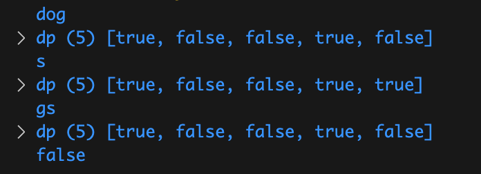

# 2023.7.2

[剑指 Offer 05. 替换空格](https://leetcode.cn/problems/ti-huan-kong-ge-lcof/) 【简单】

请实现一个函数，把字符串 `s` 中的每个空格替换成"%20"。


```js
var replaceSpace = function(s) {
    s = s.split('')
    let originLen = s.length
    count = 0
    for (let i of s) {
        if(i === ' ') count++
    }
    let newLen = originLen + count*2
    for(let i=originLen-1, j=newLen-1; i>=0; i--, j--) {
        if(s[i] === ' ') {
            s[j] = '0'
            s[j-1] = '2'
            s[j-2] = '%'
            j -=2
        } else {
            s[j] = s[i]
        }
    }
    return s.join('')
};
```

```js
var replaceSpace = function(s) {
    return s.split(' ').join('%20')
};
```

```js
var replaceSpace = function(s) {
    let newS = ''
    for (let i of s) {
        if(i === ' ') {
            newS += '%20'
        } else {
            newS += i
        }
    }
    return newS
};
```


# 2023.7.3

[剑指 Offer 58 - II. 左旋转字符串](https://leetcode.cn/problems/zuo-xuan-zhuan-zi-fu-chuan-lcof/) 【简单】

字符串的左旋转操作是把字符串前面的若干个字符转移到字符串的尾部。请定义一个函数实现字符串左旋转操作的功能。比如，输入字符串"abcdefg"和数字2，该函数将返回左旋转两位得到的结果"cdefgab"。

```javascript
var reverseLeftWords = function(s, n) {
    let len = s.length
    s = s+s
    return s.slice(n, n+len)
};
```

```javascript
var reverseLeftWords = function(s, n) {
    return s.slice(n) + s.slice(0,n)
};
```


[剑指 Offer 20. 表示数值的字符串](https://leetcode.cn/problems/biao-shi-shu-zhi-de-zi-fu-chuan-lcof/) 【中等】

请实现一个函数用来判断字符串是否表示数值（包括整数和小数）。

- 数值（按顺序）可以分成以下几个部分：

若干空格
一个 小数 或者 整数
（可选）一个 'e' 或 'E' ，后面跟着一个 整数
若干空格

- 小数（按顺序）可以分成以下几个部分：

（可选）一个符号字符（'+' 或 '-'）
下述格式之一：
至少一位数字，后面跟着一个点 '.'
至少一位数字，后面跟着一个点 '.' ，后面再跟着至少一位数字
一个点 '.' ，后面跟着至少一位数字

- 整数（按顺序）可以分成以下几个部分：

（可选）一个符号字符（'+' 或 '-'）
至少一位数字

- 部分数值列举如下：

["+100", "5e2", "-123", "3.1416", "-1E-16", "0123"]

- 部分非数值列举如下：

["12e", "1a3.14", "1.2.3", "+-5", "12e+5.4"]

```javascript
var isNumber = function(s) {
    let numFlag = false, dotFlag = false, eFlag = false
    s = s.trim()
    for(let i=0; i<s.length; i++) {
        if(s[i]>='0' && s[i]<='9') {
            numFlag = true
        } else if(s[i]==='.' && !dotFlag && !eFlag) {
            dotFlag = true
        } else if((s[i]==='e' || s[i]==='E') && !eFlag && numFlag) {
            eFlag = true
            numFlag = false // e后面必有数字
        } else if((s[i]==='+' || s[i]==='-') && (i===0 || s[i-1]==='e' || s[i-1]==='E')) {
            continue
        } else {
            return false
        }
    }
    return numFlag
};
```

暴力枚举


# 2023.7.4

[剑指 Offer 67. 把字符串转换成整数](https://leetcode.cn/problems/ba-zi-fu-chuan-zhuan-huan-cheng-zheng-shu-lcof/) 【中等】

写一个函数 StrToInt，实现把字符串转换成整数这个功能。不能使用 atoi 或者其他类似的库函数。

首先，该函数会根据需要丢弃无用的开头空格字符，直到寻找到第一个非空格的字符为止。

当我们寻找到的第一个非空字符为正或者负号时，则将该符号与之后面尽可能多的连续数字组合起来，作为该整数的正负号；假如第一个非空字符是数字，则直接将其与之后连续的数字字符组合起来，形成整数。

该字符串除了有效的整数部分之后也可能会存在多余的字符，这些字符可以被忽略，它们对于函数不应该造成影响。

注意：假如该字符串中的第一个非空格字符不是一个有效整数字符、字符串为空或字符串仅包含空白字符时，则你的函数不需要进行转换。

在任何情况下，若函数不能进行有效的转换时，请返回 0。

说明：

假设我们的环境只能存储 32 位大小的有符号整数，那么其数值范围为 [−231,  231 − 1]。如果数值超过这个范围，请返回  INT_MAX (231 − 1) 或 INT_MIN (−231) 。

```javascript
var strToInt = function(str) {
    str = str.trim()
    let len = 0, flag = 1, start = 0, res=0
    if(str[0]==='-' || str[0]==='+') {
        start = 1
        if(str[0]==='-') {
            flag = -1
        }
    } else if(str[0]<'0' || str[0]>'9') {
        return 0
    }
    for(let i=start; i<=str.length; i++) {
        if(str[i]>='0' && str[i]<='9') {
            if(len<1 && str[i]==='0') start++
            else len++
        } else {
            break
        }
    }
    if(len>=1) res = flag*(str.slice(start,start+len))
    if(res>Math.pow(2,31)-1) return Math.pow(2,31)-1
    else if(res<-Math.pow(2,31)) return -Math.pow(2,31)
    return res
};
```

暴力枚举


[206. 反转链表](https://leetcode.cn/problems/reverse-linked-list/) 【简单】

给你单链表的头节点 `head` ，请你反转链表，并返回反转后的链表。


```javascript
/**
 * Definition for singly-linked list.
 * function ListNode(val, next) {
 *     this.val = (val===undefined ? 0 : val)
 *     this.next = (next===undefined ? null : next)
 * }
 */
/**
 * @param {ListNode} head
 * @return {ListNode}
 */
var reverseList = function(head) {
    if(head === null || head.next === null) {
        return head
    }
    let last = reverseList(head.next)
    head.next.next = head
    head.next = null
    return last
};
```

又是你！可以


# 2023.7.5

[剑指 Offer 06. 从尾到头打印链表](https://leetcode.cn/problems/cong-wei-dao-tou-da-yin-lian-biao-lcof/) 【简单】

输入一个链表的头节点，从尾到头反过来返回每个节点的值（用数组返回）。

```javascript
/**
 * Definition for singly-linked list.
 * function ListNode(val) {
 *     this.val = val;
 *     this.next = null;
 * }
 */
/**
 * @param {ListNode} head
 * @return {number[]}
 */
var reversePrint = function(head) {
    let res = []
    while(head!==null) {
        res.unshift(head.val)
        head = head.next
    }
    return res
};
```

唯一区别，这里需要返回的是一个数组


❗️[剑指 Offer 35. 复杂链表的复制](https://leetcode.cn/problems/fu-za-lian-biao-de-fu-zhi-lcof/) 【中等】 😱🤯我不会❗️救

请实现 copyRandomList 函数，复制一个复杂链表。在复杂链表中，每个节点除了有一个 next 指针指向下一个节点，还有一个 random 指针指向链表中的任意节点或者 null。

```javascript
 * // Definition for a Node.
 * function Node(val, next, random) {
 *    this.val = val;
 *    this.next = next;
 *    this.random = random;
 * };
 */

/**
 * @param {Node} head
 * @return {Node}
 */
var copyRandomList = function(head, cachedNode=new Map()) {
    if (head === null) {
        return null;
    }
    if (!cachedNode.has(head)) {
        cachedNode.set(head, {val: head.val}), Object.assign(cachedNode.get(head), {next: copyRandomList(head.next, cachedNode), random: copyRandomList(head.random, cachedNode)})
    }
    return cachedNode.get(head)
};
```


# 2023.7.6

[剑指 Offer 03. 数组中重复的数字](https://leetcode.cn/problems/shu-zu-zhong-zhong-fu-de-shu-zi-lcof/) 【简单】

找出数组中重复的数字。


在一个长度为 n 的数组 nums 里的所有数字都在 0～n-1 的范围内。数组中某些数字是重复的，但不知道有几个数字重复了，也不知道每个数字重复了几次。请找出数组中任意一个重复的数字。

```javascript
var findRepeatNumber = function(nums) {
    let map = new Map()
    for (let i of nums) {
        if(map.has(i)) return i
        map.set(i,1)
    }
    return
};
```


[剑指 Offer 53 - I. 在排序数组中查找数字 I](https://leetcode.cn/problems/zai-pai-xu-shu-zu-zhong-cha-zhao-shu-zi-lcof/) 【简单】

统计一个数字在排序数组中出现的次数。

```javascript
/**
 * @param {number[]} nums
 * @param {number} target
 * @return {number}
 */
var search = function(nums, target) {
    function searchleftBinary(nums, target) {
        let left = 0, right = nums.length-1
        while(left<=right) {
            let mid = left+Math.floor((right-left)/2)
            if(nums[mid] === target) {
                right = mid -1
            } else if(nums[mid] < target) {
                left = mid + 1
            } else {
                right = mid - 1
            }
        }
        return left
    }
    let left = searchleftBinary(nums, target)
    if(nums[left] === target) {
        for(let i = left; i<=nums.length; i++) {
            if(nums[i] !== target) {
            return i - left
            }
        }
    }
    return 0
};
```

也可以在定义一个找有边界的函数


[剑指 Offer 53 - II. 0～n-1中缺失的数字](https://leetcode.cn/problems/que-shi-de-shu-zi-lcof/) 【简单】

一个长度为n-1的递增排序数组中的所有数字都是唯一的，并且每个数字都在范围0～n-1之内。在范围0～n-1内的n个数字中有且只有一个数字不在该数组中，请找出这个数字。

```javascript
/**
 * @param {number[]} nums
 * @return {number}
 */
var missingNumber = function(nums) {
    let left = 0, right = nums.length-1
    while (left <= right) {
        let mid = left + Math.floor((right-left)/2)
        if(nums[mid] <= mid) {
            left = mid + 1
        } else if (nums[mid] > mid) {
            right = mid - 1
        }
    }
    return left
};
```


# 2023.7.7

[剑指 Offer 04. 二维数组中的查找](https://leetcode.cn/problems/er-wei-shu-zu-zhong-de-cha-zhao-lcof/) 【中等】

在一个 n * m 的二维数组中，每一行都按照从左到右 非递减 的顺序排序，每一列都按照从上到下 非递减 的顺序排序。请完成一个高效的函数，输入这样的一个二维数组和一个整数，判断数组中是否含有该整数。

[
  [1,   4,  7, 11, 15],
  [2,   5,  8, 12, 19],
  [3,   6,  9, 16, 22],
  [10, 13, 14, 17, 24],
  [18, 21, 23, 26, 30]
]
给定 target = 5，返回 true

给定 target = 20，返回 false

```javascript
/**
 * @param {number[][]} matrix
 * @param {number} target
 * @return {boolean}
 */
var findNumberIn2DArray = function(matrix, target) {
    let m = matrix.length, n = matrix[0]?.length
    let x = 0, y = n - 1
    while(x<m && y>=0) {
        if(matrix[x][y] === target) {
            return true
        } else if(matrix[x][y] > target) {
            y--
        } else {
            x++
        }
    }
    return false
};
```


[剑指 Offer 11. 旋转数组的最小数字](https://leetcode.cn/problems/xuan-zhuan-shu-zu-de-zui-xiao-shu-zi-lcof/) 【简单】

把一个数组最开始的若干个元素搬到数组的末尾，我们称之为数组的旋转。

给你一个可能存在 重复 元素值的数组 numbers ，它原来是一个升序排列的数组，并按上述情形进行了一次旋转。请返回旋转数组的最小元素。例如，数组 [3,4,5,1,2] 为 [1,2,3,4,5] 的一次旋转，该数组的最小值为 1。  

注意，数组 [a[0], a[1], a[2], ..., a[n-1]] 旋转一次 的结果为数组 [a[n-1], a[0], a[1], a[2], ..., a[n-2]] 。

```javascript
/**
 * @param {number[]} numbers
 * @return {number}
 */
var minArray = function(numbers) {
    let left = 0, right = numbers.length-1
    while(left < right) {
        let mid = left + Math.floor((right - left)/2)
        if(numbers[mid] < numbers[right]) {
            right = mid
        } else if(numbers[mid] > numbers[right]) {
            left = mid + 1
        } else {
            right -= 1
        }
    }
    return numbers[left]
};
```

这题真还得想想


# 2023.7.8

[剑指 Offer 50. 第一个只出现一次的字符](https://leetcode.cn/problems/di-yi-ge-zhi-chu-xian-yi-ci-de-zi-fu-lcof/) 【简单】

在字符串 s 中找出第一个只出现一次的字符。如果没有，返回一个单空格。 s 只包含小写字母。

```javascript
/**
 * @param {string} s
 * @return {character}
 */
var firstUniqChar = function(s) {
    let map = new Map()
    let len = s.length
    for(let [i,ch] of Array.from(s).entries()) {
        if(map.has(ch)) {
            map.set(ch, -1)
        } else {
            map.set(ch, i)
        }
    }
    let first = len
    for(let index of map.values()) {
        if(index !== -1 && index<first) {
            first = index
        }
    }
    return first===len ? ' ' :s[first]
};
```

怎么这里还可以用lodash的呀

```javascript
var firstUniqChar = function(s) {
    const frequency = _.countBy(s);
    for (const ch of s) {
        if (frequency[ch] === 1) {
            return ch;
        }
    }
    return ' ';
};
```


[剑指 Offer 32 - I. 从上到下打印二叉树](https://leetcode.cn/problems/cong-shang-dao-xia-da-yin-er-cha-shu-lcof/) 【简单】

从上到下打印出二叉树的每个节点，同一层的节点按照从左到右的顺序打印。

```javascript
/**
 * Definition for a binary tree node.
 * function TreeNode(val) {
 *     this.val = val;
 *     this.left = this.right = null;
 * }
 */
/**
 * @param {TreeNode} root
 * @return {number[]}
 */
var levelOrder = function(root) {
    let res  = []
    if(root === null) return res
    let queue = [root]
    while(queue.length) {
        let n = queue.length
        while(n--) {
            let cur = queue.shift()
            res.push(cur.val)
            cur.left && queue.push(cur.left)
            cur.right && queue.push(cur.right)
        }
    }
    return res
};
```

就是喜欢层次遍历


# 2023.7.9

[剑指 Offer 32 - II. 从上到下打印二叉树 II](https://leetcode.cn/problems/cong-shang-dao-xia-da-yin-er-cha-shu-ii-lcof/) 【简单】

从上到下按层打印二叉树，同一层的节点按从左到右的顺序打印，每一层打印到一行。

```javascript
/**
 * Definition for a binary tree node.
 * function TreeNode(val) {
 *     this.val = val;
 *     this.left = this.right = null;
 * }
 */
/**
 * @param {TreeNode} root
 * @return {number[][]}
 */
var levelOrder = function(root) {
    let res = []
    if(root === null) return res
    let queue = [root]
    while(queue.length) {
        let n = queue.length
        let level = []
        while(n--) {
            let cur = queue.shift()
            level.push(cur.val)
            cur.left && queue.push(cur.left) 
            cur.right && queue.push(cur.right) 
        }
        res.push(level)
    }
    return res
};
```


[剑指 Offer 32 - III. 从上到下打印二叉树 III](https://leetcode.cn/problems/cong-shang-dao-xia-da-yin-er-cha-shu-iii-lcof/) 【简单】

请实现一个函数按照之字形顺序打印二叉树，即第一行按照从左到右的顺序打印，第二层按照从右到左的顺序打印，第三行再按照从左到右的顺序打印，其他行以此类推。

```javascript
/**
 * Definition for a binary tree node.
 * function TreeNode(val) {
 *     this.val = val;
 *     this.left = this.right = null;
 * }
 */
/**
 * @param {TreeNode} root
 * @return {number[][]}
 */
var levelOrder = function(root) {
    let res = []
    let isLeft = true
    if(root === null) return res
    let queue = [root]
    while(queue.length) {
        let n = queue.length
        let level = []
        while(n--) {
            let cur = queue.shift()
            if(isLeft) {
                level.push(cur.val)
            } else {
                level.unshift(cur.val)
            }
            cur.left && queue.push(cur.left)
            cur.right && queue.push(cur.right)
        }
        res.push(level)
        isLeft = !isLeft
    }
    return res
};
```


[剑指 Offer 26. 树的子结构](https://leetcode.cn/problems/shu-de-zi-jie-gou-lcof/) 【中等】

输入两棵二叉树A和B，判断B是不是A的子结构。(约定空树不是任意一个树的子结构)

B是A的子结构， 即 A中有出现和B相同的结构和节点值。

```javascript
/**
 * Definition for a binary tree node.
 * function TreeNode(val) {
 *     this.val = val;
 *     this.left = this.right = null;
 * }
 */
/**
 * @param {TreeNode} A
 * @param {TreeNode} B
 * @return {boolean}
 */
var isSubStructure = function(A, B) {
    if(!A || !B) return false
    function dfs(A, B) {
        if(B === null) return true
        return A ? A.val===B.val && dfs(A.left, B.left) && dfs(A.right, B.right):false
    }
    return dfs(A,B) || isSubStructure(A.left, B) || isSubStructure(A.right, B)
};
```

❗️看了题解的


# 2023.7.10

[剑指 Offer 27. 二叉树的镜像](https://leetcode.cn/problems/er-cha-shu-de-jing-xiang-lcof/) 【简单】

请完成一个函数，输入一个二叉树，该函数输出它的镜像。

```javascript
/**
 * Definition for a binary tree node.
 * function TreeNode(val) {
 *     this.val = val;
 *     this.left = this.right = null;
 * }
 */
/**
 * @param {TreeNode} root
 * @return {TreeNode}
 */
var mirrorTree = function(root) {
    if(root === null) return null
    let left = mirrorTree(root.left)
    let right = mirrorTree(root.right)
    root.left = right
    root.right = left
    return root
};
```


[剑指 Offer 28. 对称的二叉树](https://leetcode.cn/problems/dui-cheng-de-er-cha-shu-lcof/) 【中等】

请实现一个函数，用来判断一棵二叉树是不是对称的。如果一棵二叉树和它的镜像一样，那么它是对称的。

```javascript
/**
 * Definition for a binary tree node.
 * function TreeNode(val) {
 *     this.val = val;
 *     this.left = this.right = null;
 * }
 */
/**
 * @param {TreeNode} root
 * @return {boolean}
 */
var isSymmetric = function(root) {
    return check(root, root)
    function check(left, right) {
        if(left === null && right === null) return true
        else if(left === null || right === null) return false
        return left.val===right.val && check(left.left,right.right) && check(left.right, right.left)
    }
};
```


# 2023.7.11

[剑指 Offer 12. 矩阵中的路径](https://leetcode.cn/problems/ju-zhen-zhong-de-lu-jing-lcof/) 【中等】

给定一个 m x n 二维字符网格 board 和一个字符串单词 word 。如果 word 存在于网格中，返回 true ；否则，返回 false 。

单词必须按照字母顺序，通过相邻的单元格内的字母构成，其中“相邻”单元格是那些水平相邻或垂直相邻的单元格。同一个单元格内的字母不允许被重复使用。


```javascript
/**
 * @param {character[][]} board
 * @param {string} word
 * @return {boolean}
 */
var exist = function(board, word) {
    function dfs(i, j, k) {
        if(i>=m || i<0 || j>=n || j<0 || board[i][j]!==word[k]) {
            return false
        } else if(k === word.length-1) {
            return true
        }
        board[i][j] = ''
        let res = dfs(i+1, j, k+1) || dfs(i-1, j, k+1) || dfs(i, j+1, k+1) || dfs(i, j-1, k+1)
        board[i][j] = word[k]
        return res
    }
    let m = board.length, n = board[0].length
    for(let i=0; i<m; i++) {
        for(let j=0; j<n; j++) {
            if(dfs(i, j, 0)) {
                return true
            }
        }
    }
    return false
};
```


# 2023.7.12

[剑指 Offer 13. 机器人的运动范围](https://leetcode.cn/problems/ji-qi-ren-de-yun-dong-fan-wei-lcof/) 【中等】

地上有一个m行n列的方格，从坐标 [0,0] 到坐标 [m-1,n-1] 。一个机器人从坐标 [0, 0] 的格子开始移动，它每次可以向左、右、上、下移动一格（不能移动到方格外），也不能进入行坐标和列坐标的数位之和大于k的格子。例如，当k为18时，机器人能够进入方格 [35, 37] ，因为3+5+3+7=18。但它不能进入方格 [35, 38]，因为3+5+3+8=19。请问该机器人能够到达多少个格子？

```javascript
/**
 * @param {number} m
 * @param {number} n
 * @param {number} k
 * @return {number}
 */
var movingCount = function(m, n, k) {
    let visited = Array(m).fill().map(()=> Array(n).fill(false))
    function sum(n) {
        return n % 10 + Math.floor(n/10)
    }
    function dfs(i, j){
        if(i>=m || j>=n || sum(i)+sum(j)>k || visited[i][j]) {
            return 0
        } else {
            visited[i][j] = true
            return dfs(i+1, j) + dfs(i, j+1) + 1
        }
    }
    return dfs(0, 0)
};
```


[剑指 Offer 42. 连续子数组的最大和](https://leetcode.cn/problems/lian-xu-zi-shu-zu-de-zui-da-he-lcof/) 【简单】

输入一个整型数组，数组中的一个或连续多个整数组成一个子数组。求所有子数组的和的最大值。

要求时间复杂度为O(n)。

```javascript
/**
 * @param {number[]} nums
 * @return {number}
 */
var maxSubArray = function(nums) {
    let res = 0, max = nums[0]
    for(let num of nums) {
        res += num
        if(res > max) max = res
        if(res<0) res = 0
    }
    return max
};
```


# 2023.7.13

[剑指 Offer 39. 数组中出现次数超过一半的数字](https://leetcode.cn/problems/shu-zu-zhong-chu-xian-ci-shu-chao-guo-yi-ban-de-shu-zi-lcof/) 【简单】

数组中有一个数字出现的次数超过数组长度的一半，请找出这个数字。

你可以假设数组是非空的，并且给定的数组总是存在多数元素。

```javascript
/**
 * @param {number[]} nums
 * @return {number}
 */
var majorityElement = function(nums) {
    let len = Math.floor(nums.length / 2)+1
    let map = new Map()
    for(let num of nums) {
        if(map.has(num)) {
            let cur = map.get(num)+1
            if(cur >= len) return num
            map.set(num, cur)
        } else {
            map.set(num, 1)
        }
    }
    return nums[0]
};
```


[剑指 Offer 66. 构建乘积数组](https://leetcode.cn/problems/gou-jian-cheng-ji-shu-zu-lcof/) 【中等】

给定一个数组 A[0,1,…,n-1]，请构建一个数组 B[0,1,…,n-1]，其中 B[i] 的值是数组 A 中除了下标 i 以外的元素的积, 即 B[i]=A[0]×A[1]×…×A[i-1]×A[i+1]×…×A[n-1]。不能使用除法。

```javascript
/**
 * @param {number[]} a
 * @return {number[]}
 */
var constructArr = function(a) {
    let prefix = [1], suffix = [], res = []
    suffix[a.length-1] = 1
    for(let i=1; i<a.length; i++) {
        prefix[i] = a[i-1] * prefix[i-1]
    }
    for(let i=a.length-2; i>=0; i--) {
        suffix[i] = a[i+1] * suffix[i+1]
    }
    for(let i=0; i<a.length; i++) {
        res[i] = prefix[i] * suffix[i]
    }
    return res
};
```

这个真的有意思啊 前缀和&后缀和


# 2023.7.14

[剑指 Offer 29. 顺时针打印矩阵](https://leetcode.cn/problems/shun-shi-zhen-da-yin-ju-zhen-lcof/) 【简单】

输入一个矩阵，按照从外向里以顺时针的顺序依次打印出每一个数字。

```javascript
/**
 * @param {number[][]} matrix
 * @return {number[]}
 */
var spiralOrder = function(matrix) {
    let res = []
    if(!matrix.length) return res
    let left = 0, right = matrix[0].length-1, top = 0, bottom = matrix.length-1
    while(left<=right && top<=bottom) {
        for(let i=left; i<=right; i++) {
            res.push(matrix[top][i])
        }
        for(let i=top+1; i<=bottom; i++) {
            res.push(matrix[i][right])
        }
        if(left<right && top<bottom) {
            for(let i=right-1; i>=left; i--) {
                res.push(matrix[bottom][i])
            }
            for(let i=bottom-1; i>=top+1; i--) {
                res.push(matrix[i][top])
            }
        }
        [left, right, top, bottom] = [left+1, right-1, top+1, bottom-1]
    }
    return res
};
```

举个例子就出来了😎


[剑指 Offer 61. 扑克牌中的顺子](https://leetcode.cn/problems/bu-ke-pai-zhong-de-shun-zi-lcof/) 【简单】

从若干副扑克牌中随机抽 5 张牌，判断是不是一个顺子，即这5张牌是不是连续的。2～10为数字本身，A为1，J为11，Q为12，K为13，而大、小王为 0 ，可以看成任意数字。A 不能视为 14。

```javascript
/**
 * @param {number[]} nums
 * @return {boolean}
 */
var isStraight = function(nums) {
    let set = new Set()
    let max = -Infinity, min = Infinity
    for(let num of nums) {
        if(num === 0) {
            continue
        } else {
            if(set.has(num)) {
                return false
            }
            set.add(num)
        }
        max = Math.max(max, num)
        min = Math.min(min, num)
    }
    return (max-min) <= 4
};
```


# 2023.7.15

[剑指 Offer 45. 把数组排成最小的数](https://leetcode.cn/problems/ba-shu-zu-pai-cheng-zui-xiao-de-shu-lcof/) 【中等】

输入一个非负整数数组，把数组里所有数字拼接起来排成一个数，打印能拼接出的所有数字中最小的一个。

```javascript
/**
 * @param {number[]} nums
 * @return {string}
 */
var minNumber = function(nums) {
    nums = nums.sort((a,b) => {
        return Number(String(a)+b) - Number(String(b)+a)
    })
    return nums.join("")
};
```


[剑指 Offer 47. 礼物的最大价值](https://leetcode.cn/problems/li-wu-de-zui-da-jie-zhi-lcof/) 【中等】

在一个 m*n 的棋盘的每一格都放有一个礼物，每个礼物都有一定的价值（价值大于 0）。你可以从棋盘的左上角开始拿格子里的礼物，并每次向右或者向下移动一格、直到到达棋盘的右下角。给定一个棋盘及其上面的礼物的价值，请计算你最多能拿到多少价值的礼物？

```javascript
/**
 * @param {number[][]} grid
 * @return {number}
 */
var maxValue = function(grid) {
    const m = grid.length, n = grid[0].length
    const res = new Array(m).fill(0).map(() => new Array(n).fill(0))
    for (let i = 0; i < m; i++) {
        for (let j = 0; j < n; j++) {
            if (i > 0) {
                res[i][j] = res[i - 1][j]
            }
            if (j > 0) {
                res[i][j] = Math.max(res[i][j], res[i][j - 1])
            }
            res[i][j] += grid[i][j]
        }
    }
    return res[m - 1][n - 1]
};
```


# 2023.7.16

[剑指 Offer 55 - I. 二叉树的深度](https://leetcode.cn/problems/er-cha-shu-de-shen-du-lcof/) 【简单】

输入一棵二叉树的根节点，求该树的深度。从根节点到叶节点依次经过的节点（含根、叶节点）形成树的一条路径，最长路径的长度为树的深度。

```javascript
/**
 * Definition for a binary tree node.
 * function TreeNode(val) {
 *     this.val = val;
 *     this.left = this.right = null;
 * }
 */
/**
 * @param {TreeNode} root
 * @return {number}
 */
var maxDepth = function(root) {
    let depth = 0
    if(root === null) return depth
    let queue = [root]
    while(queue.length) {
        let num = queue.length
        depth++
        while(num--) {
            let cur = queue.shift()
            cur.left && queue.push(cur.left)
            cur.right && queue.push(cur.right)
        }
    }
    return depth
};
```


[剑指 Offer 54. 二叉搜索树的第k大节点](https://leetcode.cn/problems/er-cha-sou-suo-shu-de-di-kda-jie-dian-lcof/) 【简单】

给定一棵二叉搜索树，请找出其中第 `k` 大的节点的值。

```javascript
/**
 * Definition for a binary tree node.
 * function TreeNode(val) {
 *     this.val = val;
 *     this.left = this.right = null;
 * }
 */
/**
 * @param {TreeNode} root
 * @param {number} k
 * @return {number}
 */
var kthLargest = function(root, k) {
    let res = []
    let queue = [root]
    while(queue.length) {
        let num = queue.length
        while(num--) {
            let cur = queue.shift()
            res.push(cur.val)
            cur.left && queue.push(cur.left)
            cur.right && queue.push(cur.right)
        }
    }
    res.sort((a,b) => b-a)
    return res[k-1]
};
```


[剑指 Offer 10- II. 青蛙跳台阶问题](https://leetcode.cn/problems/qing-wa-tiao-tai-jie-wen-ti-lcof/) 【简单】

一只青蛙一次可以跳上1级台阶，也可以跳上2级台阶。求该青蛙跳上一个 n 级的台阶总共有多少种跳法。

答案需要取模 1e9+7（1000000007），如计算初始结果为：1000000008，请返回 1。

```javascript
/**
 * @param {number} n
 * @return {number}
 */
var numWays = function(n) {
    if(n <= 1) return 1
    let dp = new Array(3)
    dp[1] = 1
    dp[2] = 2
    for(let i=3; i<=n; i++) {
        let sum = (dp[1] + dp[2]) % 1000000007
        dp[1] = dp[2]
        dp[2] = sum
    }
    return dp[2]
};
```


# 2023.7.17

[剑指 Offer 34. 二叉树中和为某一值的路径](https://leetcode.cn/problems/er-cha-shu-zhong-he-wei-mou-yi-zhi-de-lu-jing-lcof/) 【中等】

给你二叉树的根节点 root 和一个整数目标和 targetSum ，找出所有 从根节点到叶子节点 路径总和等于给定目标和的路径。

```javascript
/**
 * Definition for a binary tree node.
 * function TreeNode(val, left, right) {
 *     this.val = (val===undefined ? 0 : val)
 *     this.left = (left===undefined ? null : left)
 *     this.right = (right===undefined ? null : right)
 * }
 */
/**
 * @param {TreeNode} root
 * @param {number} target
 * @return {number[][]}
 */
var pathSum = function(root, target) {
    let res = []
    function dfs(root, count, nums) {
        if(root) {
            count += root.val
            nums = [...nums, root.val]
            if(count === target && !root.right && !root.left) {
                res.push(nums)
            }
            dfs(root.left, count, nums)
            dfs(root.right, count, nums)
        }
    }
    dfs(root, 0, [])
    return res
};
```

还卡挺久

区别：

`nums.push(root.val) ` ❌

`nums` 是一个引用，每次递归调用都会向 `nums` 数组中添加当前节点的值 `root.val`。然后将这个 `nums` 数组直接添加到 `res` 数组中，所以最终 `res` 数组会包含指向相同 `nums` 引用的多个数组，而这些数组的值会根据递归调用的变化而变化。

`nums = [...nums, root.val]` ☑️

每次递归调用都会创建一个新的 `nums` 数组


# 2023.7.18

[剑指 Offer 55 - II. 平衡二叉树](https://leetcode.cn/problems/ping-heng-er-cha-shu-lcof/) 【简单】

输入一棵二叉树的根节点，判断该树是不是平衡二叉树。如果某二叉树中任意节点的左右子树的深度相差不超过1，那么它就是一棵平衡二叉树。

```javascript
/**
 * Definition for a binary tree node.
 * function TreeNode(val) {
 *     this.val = val;
 *     this.left = this.right = null;
 * }
 */
/**
 * @param {TreeNode} root
 * @return {boolean}
 */
var isBalanced = function(root) {
    function getDepth(node) {
        if(node === null) return 0
        let leftDepth = getDepth(node.left)
        if(leftDepth === -1) return -1
        let rightDepth = getDepth(node.right)
        if(rightDepth === -1) return -1 
        if(Math.abs(leftDepth - rightDepth) > 1) return -1
        else return Math.max(leftDepth, rightDepth)+1
    }
    return !(getDepth(root) === -1)
};

```


[剑指 Offer 64. 求1+2+…+n](https://leetcode.cn/problems/qiu-12n-lcof/) 【中等】

求 `1+2+...+n` ，要求不能使用乘除法、for、while、if、else、switch、case等关键字及条件判断语句（A?B:C）。

```javascript
/**
 * @param {number} n
 * @return {number}
 */
var sumNums = function(n) {
    return n===0 ? 0 : n + sumNums(n-1)
};
```


# 2023.7.20

[剑指 Offer 68 - I. 二叉搜索树的最近公共祖先](https://leetcode.cn/problems/er-cha-sou-suo-shu-de-zui-jin-gong-gong-zu-xian-lcof/) 【简单】

给定一个二叉搜索树, 找到该树中两个指定节点的最近公共祖先。

百度百科中最近公共祖先的定义为：“对于有根树 T 的两个结点 p、q，最近公共祖先表示为一个结点 x，满足 x 是 p、q 的祖先且 x 的深度尽可能大（一个节点也可以是它自己的祖先）。”

```javascript
/**
 * Definition for a binary tree node.
 * function TreeNode(val) {
 *     this.val = val;
 *     this.left = this.right = null;
 * }
 */
/**
 * @param {TreeNode} root
 * @param {TreeNode} p
 * @param {TreeNode} q
 * @return {TreeNode}
 */
var lowestCommonAncestor = function(root, p, q) {
    if(p.val === q.val) {
        return q
    }
    while(root) {
        if(q.val < root.val && p.val < root.val) {
            root = root.left
        } else if(q.val > root.val && p.val > root.val) {
            root = root.right
        } else {
            return root
        }
    }
};
```

就看这俩啥时候分道扬镳呗


[剑指 Offer 68 - II. 二叉树的最近公共祖先](https://leetcode.cn/problems/er-cha-shu-de-zui-jin-gong-gong-zu-xian-lcof/) 【简单】

给定一个二叉树, 找到该树中两个指定节点的最近公共祖先。

百度百科中最近公共祖先的定义为：“对于有根树 T 的两个结点 p、q，最近公共祖先表示为一个结点 x，满足 x 是 p、q 的祖先且 x 的深度尽可能大（一个节点也可以是它自己的祖先）。”

```javascript
/**
 * Definition for a binary tree node.
 * function TreeNode(val) {
 *     this.val = val;
 *     this.left = this.right = null;
 * }
 */
/**
 * @param {TreeNode} root
 * @param {TreeNode} p
 * @param {TreeNode} q
 * @return {TreeNode}
 */
var lowestCommonAncestor = function(root, p, q) {
    if(root === null) return null
    if(root === q || root === p) return root
    let left = lowestCommonAncestor(root.left, p, q)
    let right = lowestCommonAncestor(root.right, p, q)
    if(left === null && right === null) {
        return null
    } else if(left !== null && right !== null) {
        return root
    }
    return left === null ? right : left
};
```

这个还是有点儿难想的


# 2023.7.22

[剑指 Offer 40. 最小的k个数](https://leetcode.cn/problems/zui-xiao-de-kge-shu-lcof/) 【简单】

输入整数数组 `arr` ，找出其中最小的 `k` 个数。例如，输入4、5、1、6、2、7、3、8这8个数字，则最小的4个数字是1、2、3、4。

```javascript
/**
 * @param {number[]} arr
 * @param {number} k
 * @return {number[]}
 */
var getLeastNumbers = function(arr, k) {
    arr.sort((a,b) => a-b)
    return arr.slice(0, k)
};
```


[剑指 Offer 10- I. 斐波那契数列](https://leetcode.cn/problems/fei-bo-na-qi-shu-lie-lcof/) 【简单】

写一个函数，输入 n ，求斐波那契（Fibonacci）数列的第 n 项（即 F(N)）。斐波那契数列的定义如下：

F(0) = 0,   F(1) = 1
F(N) = F(N - 1) + F(N - 2), 其中 N > 1.
斐波那契数列由 0 和 1 开始，之后的斐波那契数就是由之前的两数相加而得出。

答案需要取模 1e9+7（1000000007），如计算初始结果为：1000000008，请返回 1。

```javascript
/**
 * @param {number} n
 * @return {number}
 */
var fib = function(n) {
    let p = 0, q = 1
    if(n<=1) return n
    for(let i=2; i<=n; i++) {
        let sum = (p + q) % 1000000007
        p = q
        q = sum
    }
    return q
};
```

递归居然超时


[剑指 Offer 63. 股票的最大利润](https://leetcode.cn/problems/gu-piao-de-zui-da-li-run-lcof/) 【简单】

假设把某股票的价格按照时间先后顺序存储在数组中，请问买卖该股票**一次**可能获得的最大利润是多少？

```javascript
/**
 * @param {number[]} prices
 * @return {number}
 */
var maxProfit = function(prices) {
    let res = 0, minPrice = prices[0]
    for(let price of prices) {
        minPrice = Math.min(minPrice, price)
        res = Math.max(res, price-minPrice)
    }
    return res
};
```


[剑指 Offer 48. 最长不含重复字符的子字符串](https://leetcode.cn/problems/zui-chang-bu-han-zhong-fu-zi-fu-de-zi-zi-fu-chuan-lcof/) 【中等】

请从字符串中找出一个最长的不包含重复字符的子字符串，计算该最长子字符串的长度。

```javascript
/**
 * @param {string} s
 * @return {number}
 */
var lengthOfLongestSubstring = function(s) {
    let left = 0, right = 0, res = 0
    let map = new Map()
    while(right < s.length) {
        let cur = s[right]
        right++
        if(map.has(cur)) {
            map.set(cur, map.get(cur)+1)
        } else {
            map.set(cur, 1)
        }
        while(map.get(cur) > 1) {
            let leftCur = s[left]
            left++
            map.set(leftCur, map.get(leftCur)-1)
        }
        res = Math.max(right-left, res)
    }
    return res
};
```

滑动窗口


# 2023.7.23

[剑指 Offer 38. 字符串的排列](https://leetcode.cn/problems/zi-fu-chuan-de-pai-lie-lcof/) 【中等】

输入一个字符串，打印出该字符串中字符的所有排列。

你可以以任意顺序返回这个字符串数组，但里面不能有重复元素。

```javascript
/**
 * @param {string} s
 * @return {string[]}
 */
var permutation = function(s) {
    let res = [], path = []
    s = Array.from(s)
    s.sort((a,b) => a.charCodeAt() - b.charCodeAt())
    function backTracking(nums, len, used) {
        if(path.length === len) res.push(path.join(''))
        for(let i=0; i<len; i++) {
            if(i>0 && nums[i]===nums[i-1] && !used[i-1] || used[i]) continue
            path.push(nums[i])
            used[i] = true
            backTracking(nums, nums.length, used)
            path.pop()
            used[i] = false
        }
    }
    backTracking(s, s.length, [])
    return res
};
```

注意一下字符串排序 用 `charCodeAt()`

这是包含重复元素的全排列 😖


[剑指 Offer 49. 丑数](https://leetcode.cn/problems/chou-shu-lcof/) 【中等】

我们把只包含质因子 2、3 和 5 的数称作丑数（Ugly Number）。求按从小到大的顺序的第 n 个丑数。

```javascript
/**
 * @param {number} n
 * @return {number}
 */
var nthUglyNumber = function(n) {
    let ugly = new Array(n+1)
    let p=1, p2 = 1, p3 = 1, p5 = 1
    let product2 = 1, product3 = 1, product5 = 1
    while(p <= n) {
        let min = Math.min(product2, Math.min(product3, product5))
        ugly[p++] = min
        if(min === product2) {
            product2 = 2 * ugly[p2++]
        } 
        if(min === product3) {
            product3 = 3 * ugly[p3++]
        }
         if(min === product5) {
            product5 = 5 * ugly[p5++]
        }
    }
    return ugly[n]
};
```

看作三个链表，判断得是并列的if 🫣


# 2023.7.24

[46. 全排列](https://leetcode.cn/problems/permutations/) 【中等】

给定一个不含重复数字的数组 `nums` ，返回其 *所有可能的全排列* 。你可以 **按任意顺序** 返回答案。

```javascript
/**
 * @param {number} n
 * @return {number[]}
 */
var dicesProbability = function(n) {
    let res = new Array(n+1).fill().map(()=> new Array(n*6+1).fill(0))
    // 肯定先有一个初始值嘛
    for(let j=1; j<=6; j++) {
        res[1][j] = 1/6.0
    }
    for(let i=2; i<=n; i++) {
        for(let j=i; j<=6*n; j++) {
            for(let k=1; k<=6; k++) {
                if(j - k > 0) res[i][j] += res[i-1][j-k]/6.0
            }
        }
    }
    return res[n].splice(n)
};
```

不含重复元素


# 2023.7.25

[剑指 Offer 46. 把数字翻译成字符串](https://leetcode.cn/problems/ba-shu-zi-fan-yi-cheng-zi-fu-chuan-lcof/) 【中等】

给定一个数字，我们按照如下规则把它翻译为字符串：0 翻译成 “a” ，1 翻译成 “b”，……，11 翻译成 “l”，……，25 翻译成 “z”。一个数字可能有多个翻译。请编程实现一个函数，用来计算一个数字有多少种不同的翻译方法。

```javascript
/**
 * @param {number} num
 * @return {number}
 */
var translateNum = function(num) {
    let str = num.toString()
    let len = str.length
    // dp[i] 表示第i-1个元素拥有的多少种不同翻译方法
    let dp = new Array(str.length+1).fill(0)
    dp[0] = 1, dp[1] = 1
    for(let i=2; i<=len; i++) {
        let first = str[i-2], second = str[i-1]
        if(second<='9' && second>='0') {
            dp[i] += dp[i-1]
        }
        if(first==='1' || first==='2' && second <= '5') {
            dp[i] += dp[i-2]
        }
    }
    return dp[len]
};
```

只要数字就行了


[剑指 Offer 07. 重建二叉树](https://leetcode.cn/problems/zhong-jian-er-cha-shu-lcof/) 【中等】

输入某二叉树的前序遍历和中序遍历的结果，请构建该二叉树并返回其根节点。

假设输入的前序遍历和中序遍历的结果中都不含重复的数字。

```javascript
/**
 * Definition for a binary tree node.
 * function TreeNode(val) {
 *     this.val = val;
 *     this.left = this.right = null;
 * }
 */
/**
 * @param {number[]} preorder
 * @param {number[]} inorder
 * @return {TreeNode}
 */
var buildTree = function(preorder, inorder) {
    if(preorder.length === 0) {
        return null
    }
    const index = inorder.findIndex(item => item===preorder[0])
    return {
        val: preorder[0],
        left: buildTree(preorder.slice(1, index+1), inorder.slice(0, index)),
        right: buildTree(preorder.slice(index+1), inorder.slice(index+1))
    }
};
```


[剑指 Offer 16. 数值的整数次方](https://leetcode.cn/problems/shu-zhi-de-zheng-shu-ci-fang-lcof/) 【中等】

实现 [pow(*x*, *n*)](https://www.cplusplus.com/reference/valarray/pow/) ，即计算 x 的 n 次幂函数（即，xn）。不得使用库函数，同时不需要考虑大数问题。

```javascript
/**
 * @param {number} x
 * @param {number} n
 * @return {number}
 */
var myPow = function(x, n) {
    if(n === 0) return 1
    if(n < 0) {
        return myPow(1/x, -n)
    }
    if(n % 2 === 1) {
        return x * myPow(x, n-1)
    } else {
        let sub = myPow(x, n/2)
        return sub * sub
    }
};
```


# 2023.7.26

[剑指 Offer 18. 删除链表的节点](https://leetcode.cn/problems/shan-chu-lian-biao-de-jie-dian-lcof/) 【简单】

给定单向链表的头指针和一个要删除的节点的值，定义一个函数删除该节点。

返回删除后的链表的头节点

```javascript
/**
 * Definition for singly-linked list.
 * function ListNode(val) {
 *     this.val = val;
 *     this.next = null;
 * }
 */
/**
 * @param {ListNode} head
 * @param {number} val
 * @return {ListNode}
 */
var deleteNode = function(head, val) {
    // 双指针
    if(head.val === val) return head.next
    let pre = head, cur = head.next
    while(cur.val !== val) {
        pre = cur
        cur = cur.next
    }
    pre.next = cur.next
    return head
};

```


# 2023.7.27

[剑指 Offer 22. 链表中倒数第k个节点](https://leetcode.cn/problems/lian-biao-zhong-dao-shu-di-kge-jie-dian-lcof/) 【简单】

输入一个链表，输出该链表中倒数第k个节点。为了符合大多数人的习惯，本题从1开始计数，即链表的尾节点是倒数第1个节点。

例如，一个链表有 6 个节点，从头节点开始，它们的值依次是 1、2、3、4、5、6。这个链表的倒数第 3 个节点是值为 4 的节点。

```javascript
/**
 * Definition for singly-linked list.
 * function ListNode(val) {
 *     this.val = val;
 *     this.next = null;
 * }
 */
/**
 * @param {ListNode} head
 * @param {number} k
 * @return {ListNode}
 */
var getKthFromEnd = function(head, k) {
    let p1 = head, p2 = head
    while(k--) {
        p1 = p1.next
    }
    while(p1 !== null) {
        p1 = p1.next
        p2 = p2.next
    }
    return p2
};
```


# 2023.7.28

[剑指 Offer 25. 合并两个排序的链表](https://leetcode.cn/problems/he-bing-liang-ge-pai-xu-de-lian-biao-lcof/) 【简单】

输入两个递增排序的链表，合并这两个链表并使新链表中的节点仍然是递增排序的。

```javascript
/**
 * Definition for singly-linked list.
 * function ListNode(val) {
 *     this.val = val;
 *     this.next = null;
 * }
 */
/**
 * @param {ListNode} l1
 * @param {ListNode} l2
 * @return {ListNode}
 */
var mergeTwoLists = function(l1, l2) {
    let dummy = new ListNode(-1), p = dummy
    let p1 = l1, p2 = l2
    while(p1 !== null && p2 !== null) {
        if(p1.val > p2.val) {
            p.next = p2
            p2 = p2.next
        } else {
            p.next = p1
            p1 = p1.next
        }
        p = p.next
    }
    if(p1 !== null) {
        p.next = p1
    }
    if(p2 !== null) {
        p.next = p2
    }
    return dummy.next
};
```


# 2023.7.29

[剑指 Offer 52. 两个链表的第一个公共节点](https://leetcode.cn/problems/liang-ge-lian-biao-de-di-yi-ge-gong-gong-jie-dian-lcof/) 【简单】

输入两个链表，找出它们的第一个公共节点。

```javascript
/**
 * Definition for singly-linked list.
 * function ListNode(val) {
 *     this.val = val;
 *     this.next = null;
 * }
 */

/**
 * @param {ListNode} headA
 * @param {ListNode} headB
 * @return {ListNode}
 */
var getIntersectionNode = function(headA, headB) {
    let p1 = headA, p2 = headB
    while(p1 !== p2) {
        if(p1 === null) {
            p1 = headB
        } else {
            p1 = p1.next
        }
        if(p2 === null) {
            p2 = headA
        } else {
            p2 = p2.next
        }
    }
    return p1
};
```


[剑指 Offer 21. 调整数组顺序使奇数位于偶数前面](https://leetcode.cn/problems/diao-zheng-shu-zu-shun-xu-shi-qi-shu-wei-yu-ou-shu-qian-mian-lcof/) 【简单】

输入一个整数数组，实现一个函数来调整该数组中数字的顺序，使得所有奇数在数组的前半部分，所有偶数在数组的后半部分。

```javascript
/**
 * @param {number[]} nums
 * @return {number[]}
 */
var exchange = function(nums) {
    let slow = 0, fast = 0
    while(fast < nums.length) {
        if(nums[fast] % 2 === 1) {
            let temp = nums[slow]
            nums[slow] = nums[fast]
            nums[fast] = temp
            slow++
        }
        fast++
    }
    return nums
};
```


[剑指 Offer 57. 和为s的两个数字](https://leetcode.cn/problems/he-wei-sde-liang-ge-shu-zi-lcof/) 【简单】

输入一个递增排序的数组和一个数字s，在数组中查找两个数，使得它们的和正好是s。如果有多对数字的和等于s，则输出任意一对即可。

```javascript
/**
 * @param {number[]} nums
 * @param {number} target
 * @return {number[]}
 */
var twoSum = function(nums, target) {
    let left = 0, right = nums.length - 1
    while(left < right) {
        let sum = nums[left] + nums[right]
        if(sum < target) {
            left++
        } else if(sum > target) {
            right--
        } else {
            return [nums[left], nums[right]]
        }
    }
    return null
};
```


# 2023.7.30

[剑指 Offer 58 - I. 翻转单词顺序](https://leetcode.cn/problems/fan-zhuan-dan-ci-shun-xu-lcof/) 【简单】

输入一个英文句子，翻转句子中单词的顺序，但单词内字符的顺序不变。为简单起见，标点符号和普通字母一样处理。例如输入字符串"I am a student. "，则输出"student. a am I"。

```javascript
/**
 * @param {string} s
 * @return {string}
 */
var reverseWords = function(s) {
    let len = s.length, res = []
    let i = 0, j = 0
    s = s.trim()
    while(j < len) {
        while(j<len && s[j] !== ' ') {
            j++
        }
        res.unshift(s.slice(i, j))
        while(j<len && s[j] === ' ') {
            j++
        }
        i = j
    }
    return res.join(' ')
};
```


[剑指 Offer 17. 打印从1到最大的n位数](https://leetcode.cn/problems/da-yin-cong-1dao-zui-da-de-nwei-shu-lcof/) 【简单】 

输入数字 `n`，按顺序打印出从 1 到最大的 n 位十进制数。比如输入 3，则打印出 1、2、3 一直到最大的 3 位数 999。

```javascript
/**
 * @param {number} n
 * @return {number[]}
 */
var printNumbers = function(n) {
    let maxNum = 0
    for (let i = 0; i < n; i++) {
        maxNum = 10 * maxNum + 9
    }
    let res = new Array(maxNum)
    for (let i = 1; i <= maxNum; i++) {
        res[i - 1] = i
    }
    return res
};
```


# 2023.7.31

[986. 区间列表的交集](https://leetcode.cn/problems/interval-list-intersections/) 【中等】

给定两个由一些 闭区间 组成的列表，firstList 和 secondList ，其中 firstList[i] = [starti, endi] 而 secondList[j] = [startj, endj] 。每个区间列表都是成对 不相交 的，并且 已经排序 。

返回这 两个区间列表的交集 。

形式上，闭区间 [a, b]（其中 a <= b）表示实数 x 的集合，而 a <= x <= b 。

两个闭区间的 交集 是一组实数，要么为空集，要么为闭区间。例如，[1, 3] 和 [2, 4] 的交集为 [2, 3] 。

```javascript
/**
 * @param {number[][]} firstList
 * @param {number[][]} secondList
 * @return {number[][]}
 */
var intervalIntersection = function(firstList, secondList) {
    let res = []
    let i = 0, j = 0
    while(i < firstList.length && j < secondList.length) {
        let a1 = firstList[i][0], a2 = firstList[i][1]
        let b1 = secondList[j][0], b2 = secondList[j][1]

        if(b2 >= a1 && a2 >= b1) {
            res.push([Math.max(a1, b1), Math.min(a2, b2)])
        }
        if(b2 < a2) {
            j++
        } else {
            i++
        }
    }
    return res
};
```


[3. 无重复字符的最长子串](https://leetcode.cn/problems/longest-substring-without-repeating-characters/) 【中等】

给定一个字符串 `s` ，请你找出其中不含有重复字符的 **最长子串** 的长度。

```javascript
/**
 * @param {string} s
 * @return {number}
 */
var lengthOfLongestSubstring = function(s) {
    // 用map吧
    let map = new Map()
    let left = 0, right = 0, res = 0
    while(right < s.length) {
        let c = s[right++]
        map.set(c, map.get(c) ? map.get(c) + 1 : 1 )
        while(map.get(c) > 1) {
            let temp = s[left++]
            map.set(temp, map.get(temp) - 1)
        }
        res = Math.max(res, right - left)
    }
    return res
};
```


# 2023.8.1

[797. 所有可能的路径](https://leetcode.cn/problems/all-paths-from-source-to-target/) 【中等】

给你一个有 n 个节点的 有向无环图（DAG），请你找出所有从节点 0 到节点 n-1 的路径并输出（不要求按特定顺序）

 graph[i] 是一个从节点 i 可以访问的所有节点的列表（即从节点 i 到节点 graph[i][j]存在一条有向边）。

```javascript
/**
 * @param {number[][]} graph
 * @return {number[][]}
 */
var allPathsSourceTarget = function(graph) {
  	// dfs
    let stack = [0], res = []
    const dfs = (graph, x, n) => {
        if(x === n) {
            res.push([...stack])
            return
        }
        for(const i of graph[x]) {
            stack.push(i)
            dfs(graph, i, n)
            stack.pop()
        }
    }
    dfs(graph, 0, graph.length-1)
    return res
};
```

回溯


[151. 反转字符串中的单词](https://leetcode.cn/problems/reverse-words-in-a-string/) 【中等】

给你一个字符串 s ，请你反转字符串中 单词 的顺序。

单词 是由非空格字符组成的字符串。s 中使用至少一个空格将字符串中的 单词 分隔开。

返回 单词 顺序颠倒且 单词 之间用单个空格连接的结果字符串。

注意：输入字符串 s中可能会存在前导空格、尾随空格或者单词间的多个空格。返回的结果字符串中，单词间应当仅用单个空格分隔，且不包含任何额外的空格。

```javascript
/**
 * @param {string} s
 * @return {string}
 */
var reverseWords = function(s) {
    let i = 0, j = 0, res = []
    s = s.trim()
    let len = s.length
    while(j < len) {
        while(j < len && s[j] !== ' ') {
            j++
        }
        res.unshift(s.slice(i, j))
        while(j < len && s[j] === ' ') {
            j++
        }
        i = j
    }
    return res.join(' ')
};
```

第二次嘞


# 2023.8.2

🙌 开始逐块攻破叭

回溯 - 分割 👉 需要startIndex

[131. 分割回文串](https://leetcode.cn/problems/palindrome-partitioning/) 【中等】

```javascript
/**
 * @param {string} s
 * @return {string[][]}
 */
var partition = function(s) {
    function isPalindorme(left, right, str) {
        for(let i=left, j=right; i<j; i++, j--) {
            if(str[i] !== str[j]) return false
        }
        return true
    }
    let path = [], res = []
    let len = s.length
    function backTracking(startIndex) {
        if(startIndex === len) {
            res.push([...path])
          	return
        }
        for(let i=startIndex; i<len; i++) {
            // 现阶段不是回文，但还有机会
            if(!isPalindorme(startIndex, i, s)) continue
            path.push(s.slice(startIndex, i+1))
            backTracking(i+1)
            path.pop()
        }
    }
    backTracking(0)
    return res
};
```


[93. 复原 IP 地址](https://leetcode.cn/problems/restore-ip-addresses/) 【中等】

有效 IP 地址 正好由四个整数（每个整数位于 0 到 255 之间组成，且不能含有前导 0），整数之间用 '.' 分隔。

例如："0.1.2.201" 和 "192.168.1.1" 是 有效 IP 地址，但是 "0.011.255.245"、"192.168.1.312" 和 "192.168@1.1" 是 无效 IP 地址。
给定一个只包含数字的字符串 s ，用以表示一个 IP 地址，返回所有可能的有效 IP 地址，这些地址可以通过在 s 中插入 '.' 来形成。你 不能 重新排序或删除 s 中的任何数字。你可以按 任何 顺序返回答案。

```javascript
/**
 * @param {string} s
 * @return {string[]}
 */
var restoreIpAddresses = function(s) {
    function isValidate(str) {
        if(str*1 > 255) return false
        if(str.length > 1 && str[0] === '0') return false
        return true
    }
    let path = [], res = []
    let len = s.length
    function backTracking(startIndex) {
        if(path.length > 4) return
        if(path.length === 4 && startIndex === len){
            res.push(path.join('.'))
        }
        for(let i=startIndex; i<len; i++) {
            if(!isValidate(s.slice(startIndex, i+1))) return
            path.push(s.slice(startIndex, i+1))
            backTracking(i+1)
            path.pop()
        }
    }
    backTracking(0)
    return res
};
```


---

组合 一个数组 - 需要startIndex

[77. 组合](https://leetcode.cn/problems/combinations/) 【中等】

给定两个整数 `n` 和 `k`，返回范围 `[1, n]` 中所有可能的 `k` 个数的组合。

你可以按 **任何顺序** 返回答案。

```javascript
/**
 * @param {number} n
 * @param {number} k
 * @return {number[][]}
 */
var combine = function(n, k) {
    let path = [], res = []
    function backTracking(startIndex) {
        if(path.length > k) return
        if(path.length === k) {
            res.push([...path])
          	return
        }
        for(let i=startIndex; i<=n; i++) {
            path.push(i)
            backTracking(i+1)
            path.pop()
        }
    }
    backTracking(1)
    return res
};
```

在遍历中添加剪枝条件，会厉害很多👍

```javascript
/**
 * @param {number} n
 * @param {number} k
 * @return {number[][]}
 */
var combine = function(n, k) {
    let path = [], res = []
    function backTracking(startIndex) {
        if(path.length === k) {
            res.push([...path])
            return
        }
        for(let i=startIndex; i<=n-(k-path.length)+1; i++) {
            path.push(i)
            backTracking(i+1)
            path.pop()
        }
    }
    backTracking(1)
    return res
};
```

组合和分割确实不一样，组合这里的res.push条件就不是startIndex===len了，看题意

不错不错


# 2023.8.3

[216. 组合总和 III](https://leetcode.cn/problems/combination-sum-iii/) 【中等】

找出所有相加之和为 n 的 k 个数的组合，且满足下列条件：

只使用数字1到9
每个数字 最多使用一次 
返回 所有可能的有效组合的列表 。该列表不能包含相同的组合两次，组合可以以任何顺序返回。

```javascript
/**
 * @param {number} k
 * @param {number} n
 * @return {number[][]}
 */
var combinationSum3 = function(k, n) {
    let path = [], res = []
    function backTracking(startIndex, sum) {
        if(path.length === k && sum === n) {
            res.push([...path])
            return
        }
        for(let i=startIndex; i<=9-(k-path.length)+1; i++) {
            if(i + sum > n) return
            path.push(i)
            sum += i
            backTracking(i+1, sum)
            path.pop()
            sum -= i
        }
    }
    backTracking(1, 0)
    return res
};
```


[17. 电话号码的字母组合](https://leetcode.cn/problems/letter-combinations-of-a-phone-number/) 【中等】

给定一个仅包含数字 2-9 的字符串，返回所有它能表示的字母组合。答案可以按 任意顺序 返回。

给出数字到字母的映射如下（与电话按键相同）。注意 1 不对应任何字母。

```javascript
/**
 * @param {string} digits
 * @return {string[]}
 */
var letterCombinations = function(digits) {
    const map = ["","","abc","def","ghi","jkl","mno","pqrs","tuv","wxyz"]
    let path = [], res = []
    if(digits.length === 0) return res
    function backTracking(startIndex) {
        if(path.length === digits.length) {   // startIndex === len 也行
            res.push(path.join(''))
            return
        }
      	// 全都要嘛
        for(let c of map[digits[startIndex]]) {
            path.push(c)
            backTracking(startIndex+1)
            path.pop()
        }
    }
    backTracking(0)
    return res
};
```


[39. 组合总和](https://leetcode.cn/problems/combination-sum/) 【中等】

给你一个 无重复元素 的整数数组 candidates 和一个目标整数 target ，找出 candidates 中可以使数字和为目标数 target 的 所有 不同组合 ，并以列表形式返回。你可以按 任意顺序 返回这些组合。

candidates 中的 同一个 数字可以 无限制重复被选取 。如果至少一个数字的被选数量不同，则两种组合是不同的。 

对于给定的输入，保证和为 target 的不同组合数少于 150 个。

```javascript
/**
 * @param {number[]} candidates
 * @param {number} target
 * @return {number[][]}
 */
var combinationSum = function(candidates, target) {
    let path = [], res = []
    // 要排序啊
    candidates.sort((a, b) => a - b)
    function backTracking(startIndex, sum) {
        if(sum === target) {
            res.push([...path])
            return
        }
        for(let i=startIndex; i<candidates.length; i++) {
            let cur = candidates[i]
            if(sum + cur > target) return
            path.push(cur)
            sum += cur
            backTracking(i, sum)
            path.pop()
            sum -= cur
        }
    }
    backTracking(0, 0)
    return res
};
```

本身给的数组元素互不相同


[40. 组合总和 II](https://leetcode.cn/problems/combination-sum-ii/) 【中等】

给定一个候选人编号的集合 candidates 和一个目标数 target ，找出 candidates 中所有可以使数字和为 target 的组合。

candidates 中的每个数字在每个组合中只能使用 一次 。

注意：解集不能包含重复的组合。 

```javascript
/**
 * @param {number[]} candidates
 * @param {number} target
 * @return {number[][]}
 */
var combinationSum2 = function(candidates, target) {
    let path = [], res = []
    candidates.sort((a, b) => a - b)
    function backTracking(startIndex, sum) {
        if(sum === target) {
            res.push([...path])
            return
        }
        for(let i=startIndex; i<candidates.length; i++) {
            let cur = candidates[i]
            if(cur + sum > target) return
            // 同级去重 i是大于startIndex
            if(i > startIndex && cur === candidates[i-1]) continue
            path.push(cur)
            sum += cur
            // 每个组合只能使用一次 就是i+1
            backTracking(i+1, sum)
            path.pop()
            sum -= cur
        }
    }
    backTracking(0, 0)
    return res
};
```

`i>startIndex` 这里还真的要注意一下


# 2023.8.4

[78. 子集](https://leetcode.cn/problems/subsets/) 【中等】

给你一个整数数组 `nums` ，数组中的元素 **互不相同** 。返回该数组所有可能的子集（幂集）。

解集 **不能** 包含重复的子集。你可以按 **任意顺序** 返回解集。

```javascript
/**
 * @param {number[]} nums
 * @return {number[][]}
 */
var subsets = function(nums) {
    let path = [], res = []
    function backTracking(startIndex) {
        res.push([...path])
        for(let i=startIndex; i<nums.length; i++) {
            path.push(nums[i])
            backTracking(i+1)
            path.pop()
        }
    }
    backTracking(0)
    return res
};
```

分割和组合问题是找叶子，子集就是记录所有节点


[90. 子集 II](https://leetcode.cn/problems/subsets-ii/) 【中等】

给你一个整数数组 nums ，其中可能包含重复元素，请你返回该数组所有可能的子集（幂集）。

解集 不能 包含重复的子集。返回的解集中，子集可以按 任意顺序 排列。

```javascript
/**
 * @param {number[]} nums
 * @return {number[][]}
 */
var subsetsWithDup = function(nums) {
    let path = [], res = []
    nums.sort((a, b) => a - b)
    function backTracking(startIndex) {
        res.push([...path])
        for(let i=startIndex; i<nums.length; i++) {
            if(i>startIndex && nums[i] === nums[i-1]) continue
            path.push(nums[i])
            backTracking(i+1)
            path.pop()
        }
    }
    backTracking(0)
    return res
};
```


[491. 递增子序列](https://leetcode.cn/problems/non-decreasing-subsequences/) 【中等】

给你一个整数数组 nums ，找出并返回所有该数组中不同的递增子序列，递增子序列中 至少有两个元素 。你可以按 任意顺序 返回答案。

数组中可能含有重复元素，如出现两个整数相等，也可以视作递增序列的一种特殊情况。

```javascript
/**
 * @param {number[]} nums
 * @return {number[][]}
 */
var findSubsequences = function(nums) {
    let path = [], res = []
    function backTracking(startIndex) {
        if(path.length > 1) {
            res.push([...path])
        }
        let map = new Map()
        for(let i=startIndex; i<nums.length; i++) {
            if(path.length>0 && nums[i]<path[path.length-1] || map.has(nums[i]))
                continue
            map.set(nums[i], 1)
            path.push(nums[i])
            backTracking(i+1)
            path.pop()
        }
    }
    backTracking(0)
    return res
};
```

因为要求递增子序列，这题不能排序去重，每层用map


[46. 全排列](https://leetcode.cn/problems/permutations/) 【中等】

给定一个不含重复数字的数组 `nums` ，返回其 *所有可能的全排列* 。你可以 **按任意顺序** 返回答案。

```javascript
/**
 * @param {number[]} nums
 * @return {number[][]}
 */
var permute = function(nums) {
    let path = [], res = []
    let len = nums.length
    function backTracking(used) {
        if(len === path.length) {
            res.push([...path])
          	return
        }
        for(let i=0; i<len; i++) {
            if(used[i]) continue
            used[i] = true
            path.push(nums[i])
            backTracking(used)
            used[i] = false
            path.pop()
        }
    }
    backTracking([])
    return res
};
```


[47. 全排列 II](https://leetcode.cn/problems/permutations-ii/) 【中等】

给定一个可包含重复数字的序列 `nums` ，***按任意顺序*** 返回所有不重复的全排列。

```javascript
/**
 * @param {number[]} nums
 * @return {number[][]}
 */
var permuteUnique = function(nums) {
    let path = [], res = []
    let len = nums.length
    nums.sort((a, b) => a - b)
    function backTracking(used) {
        if(path.length === len) {
            res.push([...path])
          	return
        }
        for(let i=0; i<len; i++) {
            if(used[i] || i>0 && nums[i] === nums[i-1] && !used[i-1]) continue
            used[i] = true
            path.push(nums[i])
            backTracking(used)
            used[i] = false
            path.pop()
        }
    }
    backTracking([])
    return res
};
```

这里的 `!used[i-1]` 得想想，一定是同层没用过才去重🤔


# 2023.8.5

好吧 上动规了 😱💪

[509. 斐波那契数](https://leetcode.cn/problems/fibonacci-number/) 【简单】

斐波那契数 （通常用 F(n) 表示）形成的序列称为 斐波那契数列 。该数列由 0 和 1 开始，后面的每一项数字都是前面两项数字的和。也就是：

F(0) = 0，F(1) = 1
F(n) = F(n - 1) + F(n - 2)，其中 n > 1
给定 n ，请计算 F(n) 。

```javascript
/**
 * @param {number} n
 * @return {number}
 */
var fib = function(n) {
    if(n<1) return 0
    let dp = new Array(2)
    dp[0] = 0, dp[1] = 1
    for(let i=2; i<=n; i++) {
        let sum = dp[0] + dp[1]
        dp[0] = dp[1]
        dp[1] = sum
    }
    return dp[1]
};
```


[70. 爬楼梯](https://leetcode.cn/problems/climbing-stairs/) 【简单】

假设你正在爬楼梯。需要 `n` 阶你才能到达楼顶。

每次你可以爬 `1` 或 `2` 个台阶。你有多少种不同的方法可以爬到楼顶呢？

```javascript
/**
 * @param {number} n
 * @return {number}
 */
var climbStairs = function(n) {
    let dp = new Array(n+1)
    dp[1] = 1, dp[2] = 2
    for(let i=3; i<=n; i++) {
        dp[i] = dp[i-1] + dp[i-2]
    }
    return dp[n]
};
```

就是斐波那契数列，空间复杂度可以跟上一题那样优化


[746. 使用最小花费爬楼梯](https://leetcode.cn/problems/min-cost-climbing-stairs/) 【简单】

给你一个整数数组 cost ，其中 cost[i] 是从楼梯第 i 个台阶向上爬需要支付的费用。一旦你支付此费用，即可选择向上爬一个或者两个台阶。

你可以选择从下标为 0 或下标为 1 的台阶开始爬楼梯。

请你计算并返回达到楼梯顶部的最低花费。

```javascript
/**
 * @param {number[]} cost
 * @return {number}
 */
var minCostClimbingStairs = function(cost) {
    let dp = [0, 0]
    for(let i=2; i<=cost.length; i++) {
        dp[i] = Math.min(dp[i-1] + cost[i-1], dp[i-2] + cost[i-2])
    }
    return dp[cost.length]
};
```


[62. 不同路径](https://leetcode.cn/problems/unique-paths/) 【中等】

一个机器人位于一个 m x n 网格的左上角 （起始点在下图中标记为 “Start” ）。

机器人每次只能向下或者向右移动一步。机器人试图达到网格的右下角（在下图中标记为 “Finish” ）。

问总共有多少条不同的路径？

```javascript
/**
 * @param {number} m
 * @param {number} n
 * @return {number}
 */
var uniquePaths = function(m, n) {
    let dp = new Array(m).fill().map(() => new Array(n))
    for(let i=0; i<m; i++) dp[i][0] = 1
    for(let j=0; j<n; j++) dp[0][j] = 1
    for(let i=1; i<m; i++) {
        for(let j=1; j<n; j++) {
            dp[i][j] = dp[i-1][j] + dp[i][j-1]
        }
    }
    return dp[m-1][n-1]
};
```


[63. 不同路径 II](https://leetcode.cn/problems/unique-paths-ii/) 【中等】

一个机器人位于一个 m x n 网格的左上角 （起始点在下图中标记为 “Start” ）。

机器人每次只能向下或者向右移动一步。机器人试图达到网格的右下角（在下图中标记为 “Finish”）。

现在考虑网格中有障碍物。那么从左上角到右下角将会有多少条不同的路径？

网格中的障碍物和空位置分别用 1 和 0 来表示。

```javascript
/**
 * @param {number[][]} obstacleGrid
 * @return {number}
 */
var uniquePathsWithObstacles = function(obstacleGrid) {
    let m = obstacleGrid.length, n = obstacleGrid[0].length
    let dp = new Array(m).fill().map(() => new Array(n).fill(0))
    for(let i=0; i<m && !obstacleGrid[i][0]; i++) dp[i][0] = 1
    for(let j=0; j<n && !obstacleGrid[0][j]; j++) dp[0][j] = 1
    for(let i=1; i<m; i++) {
        for(let j=1; j<n; j++) {
            dp[i][j] = obstacleGrid[i][j] === 1 ? 0 : dp[i-1][j] + dp[i][j-1]
        }
    }
    return dp[m-1][n-1]
};
```

⚠️for循环第二个参数不满足，循环就停了


# 2023.8.6

[343. 整数拆分](https://leetcode.cn/problems/integer-break/) 【中等】

给定一个正整数 `n` ，将其拆分为 `k` 个 **正整数** 的和（ `k >= 2` ），并使这些整数的乘积最大化。

返回 *你可以获得的最大乘积* 。

```javascript
/**
 * @param {number} n
 * @return {number}
 */
var integerBreak = function(n) {
    let dp = new Array(n+1).fill(0)
    dp[2] = 1
    for(let i=3; i<=n; i++) {
        for(let j=1; j<=i/2; j++) {
            dp[i] = Math.max(dp[i], j*(i-j), j*dp[i-j])
        }
    }
    return dp[n]
};
```


[96. 不同的二叉搜索树](https://leetcode.cn/problems/unique-binary-search-trees/) 【中等】

给你一个整数 `n` ，求恰由 `n` 个节点组成且节点值从 `1` 到 `n` 互不相同的 **二叉搜索树** 有多少种？返回满足题意的二叉搜索树的种数。

```javascript
/**
 * @param {number} n
 * @return {number}
 */
var numTrees = function(n) {
    let dp = new Array(n+1).fill(0)
    dp[0] = 1
    for(let i=1; i<=n; i++) {
        for(let j=1; j<=i; j++) {
            dp[i] += dp[j-1] * dp[i-j]
        }
    }
    return dp[n]
};
```

我终于懂了😭


[416. 分割等和子集](https://leetcode.cn/problems/partition-equal-subset-sum/) 【中等】

给你一个 **只包含正整数** 的 **非空** 数组 `nums` 。请你判断是否可以将这个数组分割成两个子集，使得两个子集的元素和相等。

```javascript
/**
 * @param {number[]} nums
 * @return {boolean}
 */
var canPartition = function(nums) {
    let sum = 0, len = nums.length
    for(let num of nums) {
        sum += num
    }
    if(sum % 2 === 1) return false
    let half = sum / 2
    let dp = new Array(half+1).fill(0)
    for(let i=0; i<len; i++) {
        for(let j=half; j>=nums[i]; j--) {
            dp[j] = Math.max(dp[j], dp[j-nums[i]]+nums[i])
        }
    }
    return dp[half] === half
};
```

有些api要用起来呀

```javascript
/**
 * @param {number[]} nums
 * @return {boolean}
 */
var canPartition = function(nums) {
    let len = nums.length
    let sum = nums.reduce((a, b) => a + b)
    if(sum & 1) return false
    let half = sum / 2
    let dp = new Array(half+1).fill(0)
    for(let i=0; i<len; i++) {
        for(let j=half; j>=nums[i]; j--) {
            dp[j] = Math.max(dp[j], dp[j-nums[i]]+nums[i])
        }
    }
    return dp[half] === half
};
```

reduce得用，那个按位与1感觉也差不多


# 2023.8.7

[1049. 最后一块石头的重量 II](https://leetcode.cn/problems/last-stone-weight-ii/) 【中等】

有一堆石头，用整数数组 stones 表示。其中 stones[i] 表示第 i 块石头的重量。

每一回合，从中选出任意两块石头，然后将它们一起粉碎。假设石头的重量分别为 x 和 y，且 x <= y。那么粉碎的可能结果如下：

如果 x == y，那么两块石头都会被完全粉碎；
如果 x != y，那么重量为 x 的石头将会完全粉碎，而重量为 y 的石头新重量为 y-x。
最后，最多只会剩下一块 石头。返回此石头 最小的可能重量 。如果没有石头剩下，就返回 0。

```javascript
/**
 * @param {number[]} stones
 * @return {number}
 */
var lastStoneWeightII = function(stones) {
    let sum = stones.reduce((a, b) => a + b)
    let half = Math.floor(sum / 2)
    let dp = new Array(half+1).fill(0)
    for(let i=0; i<stones.length; i++) {
        for(let j=half; j>=stones[i]; j--) {
            dp[j] = Math.max(dp[j], dp[j-stones[i]]+stones[i])
        }
    }
    return sum - dp[half] - dp[half]
};
```

拿捏


[494. 目标和](https://leetcode.cn/problems/target-sum/) 【中等】

给你一个非负整数数组 nums 和一个整数 target 。

向数组中的每个整数前添加 '+' 或 '-' ，然后串联起所有整数，可以构造一个 表达式 ：

例如，nums = [2, 1] ，可以在 2 之前添加 '+' ，在 1 之前添加 '-' ，然后串联起来得到表达式 "+2-1" 。
返回可以通过上述方法构造的、运算结果等于 target 的不同 表达式 的数目。

```javascript
/**
 * @param {number[]} nums
 * @param {number} target
 * @return {number}
 */
var findTargetSumWays = function(nums, target) {
    let sum = nums.reduce((a, b) => a + b)
    if(Math.abs(target) > sum) return 0
    if((sum + target) % 2 === 1) return 0
    let plusSum = (sum + target) / 2
    let dp = new Array(plusSum + 1).fill(0)
    dp[0] = 1
    for(let i=0; i<nums.length; i++) {
        for(let j=plusSum; j>=nums[i]; j--) {
            dp[j] += dp[j - nums[i]]
        }
    }
    return dp[plusSum]
};
```

这里求的是组合，有点儿犯迷糊啊

```javascript
var findTargetSumWays = function(nums, target) {
    let sum = nums.reduce((a, b) => a + b)
    if(Math.abs(target) > sum) return 0
    if((sum + target) % 2 === 1) return 0
    let plusSum = (sum + target) / 2
    let path = [], res = []
    function backTracking(startIndex, sum) {
        if(sum === plusSum) {
            res.push([...path])
        }
        for(let i=startIndex; i<nums.length; i++) {
            if(sum > plusSum) continue
            path.push(nums[i])
            sum += nums[i]
            backTracking(i+1, sum)
            path.pop()
            sum -= nums[i]
        }
    }
    backTracking(0, 0)
    return res.length
};
```

嘿嘿 还好回溯还没忘👍

❗️二刷 这里发现了个问题，`res.push` 那里后面不能加return

因为大部分题目其实加上return会优化点性能嘛，习惯性会加上

但是，这个 `return` 语句会在找到满足条件的路径之后立即结束当前的回溯分支。在这种情况下，当找到一个满足 `sum === half` 的路径时，直接将路径添加到结果数组中，并立即结束当前的回溯分支，不再进行进一步的搜索。

当nums有0的时候，就会出现问题，比如`nums = [1,0] target=1` ，答案就变成1了，因为找到1就不继续往下找了


[474. 一和零](https://leetcode.cn/problems/ones-and-zeroes/) 【中等】

给你一个二进制字符串数组 strs 和两个整数 m 和 n 。

请你找出并返回 strs 的最大子集的长度，该子集中 最多 有 m 个 0 和 n 个 1 。

如果 x 的所有元素也是 y 的元素，集合 x 是集合 y 的 子集 。

```javascript
/**
 * @param {string[]} strs
 * @param {number} m
 * @param {number} n
 * @return {number}
 */
var findMaxForm = function(strs, m, n) {
    let dp = new Array(m+1).fill().map(() => new Array(n+1).fill(0))
    for(let str of strs) {
        let zeroNum = 0, oneNum = 0
        for(let c of str) {
            if(c === '1') oneNum++
            else zeroNum++
        }
        for(i=m; i>=zeroNum; i--) {
            for(j=n; j>=oneNum; j--) {
                dp[i][j] = Math.max(dp[i][j], dp[i-zeroNum][j-oneNum]+1)
            }
        }
    }
    return dp[m][n]
};
```

可以


# 2023.8.8

[518. 零钱兑换 II](https://leetcode.cn/problems/coin-change-ii/) 【中等】

给你一个整数数组 `coins` 表示不同面额的硬币，另给一个整数 `amount` 表示总金额。

请你计算并返回可以凑成总金额的硬币组合数。如果任何硬币组合都无法凑出总金额，返回 `0` 。

假设每一种面额的硬币有无限个。 

题目数据保证结果符合 32 位带符号整数。

```javascript
/**
 * @param {number} amount
 * @param {number[]} coins
 * @return {number}
 */
var change = function(amount, coins) {
    let dp = new Array(amount + 1).fill(0)
    dp[0] = 1
    for(let i=0; i<coins.length; i++) {
        for(let j=coins[i]; j<=amount; j++) {
            dp[j] += dp[j-coins[i]]
        }
    }
    return dp[amount]
};
```


[377. 组合总和 Ⅳ](https://leetcode.cn/problems/combination-sum-iv/) 【中等】

给你一个由 **不同** 整数组成的数组 `nums` ，和一个目标整数 `target` 。请你从 `nums` 中找出并返回总和为 `target` 的元素组合的个数。

题目数据保证答案符合 32 位整数范围。

```javascript
/**
 * @param {number[]} nums
 * @param {number} target
 * @return {number}
 */
var combinationSum4 = function(nums, target) {
    // 这题是排列
    let dp = new Array(target+1).fill(0)
    dp[0] = 1
    for(let i=0; i<=target; i++) {
        for(let j=0; j<=nums.length; j++) {
            if(i - nums[j] >= 0) {
                dp[i] += dp[i-nums[j]]
            }
        }
    }
    return dp[target]
};
```


[70. 爬楼梯](https://leetcode.cn/problems/climbing-stairs/) 【简单】

假设你正在爬楼梯。需要 `n` 阶你才能到达楼顶。

每次你可以爬 `1` 或 `2` 个台阶。你有多少种不同的方法可以爬到楼顶呢？

```javascript
/**
 * @param {number} n
 * @return {number}
 */
var climbStairs = function(n) {
    // 好吧 动规again 排列 先背包后物品
    let dp = new Array(n+1).fill(0)
    dp[0] = 1
    for(let i=0; i<=n; i++) {
        for(let j=1; j<=2; j++) {
            if(i - j >= 0) {
                dp[i] += dp[i-j]
            }
        }
    }
    return dp[n]
  	
  	// 斐波那契
    let dp = new Array(2).fill(0)
    dp[0] = 1, dp[1] = 1
    for(let i=2; i<=n; i++) {
        let sum = dp[0] + dp[1]
        dp[0] = dp[1]
        dp[1] = sum
    }
    return dp[1]
};
```

可以啊👍


[322. 零钱兑换](https://leetcode.cn/problems/coin-change/) 【中等】

给你一个整数数组 `coins` ，表示不同面额的硬币；以及一个整数 `amount` ，表示总金额。

计算并返回可以凑成总金额所需的 **最少的硬币个数** 。如果没有任何一种硬币组合能组成总金额，返回 `-1` 。

你可以认为每种硬币的数量是无限的。

```javascript
/**
 * @param {number[]} coins
 * @param {number} amount
 * @return {number}
 */
var coinChange = function(coins, amount) {
    if(!amount) {
        return 0
    }
    let dp = new Array(amount+1).fill(Infinity)
    dp[0] = 0
    for(let i=0; i<coins.length; i++) {
        for(let j=coins[i]; j<=amount; j++) {
            dp[j] = Math.min(dp[j], dp[j-coins[i]]+1)
        }
    }
    return dp[amount] === Infinity ? -1: dp[amount]
};
```

这题是求个数 组合就行 剪点儿枝呗


[279. 完全平方数](https://leetcode.cn/problems/perfect-squares/) 【中等】

给你一个整数 `n` ，返回 *和为 `n` 的完全平方数的最少数量* 。

**完全平方数** 是一个整数，其值等于另一个整数的平方；换句话说，其值等于一个整数自乘的积。例如，`1`、`4`、`9` 和 `16` 都是完全平方数，而 `3` 和 `11` 不是。

```javascript
/**
 * @param {number} n
 * @return {number}
 */
var numSquares = function(n) {
    let dp = new Array(n+1).fill(Infinity)
    dp[0] = 0
    // 跟兑换最少个数的零钱一样嘛 组合 先遍历物品后背包
    for(let i=1; i**2<=n; i++) {
        for(let j=i**2; j<=n; j++) {
            dp[j] = Math.min(dp[j], dp[j-i**2]+1)
        }
    }
    return dp[n]
};
```


# 2023.8.9 - mixed

[131. 分割回文串](https://leetcode.cn/problems/palindrome-partitioning/) ✅

```javascript
/**
 * @param {string} s
 * @return {string[][]}
 */
var partition = function(s) {
    // 回溯
    function isPalindrome(left, right, str) {
        for(let i=left, j=right; i<j; i++, j--) {
            if(str[i] !== str[j]) return false
        }
        return true
    }

    let res = [], path = []
    let len = s.length
    function backTracking(startIndex) {
        if(startIndex === len) {
            res.push([...path])
            return
        }
        for(let i=startIndex; i<len; i++) {
            if(!isPalindrome(startIndex, i, s)) continue
            path.push(s.slice(startIndex, i+1))
            backTracking(i+1)
            path.pop()
        }
    }
    backTracking(0)
    return res
};
```


[93. 复原 IP 地址](https://leetcode.cn/problems/restore-ip-addresses/) ✅

```javascript
/**
 * @param {string} s
 * @return {string[]}
 */
var restoreIpAddresses = function(s) {
    function isValidate(str) {
        if(str*1 > 255) return false
        if(str.length > 1 && str[0] === '0') return false
        return true
    }

    let path = [], res = []
    let len = s.length
    function backTracking(startIndex) {
        if(path.length > 4) return
        if(path.length === 4 && startIndex === len) {
            res.push(path.join('.'))
        }
        for(let i=startIndex; i<len; i++) {
            if(!isValidate(s.slice(startIndex, i+1))) return
            path.push(s.slice(startIndex, i+1))
            backTracking(i+1)
            path.pop()
        }
    }
    backTracking(0)
    return res
};
```


[40. 组合总和 II](https://leetcode.cn/problems/combination-sum-ii/) ↩️↩️

```javascript
/**
 * @param {number[]} candidates
 * @param {number} target
 * @return {number[][]}
 */
var combinationSum2 = function(candidates, target) {
    let path = [], res = []
    candidates.sort((a, b) => a - b)
    let len = candidates.length
    function backTracking(startIndex, sum) {
        if(sum > target) return
        if(sum === target) {
            res.push([...path])
            return
        }
        for(let i=startIndex; i<len; i++) {
            if(i>startIndex && candidates[i] === candidates[i-1]) continue
            path.push(candidates[i])
            sum += candidates[i]
            backTracking(i+1, sum)
            path.pop()
            sum -= candidates[i]
        }
    }
    backTracking(0, 0)
    return res
};
```

`if(sum > target) return` 这句一定得加


[39. 组合总和](https://leetcode.cn/problems/combination-sum/) ✅

```javascript
/**
 * @param {number[]} candidates
 * @param {number} target
 * @return {number[][]}
 */
var combinationSum = function(candidates, target) {
    let res = [], path = []
    let len = candidates.length
    function backTracking(startIndex, sum) {
        if(sum === target) {
            res.push([...path])
        }
        for(let i=startIndex; i<len; i++) {
            if(sum > target) return
            path.push(candidates[i])
            sum += candidates[i]
            backTracking(i, sum)
            path.pop()
            sum -= candidates[i]
        }
    }
    backTracking(0, 0)
    return res
};
```


[491. 递增子序列](https://leetcode.cn/problems/non-decreasing-subsequences/) ✅

```javascript
/**
 * @param {number[]} nums
 * @return {number[][]}
 */
var findSubsequences = function(nums) {
    let path = [], res = []
    let len = nums.length
    function backTracking(startIndex) {
        if(path.length > 1) {
            res.push([...path])
        }
        // 只保证每一层的元素不一样就行
        let map = new Map()
        for(let i=startIndex; i<len; i++) {
            if(map.has(nums[i]) || path.length>0 && nums[i]<path[path.length-1]) continue
            map.set(nums[i], 1)
            path.push(nums[i])
            backTracking(i+1)
            path.pop()
        }
    }
    backTracking(0)
    return res
};
```

这道题就是典型的不能在push后return掉的题，还有子集的题也是不能随便return


[47. 全排列 II](https://leetcode.cn/problems/permutations-ii/) ✅

```javascript
/**
 * @param {number[]} nums
 * @return {number[][]}
 */
var permuteUnique = function(nums) {
    let path = [], res = []
    nums.sort((a, b) => a - b)
    let len = nums.length
    function backTracking(used) {
        if(path.length === len) {
            res.push([...path])
        }
        for(let i=0; i<len; i++) {
            if(used[i] || nums[i] === nums[i-1] && used[i-1]) continue
            path.push(nums[i])
            used[i] = true
            backTracking(used)
            path.pop()
            used[i] = false
        }
    }
    backTracking([])
    return res
};
```

拿下


# 2023.8.10 - mixed

[63. 不同路径 II](https://leetcode.cn/problems/unique-paths-ii/) ✅

```javascript
/**
 * @param {number[][]} obstacleGrid
 * @return {number}
 */
var uniquePathsWithObstacles = function(obstacleGrid) {
    let m = obstacleGrid.length, n = obstacleGrid[0].length
    let dp = new Array(m).fill().map(() => new Array(n).fill(0))
    for(let i=0; i<m && !obstacleGrid[i][0]; i++) dp[i][0] = 1
    for(let j=0; j<n && !obstacleGrid[0][j]; j++) dp[0][j] = 1
    for(let i=1; i<m; i++) {
        for(let j=1; j<n; j++) {
            dp[i][j] = obstacleGrid[i][j] === 1 ? 0 : dp[i-1][j] + dp[i][j-1]
        }
    }
    return dp[m-1][n-1]
};
```


[96. 不同的二叉搜索树](https://leetcode.cn/problems/unique-binary-search-trees/) ✅

```javascript
/**
 * @param {number} n
 * @return {number}
 */
var numTrees = function(n) {
    let dp = new Array(n+1).fill(0)
    dp[0] = 1, dp[1] = 1
    for(let i=2; i<=n; i++) {
        for(let j=1; j<=i; j++) {
            dp[i] += dp[j-1]*dp[i-j]
        }
    }
    return dp[n]
};
```


[494. 目标和](https://leetcode.cn/problems/target-sum/) ↩️✅

```javascript
/**
 * @param {number[]} nums
 * @param {number} target
 * @return {number}
 */
var findTargetSumWays = function(nums, target) {
    let sum = nums.reduce((a, b) => a + b)
    if((sum + target) % 2 === 1) return 0
    if(Math.abs(target) > sum) return 0
    let plusSum = (sum + target) / 2
    let dp = new Array(plusSum+1).fill(0)
    dp[0] = 1
    // 01 组合
    for(let i=0; i<nums.length; i++) {
        for(let j=plusSum; j>=nums[i]; j--) {
            dp[j] += dp[j-nums[i]]
        }
    }
    return dp[plusSum]
};
```


[474. 一和零](https://leetcode.cn/problems/ones-and-zeroes/) ✅

```javascript
/**
 * @param {string[]} strs
 * @param {number} m
 * @param {number} n
 * @return {number}
 */
var findMaxForm = function(strs, m, n) {
    // 二维dp 组合
    let dp = new Array(m+1).fill().map(() => new Array(n+1).fill(0))
    for(let str of strs) {
        let zeroNum = 0, oneNum = 0
        for(let c of str) {
            if(c === '0') zeroNum++
            else oneNum++
        }
        for(let i=m; i>=zeroNum; i--) {
            for(let j=n; j>=oneNum; j--) {
                dp[i][j] = Math.max(dp[i][j], dp[i-zeroNum][j-oneNum]+1)
            }
        }
    }
    return dp[m][n]
};
```


[139. 单词拆分](https://leetcode.cn/problems/word-break/) 【中等】

```javascript
/**
 * @param {string} s
 * @param {string[]} wordDict
 * @return {boolean}
 */
var wordBreak = function(s, wordDict) {
    // 完全背包 组合
    let dp = new Array(s.length+1).fill(false)
    dp[0] = true
    for(let i=0; i<=s.length; i++) {
        for(let j=0; j<wordDict.length; j++) {
            if(i - wordDict[j].length >= 0) {
                if(s.slice(i - wordDict[j].length, i) === wordDict[j] && dp[i - wordDict[j].length]) {
                    dp[i] = true
                }
            }
        }
    }
    return dp[s.length]
};
```

可不兴下面这种看似有道理，其实离谱的写法啊🫣 ，有些后面的会更改前面的结果的呀

```
if(s.slice(i-wordDict[j].length, i) === wordDict[j]) {
    dp[i] = dp[i-wordDict[j].length]
}
```

这里的gs就改变了原来s的结果




↩️ 的俩三天后见吧 🔪


# 2023.8.11

[198. 打家劫舍](https://leetcode.cn/problems/house-robber/) 【中等】

你是一个专业的小偷，计划偷窃沿街的房屋。每间房内都藏有一定的现金，影响你偷窃的唯一制约因素就是相邻的房屋装有相互连通的防盗系统，**如果两间相邻的房屋在同一晚上被小偷闯入，系统会自动报警**。

给定一个代表每个房屋存放金额的非负整数数组，计算你 **不触动警报装置的情况下** ，一夜之内能够偷窃到的最高金额。

```javascript
/**
 * @param {number[]} nums
 * @return {number}
 */
var rob = function(nums) {
    let dp = new Array(nums.length).fill(0)
    dp[0] = nums[0], dp[1] = Math.max(nums[0], nums[1])
    for(let i=2; i<nums.length; i++) {
        dp[i] = Math.max(dp[i-2]+nums[i], dp[i-1])
    }
    return dp[nums.length-1]
};
```


[213. 打家劫舍 II](https://leetcode.cn/problems/house-robber-ii/) 【中等】

你是一个专业的小偷，计划偷窃沿街的房屋，每间房内都藏有一定的现金。这个地方所有的房屋都 **围成一圈** ，这意味着第一个房屋和最后一个房屋是紧挨着的。同时，相邻的房屋装有相互连通的防盗系统，**如果两间相邻的房屋在同一晚上被小偷闯入，系统会自动报警** 。

给定一个代表每个房屋存放金额的非负整数数组，计算你 **在不触动警报装置的情况下** ，今晚能够偷窃到的最高金额。

```javascript
/**
 * @param {number[]} nums
 * @return {number}
 */
var rob = function(nums) {
    // 围成一圈 两种方法取大值
    if(nums.length === 1) return nums[0]
    let nums1 = nums.slice(0, nums.length-1)
    let nums2 = nums.slice(1)
    function stealFunc(nums) {
        let dp = new Array(nums.length).fill(0)
        dp[0] = nums[0], dp[1] = Math.max(nums[0], nums[1])
        for(let i=2; i<nums.length; i++) {
            dp[i] = Math.max(dp[i-1], dp[i-2]+nums[i])
        }
        return dp[nums.length-1]
    }
    return Math.max(stealFunc(nums1), stealFunc(nums2))
};
```


[337. 打家劫舍 III](https://leetcode.cn/problems/house-robber-iii/) 【中等】↩️ ✅

小偷又发现了一个新的可行窃的地区。这个地区只有一个入口，我们称之为 `root` 。

除了 `root` 之外，每栋房子有且只有一个“父“房子与之相连。一番侦察之后，聪明的小偷意识到“这个地方的所有房屋的排列类似于一棵二叉树”。 如果 **两个直接相连的房子在同一天晚上被打劫** ，房屋将自动报警。

给定二叉树的 `root` 。返回 ***在不触动警报的情况下** ，小偷能够盗取的最高金额* 。

```javascript
/**
 * Definition for a binary tree node.
 * function TreeNode(val, left, right) {
 *     this.val = (val===undefined ? 0 : val)
 *     this.left = (left===undefined ? null : left)
 *     this.right = (right===undefined ? null : right)
 * }
 */
/**
 * @param {TreeNode} root
 * @return {number}
 */
var rob = function(root) {
    // 树的遍历 这里只能后序遍历了 左 -> 右 -> 根
    // 返回每个节点 [不偷，偷]
    function traverse(cur) {
        if(!cur) return [0, 0]
        let left = traverse(cur.left)
        let right = traverse(cur.right)
        // 本节点 不偷 左右节点都取大值
        let unSteal = Math.max(left[0], left[1]) + Math.max(right[0], right[1])
        // 本节点 偷 左右节点就不能偷了
        let steal = left[0] + right[0] + cur.val
        return [unSteal, steal]
    }
    let res = traverse(root)
    return Math.max(...res)
};
```


[300. 最长递增子序列](https://leetcode.cn/problems/longest-increasing-subsequence/) 【中等】

给你一个整数数组 `nums` ，找到其中最长严格递增子序列的长度。

**子序列** 是由数组派生而来的序列，删除（或不删除）数组中的元素而不改变其余元素的顺序。例如，`[3,6,2,7]` 是数组 `[0,3,1,6,2,2,7]` 的子序列。

```javascript
/**
 * @param {number[]} nums
 * @return {number}
 */
var lengthOfLIS = function(nums) {
    // 外循环从1开始 内循环把外循环之前的都遍历一遍
    let dp = new Array(nums.length).fill(1)
    for(let i=1; i<nums.length; i++) {
        for(let j=0; j<i; j++) {
            if(nums[i] > nums[j]) {
                dp[i] = Math.max(dp[i], dp[j] + 1)
            }
        }
    }
    return Math.max(...dp)
};
```


# 2023.8.12

[674. 最长连续递增序列](https://leetcode.cn/problems/longest-continuous-increasing-subsequence/) 【简单】

给定一个未经排序的整数数组，找到最长且 **连续递增的子序列**，并返回该序列的长度。

**连续递增的子序列** 可以由两个下标 `l` 和 `r`（`l < r`）确定，如果对于每个 `l <= i < r`，都有 `nums[i] < nums[i + 1]` ，那么子序列 `[nums[l], nums[l + 1], ..., nums[r - 1], nums[r]]` 就是连续递增子序列。

```javascript
/**
 * @param {number[]} nums
 * @return {number}
 */
var findLengthOfLCIS = function(nums) {
    let dp = new Array(nums.length).fill(1)
    for(let i=1; i<nums.length; i++) {
        if(nums[i] > nums[i-1]) {
            dp[i] = Math.max(dp[i], dp[i-1]+1)
        }
    }
    return Math.max(...dp)
};
```


[1143. 最长公共子序列](https://leetcode.cn/problems/longest-common-subsequence/) 【中等】

给定两个字符串 `text1` 和 `text2`，返回这两个字符串的最长 **公共子序列** 的长度。如果不存在 **公共子序列** ，返回 `0` 。

一个字符串的 **子序列** 是指这样一个新的字符串：它是由原字符串在不改变字符的相对顺序的情况下删除某些字符（也可以不删除任何字符）后组成的新字符串。

- 例如，`"ace"` 是 `"abcde"` 的子序列，但 `"aec"` 不是 `"abcde"` 的子序列。

两个字符串的 **公共子序列** 是这两个字符串所共同拥有的子序列。

[1035. 不相交的线](https://leetcode.cn/problems/uncrossed-lines/) 【中等】↩️ ✅

在两条独立的水平线上按给定的顺序写下 `nums1` 和 `nums2` 中的整数。

现在，可以绘制一些连接两个数字 `nums1[i]` 和 `nums2[j]` 的直线，这些直线需要同时满足满足：

-  `nums1[i] == nums2[j]`
- 且绘制的直线不与任何其他连线（非水平线）相交。

请注意，连线即使在端点也不能相交：每个数字只能属于一条连线。

以这种方法绘制线条，并返回可以绘制的最大连线数。

```javascript
/**
 * @param {string} text1
 * @param {string} text2
 * @return {number}
 */
var longestCommonSubsequence = function(text1, text2) {
    let dp = new Array(text1.length+1).fill().map(() => new Array(text2.length+1).fill(0))
    for(let i=1; i<=text1.length; i++) {
        for(let j=1; j<=text2.length; j++) {
            if(text1[i-1] === text2[j-1]) {
                dp[i][j] = dp[i-1][j-1] + 1
            } else {
                dp[i][j] = Math.max(dp[i-1][j], dp[i][j-1])
            }
        }
    }
    return dp[text1.length][text2.length]
};
```

[392. 判断子序列](https://leetcode.cn/problems/is-subsequence/) 【简单】

给定字符串 **s** 和 **t** ，判断 **s** 是否为 **t** 的子序列。

字符串的一个子序列是原始字符串删除一些（也可以不删除）字符而不改变剩余字符相对位置形成的新字符串。（例如，`"ace"`是`"abcde"`的一个子序列，而`"aec"`不是）。

```javascript
/**
 * @param {string} s
 * @param {string} t
 * @return {boolean}
 */
var isSubsequence = function(s, t) {
    let len1 = s.length, len2 = t.length
    let dp = new Array(len1+1).fill().map(() => new Array(len2+1).fill(0))
    for(let i=1; i<=len1; i++) {
        for(let j=1; j<=len2; j++) {
            if(s[i-1] === t[j-1]) {
                dp[i][j] = dp[i-1][j-1] + 1
            } else {
                dp[i][j] = Math.max(dp[i-1][j], dp[i][j-1])
            }
        }
    }
    return dp[len1][len2] === len1
};
```

诶 还是这题啊 这三题都一样

[583. 两个字符串的删除操作](https://leetcode.cn/problems/delete-operation-for-two-strings/) 【中等】

给定两个单词 `word1` 和 `word2` ，返回使得 `word1` 和 `word2` **相同**所需的**最小步数**。

**每步** 可以删除任意一个字符串中的一个字符。

```javascript
return len1 + len2 - dp[len1][len2] * 2
```

诶 这题又一样  

这四题挑一题做就行了


[53. 最大子数组和](https://leetcode.cn/problems/maximum-subarray/) 【中等】

给你一个整数数组 `nums` ，请你找出一个具有最大和的连续子数组（子数组最少包含一个元素），返回其最大和。

**子数组** 是数组中的一个连续部分。

```javascript
/**
 * @param {number[]} nums
 * @return {number}
 */
var maxSubArray = function(nums) {
    let dp = new Array(nums.length).fill(-Infinity)
    dp[0] = nums[0]
    for(let i=1; i<nums.length; i++) {
        dp[i] = Math.max(dp[i-1]+nums[i], nums[i])
    }
    return Math.max(...dp)
};
```


[115. 不同的子序列](https://leetcode.cn/problems/distinct-subsequences/) 【困难】↩️ 🔜

给你两个字符串 `s` 和 `t` ，统计并返回在 `s` 的 **子序列** 中 `t` 出现的个数。

题目数据保证答案符合 32 位带符号整数范围。

```javascript
/**
 * @param {string} s
 * @param {string} t
 * @return {number}
 */
var numDistinct = function(s, t) {
    // 用s字符串去做匹配
    // 1 不匹配 -> 上面拿下来 s当前的就当不存在
    // 2 匹配 -> 斜上方拿下来 用s当前的去匹配 + 上面拿下来 不用s当前的去匹配
    let sLen = s.length, tLen = t.length
    let dp = new Array(sLen+1).fill().map(() => new Array(tLen+1).fill(0))
    // 这里就当拿s去和空的t匹配 初值都是1
    for(let i=0; i<=sLen; i++) {
        dp[i][0] = 1
    }
    for(let i=1; i<=sLen; i++) {
        for(let j=1; j<=tLen; j++) {
            if(s[i-1] === t[j-1]) {
                // 不用去管这俩到底有没有值
                dp[i][j] = dp[i-1][j-1] + dp[i-1][j]
            } else {
                dp[i][j] = dp[i-1][j]
            }
        }
    }
    return dp[sLen][tLen]
};
```


# 2023.8.13

上贪心❕

[455. 分发饼干](https://leetcode.cn/problems/assign-cookies/) 【简单】

假设你是一位很棒的家长，想要给你的孩子们一些小饼干。但是，每个孩子最多只能给一块饼干。

对每个孩子 `i`，都有一个胃口值 `g[i]`，这是能让孩子们满足胃口的饼干的最小尺寸；并且每块饼干 `j`，都有一个尺寸 `s[j]` 。如果 `s[j] >= g[i]`，我们可以将这个饼干 `j` 分配给孩子 `i` ，这个孩子会得到满足。你的目标是尽可能满足越多数量的孩子，并输出这个最大数值。

```javascript
/**
 * @param {number[]} g
 * @param {number[]} s
 * @return {number}
 */
var findContentChildren = function(g, s) {
    g.sort((a, b) => a - b)
    s.sort((a, b) => a - b)
    let res = 0, index = s.length-1
    for(let i=g.length-1; i>=0; i--) {
        if(s[index]>=g[i] && index>=0) {
            index--
            res++
        }
    }
    return res
};
```


[376. 摆动序列](https://leetcode.cn/problems/wiggle-subsequence/) 【中等】

如果连续数字之间的差严格地在正数和负数之间交替，则数字序列称为 **摆动序列 。**第一个差（如果存在的话）可能是正数或负数。仅有一个元素或者含两个不等元素的序列也视作摆动序列。

- 例如， `[1, 7, 4, 9, 2, 5]` 是一个 **摆动序列** ，因为差值 `(6, -3, 5, -7, 3)` 是正负交替出现的。
- 相反，`[1, 4, 7, 2, 5]` 和 `[1, 7, 4, 5, 5]` 不是摆动序列，第一个序列是因为它的前两个差值都是正数，第二个序列是因为它的最后一个差值为零。

**子序列** 可以通过从原始序列中删除一些（也可以不删除）元素来获得，剩下的元素保持其原始顺序。

给你一个整数数组 `nums` ，返回 `nums` 中作为 **摆动序列** 的 **最长子序列的长度** 。

```javascript
/**
 * @param {number[]} nums
 * @return {number}
 */
var wiggleMaxLength = function(nums) {
    if(nums.length <= 1) return nums.length
    let preDiff = 0, curDiff = 0
    let res = 1
    for(let i=0; i<nums.length; i++) {
        curDiff = nums[i] - nums[i-1]
        if(preDiff>=0 && curDiff<0 || preDiff<=0 && curDiff>0) {
            res++
            preDiff = curDiff
        }
    }
    return res
};
```


[53. 最大子数组和](https://leetcode.cn/problems/maximum-subarray/) 【中等】

给你一个整数数组 `nums` ，请你找出一个具有最大和的连续子数组（子数组最少包含一个元素），返回其最大和。

**子数组** 是数组中的一个连续部分。

```javascript
/**
 * @param {number[]} nums
 * @return {number}
 */
var maxSubArray = function(nums) {
    let num = 0, res = -Infinity
    for(let i=0; i<nums.length; i++) {
        num += nums[i]
        if(num > res) res = num
        if(num < 0) num = 0
    }
    return res
};
```


[122. 买卖股票的最佳时机 II](https://leetcode.cn/problems/best-time-to-buy-and-sell-stock-ii/) 【中等】

给你一个整数数组 `prices` ，其中 `prices[i]` 表示某支股票第 `i` 天的价格。

在每一天，你可以决定是否购买和/或出售股票。你在任何时候 **最多** 只能持有 **一股** 股票。你也可以先购买，然后在 **同一天** 出售。

返回 *你能获得的 **最大** 利润* 。

```javascript
/**
 * @param {number[]} prices
 * @return {number}
 */
var maxProfit = function(prices) {
    let res = 0
    for(let i=1; i<prices.length; i++) {
        res += Math.max(prices[i]-prices[i-1], 0)
    }
    return res
};
```


[55. 跳跃游戏](https://leetcode.cn/problems/jump-game/) 【中等】↩️

给你一个非负整数数组 `nums` ，你最初位于数组的 **第一个下标** 。数组中的每个元素代表你在该位置可以跳跃的最大长度。

判断你是否能够到达最后一个下标，如果可以，返回 `true` ；否则，返回 `false` 。

```javascript
/**
 * @param {number[]} nums
 * @return {boolean}
 */
var canJump = function(nums) {
    let maxCover = 0
    for(let i=0; i<=maxCover; i++) {
        maxCover = Math.max(maxCover, i+nums[i])
        if(maxCover >= nums.length-1) return true
    }
    return false
};
```


# 2023.8.14

[40. 组合总和 II](https://leetcode.cn/problems/combination-sum-ii/) ↩️ ✅

给定一个候选人编号的集合 `candidates` 和一个目标数 `target` ，找出 `candidates` 中所有可以使数字和为 `target` 的组合。

`candidates` 中的每个数字在每个组合中只能使用 **一次** 。

**注意：**解集不能包含重复的组合。 

```javascript
/**
 * @param {number[]} candidates
 * @param {number} target
 * @return {number[][]}
 */
var combinationSum2 = function(candidates, target) {
    // 回溯 组合
    let path = [], res = []
    candidates.sort((a, b) => a - b)
    function backTracking(startIndex, sum) {
        if(sum === target) {
            res.push([...path])
            return
        }
        for(let i=startIndex; i<candidates.length; i++) {
            if(sum > target) return
            if(i>startIndex && candidates[i]===candidates[i-1]) continue
            path.push(candidates[i])
            sum += candidates[i]
            backTracking(i+1, sum)
            path.pop()
            sum -= candidates[i]
        }
    }
    backTracking(0, 0)
    return res
};
```

`if(sum > target) return` 还是忘了这句话啦 

其实这个就跟题目设置有关了，不加这句话有些用例会超出时间限制的


[494. 目标和](https://leetcode.cn/problems/target-sum/) ✅

```javascript
/**
 * @param {number[]} nums
 * @param {number} target
 * @return {number}
 */
var findTargetSumWays = function(nums, target) {
    // dp 01背包 组合
    let sum = nums.reduce((a, b) => a + b)
    if((sum + target) % 2 === 1) return 0
    if(Math.abs(target) > sum) return 0
    let half = (sum + target) / 2
    let dp = new Array(half+1).fill(0)
    dp[0] = 1
    for(let i=0; i<nums.length; i++) {
        for(j=half; j>=nums[i]; j--) {
            dp[j] += dp[j-nums[i]]
        }
    }
    return dp[half]
};
```

莫得问题


# 2023.8.15

[45. 跳跃游戏 II](https://leetcode.cn/problems/jump-game-ii/) 【中等】

给定一个长度为 `n` 的 **0 索引**整数数组 `nums`。初始位置为 `nums[0]`。

每个元素 `nums[i]` 表示从索引 `i` 向前跳转的最大长度。换句话说，如果你在 `nums[i]` 处，你可以跳转到任意 `nums[i + j]` 处:

- `0 <= j <= nums[i]` 
- `i + j < n`

返回到达 `nums[n - 1]` 的最小跳跃次数。生成的测试用例可以到达 `nums[n - 1]`。

```javascript
/**
 * @param {number[]} nums
 * @return {number}
 */
var jump = function(nums) {
    let curCover = 0
    let nextCover = 0
    let step = 0
    let len = nums.length
    for(let i=0; i<len-1; i++) {
        nextCover = Math.max(i+nums[i], nextCover)
        if(i === curCover) {
            curCover = nextCover
            step++
        }
    }
    return step
};
```


[1005. K 次取反后最大化的数组和](https://leetcode.cn/problems/maximize-sum-of-array-after-k-negations/) 【简单】

给你一个整数数组 `nums` 和一个整数 `k` ，按以下方法修改该数组：

- 选择某个下标 `i` 并将 `nums[i]` 替换为 `-nums[i]` 。

重复这个过程恰好 `k` 次。可以多次选择同一个下标 `i` 。

以这种方式修改数组后，返回数组 **可能的最大和** 。

```javascript
/**
 * @param {number[]} nums
 * @param {number} k
 * @return {number}
 */
var largestSumAfterKNegations = function(nums, k) {
    let res = 0
    nums.sort((a,b) => Math.abs(b) - Math.abs(a))
    for(let i=0; i<nums.length; i++) {
        if(nums[i]<0 && k){
            nums[i] *= -1
            k--
        }
        res += nums[i]
    }
    if(k%2 !== 0) {
        res -= 2*nums[nums.length-1]
    }
    return res
};
```


# 2023.8.16

[134. 加油站](https://leetcode.cn/problems/gas-station/) 【中等】 ↩️ ✅

在一条环路上有 `n` 个加油站，其中第 `i` 个加油站有汽油 `gas[i]` 升。

你有一辆油箱容量无限的的汽车，从第 `i` 个加油站开往第 `i+1` 个加油站需要消耗汽油 `cost[i]` 升。你从其中的一个加油站出发，开始时油箱为空。

给定两个整数数组 `gas` 和 `cost` ，如果你可以按顺序绕环路行驶一周，则返回出发时加油站的编号，否则返回 `-1` 。如果存在解，则 **保证** 它是 **唯一** 的。

```javascript
/**
 * @param {number[]} gas
 * @param {number[]} cost
 * @return {number}
 */
var canCompleteCircuit = function(gas, cost) {
    let curSum = 0, totalSum = 0, startIndex = 0
    for(let i=0; i<gas.length; i++) {
        let rest = gas[i] - cost[i]
        curSum += rest
        totalSum += rest
        if(curSum < 0) {
            startIndex = i+1
            curSum = 0
        }
    }
    if(totalSum < 0) return -1
    return startIndex
};
```


[406. 根据身高重建队列](https://leetcode.cn/problems/queue-reconstruction-by-height/) 【中等】

假设有打乱顺序的一群人站成一个队列，数组 `people` 表示队列中一些人的属性（不一定按顺序）。每个 `people[i] = [hi, ki]` 表示第 `i` 个人的身高为 `hi` ，前面 **正好** 有 `ki` 个身高大于或等于 `hi` 的人。

请你重新构造并返回输入数组 `people` 所表示的队列。返回的队列应该格式化为数组 `queue` ，其中 `queue[j] = [hj, kj]` 是队列中第 `j` 个人的属性（`queue[0]` 是排在队列前面的人）。

```javascript
/**
 * @param {number[][]} people
 * @return {number[][]}
 */
var reconstructQueue = function(people) {
    let queue = []
    people.sort((a, b) => {
        if(a[0] !== b[0]) {
            return b[0] - a[0]
        } else {
            return a[1] - b[1]
        }
    })
    for(let i=0; i<people.length; i++) {
        queue.splice(people[i][1], 0, people[i])
    }
    return queue
};
```


# 2023.8.17

[452. 用最少数量的箭引爆气球](https://leetcode.cn/problems/minimum-number-of-arrows-to-burst-balloons/) 【中等】↩️ ✅

有一些球形气球贴在一堵用 XY 平面表示的墙面上。墙面上的气球记录在整数数组 `points` ，其中`points[i] = [xstart, xend]` 表示水平直径在 `xstart` 和 `xend`之间的气球。你不知道气球的确切 y 坐标。

一支弓箭可以沿着 x 轴从不同点 **完全垂直** 地射出。在坐标 `x` 处射出一支箭，若有一个气球的直径的开始和结束坐标为 `x``start`，`x``end`， 且满足  `xstart ≤ x ≤ x``end`，则该气球会被 **引爆** 。可以射出的弓箭的数量 **没有限制** 。 弓箭一旦被射出之后，可以无限地前进。

给你一个数组 `points` ，*返回引爆所有气球所必须射出的 **最小** 弓箭数* 。

```javascript
/**
 * @param {number[][]} points
 * @return {number}
 */
var findMinArrowShots = function(points) {
    let res = 1
    points.sort((a, b) => a[0] - b[0])
    for(let i=1; i<points.length; i++) {
        if(points[i][0] <= points[i-1][1]) {
            points[i][1] = Math.min(points[i][1], points[i-1][1])
        } else {
            res++
        }
    }
    return res
};
```


[435. 无重叠区间](https://leetcode.cn/problems/non-overlapping-intervals/) 【中等】↩️ ✅

给定一个区间的集合 `intervals` ，其中 `intervals[i] = [starti, endi]` 。返回 *需要移除区间的最小数量，使剩余区间互不重叠* 。

```javascript
/**
 * @param {number[][]} intervals
 * @return {number}
 */
var eraseOverlapIntervals = function(intervals) {
    // 按右边界生序
    intervals.sort((a, b) => a[1] - b[1])
    let count = 1, end = intervals[0][1]
    // 找没有重叠的区间
    for(let i=1; i<intervals.length; i++) {
        if(intervals[i][0] >= end) {
            count++
            end = intervals[i][1]
        }
    }
    return intervals.length - count
};
```

这两题还真得想想诶


# 2023.8.18

[763. 划分字母区间](https://leetcode.cn/problems/partition-labels/) 【中等】 ✅

给你一个字符串 `s` 。我们要把这个字符串划分为尽可能多的片段，同一字母最多出现在一个片段中。

注意，划分结果需要满足：将所有划分结果按顺序连接，得到的字符串仍然是 `s` 。

返回一个表示每个字符串片段的长度的列表。

```js
/**
 * @param {string} s
 * @return {number[]}
 */
var partitionLabels = function(s) {
    let map = new Map()
    let res = [], left = 0, right = 0
    for(let i=0; i<s.length; i++) {
        map.set(s[i], i)
    }
    for(let i=0; i<s.length; i++) {
        right = Math.max(right, map.get(s[i]))
        if(right === i) {
            res.push(right-left+1)
            left = i+1
        }
    }
    return res
};
```


[56. 合并区间](https://leetcode.cn/problems/merge-intervals/) 【中等】✅

以数组 `intervals` 表示若干个区间的集合，其中单个区间为 `intervals[i] = [starti, endi]` 。请你合并所有重叠的区间，并返回 *一个不重叠的区间数组，该数组需恰好覆盖输入中的所有区间* 。

```js
/**
 * @param {number[][]} intervals
 * @return {number[][]}
 */
var merge = function(intervals) {
    intervals.sort((a, b) => a[0] - b[0])
    let left = intervals[0][0], right = intervals[0][1]
    let res = []
    for(let i=1; i<intervals.length; i++) {
        if(intervals[i][0] <= right) {
            right = Math.max(right, intervals[i][1])
        } else {
            res.push([left, right])
            left = intervals[i][0]
            right = intervals[i][1]
        }
    }
    res.push([left, right])
    return res
};
```


# 2023.8.19

[738. 单调递增的数字](https://leetcode.cn/problems/monotone-increasing-digits/) 【中等】✅

当且仅当每个相邻位数上的数字 `x` 和 `y` 满足 `x <= y` 时，我们称这个整数是**单调递增**的。

给定一个整数 `n` ，返回 *小于或等于 `n` 的最大数字，且数字呈 **单调递增*** 。

```javascript
/**
 * @param {number} n
 * @return {number}
 */
var monotoneIncreasingDigits = function(n) {
    n = n.toString()
    n = n.split('').map(item => +item)
    let flag = Infinity
    for(let i=n.length-1; i>0; i--) {
        if(n[i-1] > n[i]) {
            flag = i
            n[i-1]--
            n[i] = 9
        }
    }
    for(let i=flag; i<n.length; i++) {
        n[i] = 9
    }
    n = n.join('')
    return n
};
```


[714. 买卖股票的最佳时机含手续费](https://leetcode.cn/problems/best-time-to-buy-and-sell-stock-with-transaction-fee/) 【中等】↩️ ✅

给定一个整数数组 `prices`，其中 `prices[i]`表示第 `i` 天的股票价格 ；整数 `fee` 代表了交易股票的手续费用。

你可以无限次地完成交易，但是你每笔交易都需要付手续费。如果你已经购买了一个股票，在卖出它之前你就不能再继续购买股票了。

返回获得利润的最大值。

**注意：**这里的一笔交易指买入持有并卖出股票的整个过程，每笔交易你只需要为支付一次手续费。

```javascript
/**
 * @param {number[]} prices
 * @param {number} fee
 * @return {number}
 */
var maxProfit = function(prices, fee) {
    // 首先 这题是多次买卖 所以不用管具体啥时候买卖 跟之前一样 只要有获利就加起来
    let minPrice = prices[0], profit = 0
    for (let i = 0; i < prices.length; i++) {
        if (prices[i] < minPrice) {
            minPrice = prices[i]
        } else if (prices[i] - minPrice > fee) {
            profit += prices[i] - minPrice - fee
            minPrice = prices[i] - fee
        }
    }
    return profit
};
```


# 2023.8.20 - mixed

[121. 买卖股票的最佳时机](https://leetcode.cn/problems/best-time-to-buy-and-sell-stock/) 【简单】（一次买卖）

给定一个数组 `prices` ，它的第 `i` 个元素 `prices[i]` 表示一支给定股票第 `i` 天的价格。

你只能选择 **某一天** 买入这只股票，并选择在 **未来的某一个不同的日子** 卖出该股票。设计一个算法来计算你所能获取的最大利润。

返回你可以从这笔交易中获取的最大利润。如果你不能获取任何利润，返回 `0` 。

```javascript
/**
 * @param {number[]} prices
 * @return {number}
 */
var maxProfit = function(prices) {
    let minPrice = prices[0], maxProfit = 0
    for(let i=1; i<prices.length; i++) {
        if(prices[i] < minPrice) {
            minPrice = prices[i]
        } else if(maxProfit < prices[i] - minPrice) {
            maxProfit = prices[i] - minPrice
        }
    }
    return maxProfit
};
```

多次买卖：把大于0的利润全加起来


# 2023.8.21 - mixed

[1035. 不相交的线](https://leetcode.cn/problems/uncrossed-lines/) 【中等】

在两条独立的水平线上按给定的顺序写下 `nums1` 和 `nums2` 中的整数。

现在，可以绘制一些连接两个数字 `nums1[i]` 和 `nums2[j]` 的直线，这些直线需要同时满足满足：

-  `nums1[i] == nums2[j]`
- 且绘制的直线不与任何其他连线（非水平线）相交。

请注意，连线即使在端点也不能相交：每个数字只能属于一条连线。

以这种方法绘制线条，并返回可以绘制的最大连线数。

```js
/**
 * @param {number[]} nums1
 * @param {number[]} nums2
 * @return {number}
 */
var maxUncrossedLines = function(nums1, nums2) {
    let len1 = nums1.length, len2 = nums2.length
    // 求的是最长公共子序的长度
    let dp = new Array(len1+1).fill().map(() => new Array(len2+1).fill(0))
    for(let i=1; i<=len1; i++) {
        for(let j=1; j<=len2; j++) {
            if(nums1[i-1] === nums2[j-1]) {
                dp[i][j] = dp[i-1][j-1] + 1
            } else {
                dp[i][j] = Math.max(dp[i-1][j], dp[i][j-1])
            }
        }
    }
    return dp[len1][len2]
};
```


[55. 跳跃游戏](https://leetcode.cn/problems/jump-game/) 【中等】

给你一个非负整数数组 `nums` ，你最初位于数组的 **第一个下标** 。数组中的每个元素代表你在该位置可以跳跃的最大长度。

判断你是否能够到达最后一个下标，如果可以，返回 `true` ；否则，返回 `false` 。

```js
/**
 * @param {number[]} nums
 * @return {boolean}
 */
var canJump = function(nums) {
    let maxCover = 0
    for(let i=0; i<=maxCover; i++) {
        maxCover = Math.max(maxCover, i+nums[i])
        if(maxCover >= nums.length-1) return true
    }
    return false
};
```


[40. 组合总和 II](https://leetcode.cn/problems/combination-sum-ii/) 【中等】

给定一个候选人编号的集合 `candidates` 和一个目标数 `target` ，找出 `candidates` 中所有可以使数字和为 `target` 的组合。

`candidates` 中的每个数字在每个组合中只能使用 **一次** 。

**注意：**解集不能包含重复的组合。 

```js
/**
 * @param {number[]} candidates
 * @param {number} target
 * @return {number[][]}
 */
var combinationSum2 = function(candidates, target) {
    // 我想用回溯 组合
    let path = [], res = []
    candidates.sort((a, b) => a - b)
    function backTracking(startIndex, sum) {
        if(sum > target) return
        if(sum === target) {
            res.push([...path])
        }
        for(let i=startIndex; i<candidates.length; i++) {
            if(i>startIndex && candidates[i]===candidates[i-1]) continue
            path.push(candidates[i])
            sum += candidates[i]
            backTracking(i+1, sum)
            path.pop()
            sum -= candidates[i]
        }
    }
    backTracking(0, 0)
    return res
};
```


[134. 加油站](https://leetcode.cn/problems/gas-station/) 【中等】

在一条环路上有 `n` 个加油站，其中第 `i` 个加油站有汽油 `gas[i]` 升。

你有一辆油箱容量无限的的汽车，从第 `i` 个加油站开往第 `i+1` 个加油站需要消耗汽油 `cost[i]` 升。你从其中的一个加油站出发，开始时油箱为空。

给定两个整数数组 `gas` 和 `cost` ，如果你可以按顺序绕环路行驶一周，则返回出发时加油站的编号，否则返回 `-1` 。如果存在解，则 **保证** 它是 **唯一** 的。

```js
/**
 * @param {number[]} gas
 * @param {number[]} cost
 * @return {number}
 */
var canCompleteCircuit = function(gas, cost) {
    // 这题得是贪心了诶
    let curCost = 0, total = 0, startIndex = 0
    for(let i=0; i<gas.length; i++) {
        let rest = gas[i] - cost[i]
        total += rest
        curCost += rest
        if(curCost < 0) {
            startIndex = i + 1
            curCost = 0
        }
    }
    if(total < 0) return -1
    return startIndex
};
```


[452. 用最少数量的箭引爆气球](https://leetcode.cn/problems/minimum-number-of-arrows-to-burst-balloons/) 【中等】

有一些球形气球贴在一堵用 XY 平面表示的墙面上。墙面上的气球记录在整数数组 `points` ，其中`points[i] = [xstart, xend]` 表示水平直径在 `xstart` 和 `xend`之间的气球。你不知道气球的确切 y 坐标。

一支弓箭可以沿着 x 轴从不同点 **完全垂直** 地射出。在坐标 `x` 处射出一支箭，若有一个气球的直径的开始和结束坐标为 `x``start`，`x``end`， 且满足  `xstart ≤ x ≤ x``end`，则该气球会被 **引爆** 。可以射出的弓箭的数量 **没有限制** 。 弓箭一旦被射出之后，可以无限地前进。

给你一个数组 `points` ，*返回引爆所有气球所必须射出的 **最小** 弓箭数* 。

```js
/**
 * @param {number[][]} points
 * @return {number}
 */
var findMinArrowShots = function(points) {
    points.sort((a, b) => a[1] - b[1])
    let end = points[0][1], count = 1
    for(let i=1; i<points.length; i++) {
        if(points[i][0] > end) {
            count++
            end = points[i][1]
        }
    }
    return count
};
```


[435. 无重叠区间](https://leetcode.cn/problems/non-overlapping-intervals/) 【中等】

给定一个区间的集合 `intervals` ，其中 `intervals[i] = [starti, endi]` 。返回 *需要移除区间的最小数量，使剩余区间互不重叠* 。

```js
/**
 * @param {number[][]} intervals
 * @return {number}
 */
var eraseOverlapIntervals = function(intervals) {
    // 就是算有多少重叠的嘛
    intervals.sort((a, b) => a[1] - b[1])
    let count = 0, end = intervals[0][1]
    for(let i=1; i<intervals.length; i++) {
        if(intervals[i][0] < end) {
            count++
        } else {
            end = intervals[i][1]
        }
    }
    return count
};
```

哇哇哇 🐮哇 这两题虽然代码少 但已经迷糊了一年了 右边界排序yyds


[763. 划分字母区间](https://leetcode.cn/problems/partition-labels/) 【中等】

给你一个字符串 `s` 。我们要把这个字符串划分为尽可能多的片段，同一字母最多出现在一个片段中。

注意，划分结果需要满足：将所有划分结果按顺序连接，得到的字符串仍然是 `s` 。

返回一个表示每个字符串片段的长度的列表。

```js
/**
 * @param {string} s
 * @return {number[]}
 */
var partitionLabels = function(s) {
    // 记录每个字母的最后出现下标
    let map = new Map()
    let res = [], left = 0, right = 0
    for(let i=0; i<s.length; i++) {
        map.set(s[i], i)
    }
    for(let i=0; i<s.length; i++) {
        right = Math.max(map.get(s[i]), right)
        if(right === i) {
            res.push(right - left + 1)
            left = i + 1
        }
    }
    return res
};
```


[714. 买卖股票的最佳时机含手续费](https://leetcode.cn/problems/best-time-to-buy-and-sell-stock-with-transaction-fee/) 【中等】

给定一个整数数组 `prices`，其中 `prices[i]`表示第 `i` 天的股票价格 ；整数 `fee` 代表了交易股票的手续费用。

你可以无限次地完成交易，但是你每笔交易都需要付手续费。如果你已经购买了一个股票，在卖出它之前你就不能再继续购买股票了。

返回获得利润的最大值。

**注意：**这里的一笔交易指买入持有并卖出股票的整个过程，每笔交易你只需要为支付一次手续费。

```js
/**
 * @param {number[]} prices
 * @param {number} fee
 * @return {number}
 */
var maxProfit = function(prices, fee) {
    // 首先这里是多次买卖
    let maxProfit = 0, minPrice = prices[0]
    for(let i=1; i<prices.length; i++) {
        if(minPrice > prices[i]) {
            minPrice = prices[i]
        }
        if(prices[i] - minPrice > fee) {
            maxProfit += prices[i] - minPrice - fee
            minPrice = prices[i] - fee // 想想这个例子就明白了[1,4,5]
        }
    }
    return maxProfit
};
```

还可以诶


# 2023.8.22

上差分❕

[1109. 航班预订统计](https://leetcode.cn/problems/corporate-flight-bookings/) 【中等】

这里有 `n` 个航班，它们分别从 `1` 到 `n` 进行编号。

有一份航班预订表 `bookings` ，表中第 `i` 条预订记录 `bookings[i] = [firsti, lasti, seatsi]` 意味着在从 `firsti` 到 `lasti` （**包含** `firsti` 和 `lasti` ）的 **每个航班** 上预订了 `seatsi` 个座位。

请你返回一个长度为 `n` 的数组 `answer`，里面的元素是每个航班预定的座位总数。

```js
/**
 * @param {number[][]} bookings
 * @param {number} n
 * @return {number[]}
 */
var corpFlightBookings = function(bookings, n) {
    // 上差分数组
    let diff = new Array(n).fill(0)
    for(let booking of bookings) {
        diff[booking[0]-1] += booking[2]
        if(booking[1] < n) {
            diff[booking[1]] -= booking[2]
        }
    }
    for(let i=1; i<n; i++) {
        diff[i] += diff[i-1]
    }
    return diff
};
```


上链表❕

[21. 合并两个有序链表](https://leetcode.cn/problems/merge-two-sorted-lists/) 【简单】

将两个升序链表合并为一个新的 **升序** 链表并返回。新链表是通过拼接给定的两个链表的所有节点组成的。

```js
/**
 * Definition for singly-linked list.
 * function ListNode(val, next) {
 *     this.val = (val===undefined ? 0 : val)
 *     this.next = (next===undefined ? null : next)
 * }
 */
/**
 * @param {ListNode} list1
 * @param {ListNode} list2
 * @return {ListNode}
 */
var mergeTwoLists = function(list1, list2) {
    // 哑节点 + 游标
    let dummy = new ListNode(-1)
    let p = dummy
    while(list1 !== null && list2 !== null) {
        if(list1.val <= list2.val) {
            p.next = list1
            list1 = list1.next
        } else {
            p.next = list2
            list2 = list2.next
        }
        p = p.next
    }
    p.next = list1 === null ? list2 : list1
    return dummy.next
};
```


[86. 分隔链表](https://leetcode.cn/problems/partition-list/) 【中等】✅

给你一个链表的头节点 `head` 和一个特定值 `x` ，请你对链表进行分隔，使得所有 **小于** `x` 的节点都出现在 **大于或等于** `x` 的节点之前。

你应当 **保留** 两个分区中每个节点的初始相对位置。

```js
/**
 * Definition for singly-linked list.
 * function ListNode(val, next) {
 *     this.val = (val===undefined ? 0 : val)
 *     this.next = (next===undefined ? null : next)
 * }
 */
/**
 * @param {ListNode} head
 * @param {number} x
 * @return {ListNode}
 */
var partition = function(head, x) {
    let dummy1 = new ListNode(-1), dummy2 = new ListNode(-1)
    let p1 = dummy1, p2 = dummy2
    while(head !== null) {
        if(head.val < x) {
            p1.next = head
            p1 = p1.next
        } else {
            p2.next = head
            p2 = p2.next
        }
        head = head.next
    }
    p2.next = null
    p1.next = dummy2.next
    return dummy1.next
};
```

嘿嘿 不错


[23. 合并 K 个升序链表](https://leetcode.cn/problems/merge-k-sorted-lists/) 【困难】✅

给你一个链表数组，每个链表都已经按升序排列。

请你将所有链表合并到一个升序链表中，返回合并后的链表。

```js
/**
 * Definition for singly-linked list.
 * function ListNode(val, next) {
 *     this.val = (val===undefined ? 0 : val)
 *     this.next = (next===undefined ? null : next)
 * }
 */
/**
 * @param {ListNode[]} lists
 * @return {ListNode}
 */
var mergeKLists = function(lists) {
    // 就先用合并两个数组的思想叭
    let dummy = null
    for(let i=0; i<lists.length; i++) {
        dummy = mergeTwoList(dummy, lists[i])
    }
    return dummy
};
function mergeTwoList(list1, list2) {
    let dummy = new ListNode(-1)
    let p = dummy
    while(list1 !== null && list2 !== null) {
        if(list1.val <= list2.val) {
            p.next = list1
            list1 = list1.next
        } else {
            p.next = list2
            list2 = list2.next
        }
        p = p.next
    }
    p.next = list1===null ? list2 : list1
    return dummy.next
}
```

**返回空链表就是直接指向null就行了**，其他没问题


[19. 删除链表的倒数第 N 个结点](https://leetcode.cn/problems/remove-nth-node-from-end-of-list/) 【中等】✅

给你一个链表，删除链表的倒数第 `n` 个结点，并且返回链表的头结点。

```js
/**
 * Definition for singly-linked list.
 * function ListNode(val, next) {
 *     this.val = (val===undefined ? 0 : val)
 *     this.next = (next===undefined ? null : next)
 * }
 */
/**
 * @param {ListNode} head
 * @param {number} n
 * @return {ListNode}
 */
var removeNthFromEnd = function(head, n) {
    // 快慢指针呗
    let dummy = new ListNode(-1)
    dummy.next = head
    let p1 = dummy, p2 = dummy
    while(n--) {
        p1 = p1.next
    }
    while(p1 !== null && p1.next !== null) {
        p1 = p1.next
        p2 = p2.next
    }
    p2.next = p2.next.next
    return dummy.next
};
```

一开始没用哑节点还调了还挺久，这里还是得用上，head = [1], n = 1，不然这种没法做，不加哑节点其他都能通过的


[876. 链表的中间结点](https://leetcode.cn/problems/middle-of-the-linked-list/) 【简单】✅

给你单链表的头结点 `head` ，请你找出并返回链表的中间结点。

如果有两个中间结点，则返回第二个中间结点。

```js
/**
 * Definition for singly-linked list.
 * function ListNode(val, next) {
 *     this.val = (val===undefined ? 0 : val)
 *     this.next = (next===undefined ? null : next)
 * }
 */
/**
 * @param {ListNode} head
 * @return {ListNode}
 */
var middleNode = function(head) {
    // 快慢指针呗
    let p1 = head, p2 = head
    while(p2 !== null && p2.next !== null) {
        p1 = p1.next
        p2 = p2.next.next
    }
    return p1
};
```


# 2023.8.24

[141. 环形链表](https://leetcode.cn/problems/linked-list-cycle/) 【中等】【是否有环】

给你一个链表的头节点 `head` ，判断链表中是否有环。

如果链表中有某个节点，可以通过连续跟踪 `next` 指针再次到达，则链表中存在环。 为了表示给定链表中的环，评测系统内部使用整数 `pos` 来表示链表尾连接到链表中的位置（索引从 0 开始）。**注意：`pos` 不作为参数进行传递** 。仅仅是为了标识链表的实际情况。

*如果链表中存在环* ，则返回 `true` 。 否则，返回 `false` 。

```js
/**
 * Definition for singly-linked list.
 * function ListNode(val) {
 *     this.val = val;
 *     this.next = null;
 * }
 */

/**
 * @param {ListNode} head
 * @return {boolean}
 */
var hasCycle = function(head) {
    let slow = head, fast = head
    while(fast !== null && fast.next !== null) {
        slow = slow.next
        fast = fast.next.next
        if(slow === fast) {
            return true
        }
    }
    return false
};
```


[142. 环形链表 II](https://leetcode.cn/problems/linked-list-cycle-ii/) 【中等】【找环起点】✅

给定一个链表的头节点  `head` ，返回链表开始入环的第一个节点。 *如果链表无环，则返回 `null`。*

如果链表中有某个节点，可以通过连续跟踪 `next` 指针再次到达，则链表中存在环。 为了表示给定链表中的环，评测系统内部使用整数 `pos` 来表示链表尾连接到链表中的位置（**索引从 0 开始**）。如果 `pos` 是 `-1`，则在该链表中没有环。**注意：`pos` 不作为参数进行传递**，仅仅是为了标识链表的实际情况。

**不允许修改** 链表。

```js
/**
 * Definition for singly-linked list.
 * function ListNode(val) {
 *     this.val = val;
 *     this.next = null;
 * }
 */

/**
 * @param {ListNode} head
 * @return {ListNode}
 */
var detectCycle = function(head) {
    // 找链表起点嘛
    let slow = head, fast = head
    while(fast !== null && fast.next !== null) {
        slow = slow.next
        fast = fast.next.next
        if(slow === fast) {
            break
        }
    }
    if(fast === null || fast.next === null) {
        return null
    }
    slow = head
    while(slow !== fast) {
        slow = slow.next
        fast = fast.next
    }
    return slow
};
```


[160. 相交链表](https://leetcode.cn/problems/intersection-of-two-linked-lists/) 【简单】↩️

给你两个单链表的头节点 `headA` 和 `headB` ，请你找出并返回两个单链表相交的起始节点。如果两个链表不存在相交节点，返回 `null` 。

```js
/**
 * Definition for singly-linked list.
 * function ListNode(val) {
 *     this.val = val;
 *     this.next = null;
 * }
 */

/**
 * @param {ListNode} headA
 * @param {ListNode} headB
 * @return {ListNode}
 */
var getIntersectionNode = function(headA, headB) {
    let p1 = headA, p2 = headB
    while(p1 !== p2) {
        if(p1 === null) {
            p1 = headB
        } else {
            p1 = p1.next
        }
        if(p2 === null) {
            p2 = headA
        } else {
            p2 = p2.next
        }
    }
    return p1
};
```

是if-else的逻辑


[206. 反转链表](https://leetcode.cn/problems/reverse-linked-list/) 【简单】 ✅

给你单链表的头节点 `head` ，请你反转链表，并返回反转后的链表。

```js
/**
 * Definition for singly-linked list.
 * function ListNode(val, next) {
 *     this.val = (val===undefined ? 0 : val)
 *     this.next = (next===undefined ? null : next)
 * }
 */
/**
 * @param {ListNode} head
 * @return {ListNode}
 */
var reverseList = function(head) {
    // head为空 || head只有一个节点
    if(head === null || head.next === null) {
        return head
    }
    let last = reverseList(head.next)
    head.next.next = head
    head.next = null
    return last
};
```

神仙递归


[92. 反转链表 II](https://leetcode.cn/problems/reverse-linked-list-ii/) 【中等】✅↩️

给你单链表的头指针 `head` 和两个整数 `left` 和 `right` ，其中 `left <= right` 。请你反转从位置 `left` 到位置 `right` 的链表节点，返回 **反转后的链表** 。

```js
/**
 * Definition for singly-linked list.
 * function ListNode(val, next) {
 *     this.val = (val===undefined ? 0 : val)
 *     this.next = (next===undefined ? null : next)
 * }
 */
/**
 * @param {ListNode} head
 * @param {number} left
 * @param {number} right
 * @return {ListNode}
 */
var reverseBetween = function(head, left, right) {
    if(left === 1) {
        return reverseN(head, right)
    }
    head.next = reverseBetween(head.next, left-1, right-1)
    return head
};
let successor = null
function reverseN(head, n) {
    // 只有一个节点时
    if(n === 1) {
        // successor记录不用反转部分的开始节点
        successor = head.next
        return head
    }
    let last = reverseN(head.next, n-1)
    head.next.next = head
    head.next = successor
    return last
}
```


# 2023.8.25

[26. 删除有序数组中的重复项](https://leetcode.cn/problems/remove-duplicates-from-sorted-array/) 【简单】✅

给你一个 **升序排列** 的数组 `nums` ，请你**[ 原地](http://baike.baidu.com/item/原地算法)** 删除重复出现的元素，使每个元素 **只出现一次** ，返回删除后数组的新长度。元素的 **相对顺序** 应该保持 **一致** 。然后返回 `nums` 中唯一元素的个数。

考虑 `nums` 的唯一元素的数量为 `k` ，你需要做以下事情确保你的题解可以被通过：

- 更改数组 `nums` ，使 `nums` 的前 `k` 个元素包含唯一元素，并按照它们最初在 `nums` 中出现的顺序排列。`nums` 的其余元素与 `nums` 的大小不重要。
- 返回 `k` 。

```js
/**
 * @param {number[]} nums
 * @return {number}
 */
var removeDuplicates = function(nums) {
    // 说那么多 该原数组 返回新数组长度
    let fast = 0, slow = 0
    while(fast < nums.length) {
        if(nums[fast] !== nums[slow]) {
            nums[++slow] = nums[fast]
        }
        fast++
    }
    return slow+1
};
```


[83. 删除排序链表中的重复元素](https://leetcode.cn/problems/remove-duplicates-from-sorted-list/) 【简单】✅

给定一个已排序的链表的头 `head` ， *删除所有重复的元素，使每个元素只出现一次* 。返回 *已排序的链表* 。

```js
/**
 * Definition for singly-linked list.
 * function ListNode(val, next) {
 *     this.val = (val===undefined ? 0 : val)
 *     this.next = (next===undefined ? null : next)
 * }
 */
/**
 * @param {ListNode} head
 * @return {ListNode}
 */
var deleteDuplicates = function(head) {
    if(head === null) return head
    let slow = head, fast = head
    while(fast !== null) {
        if(slow.val !== fast.val) {
            slow.next = fast
            slow = slow.next
        }
        fast = fast.next
    }
    slow.next = null
    return head
};
```


# 2023.8.26

上滑动窗口❕

[76. 最小覆盖子串](https://leetcode.cn/problems/minimum-window-substring/) 【困难】

给你一个字符串 `s` 、一个字符串 `t` 。返回 `s` 中涵盖 `t` 所有字符的最小子串。如果 `s` 中不存在涵盖 `t` 所有字符的子串，则返回空字符串 `""` 。

**注意：**

- 对于 `t` 中重复字符，我们寻找的子字符串中该字符数量必须不少于 `t` 中该字符数量。
- 如果 `s` 中存在这样的子串，我们保证它是唯一的答案。

```js
/**
 * @param {string} s
 * @param {string} t
 * @return {string}
 */
var minWindow = function(s, t) {
    // need 需要的， window 现在的滑动数组中有的
    let need = new Map(), window = new Map()
    let left = 0, right = 0, validNum = 0
    let start = 0, len = Infinity
    for(let c of t) {
        need.set(c, (need.get(c) || 0) + 1)
    }
    while(right !== s.length) {
        let c = s[right]
        right++
        if(need.has(c)) {
            window.set(c, (window.get(c) || 0) + 1)
            if(window.get(c) === need.get(c)) {
                validNum++
            }
        }

        while(validNum === need.size) {
            if(right - left < len) {
                start = left
                len = right - left
            }
            let d = s[left]
            left++
            if(need.has(d)) {
                if(window.get(d) === need.get(d)) {
                    validNum--
                }
                window.set(d, window.get(d)-1)
            }
        }
    }

    return len === Infinity ? '' : s.slice(start, start+len)
};
```


上二分查找❕

[704. 二分查找](https://leetcode.cn/problems/binary-search/) 【简单】

给定一个 `n` 个元素有序的（升序）整型数组 `nums` 和一个目标值 `target` ，写一个函数搜索 `nums` 中的 `target`，如果目标值存在返回下标，否则返回 `-1`。

```js
/**
 * @param {number[]} nums
 * @param {number} target
 * @return {number}
 */
var search = function(nums, target) {
    let left = 0, right = nums.length-1, mid = 0
    while(left <= right) {
        mid = left + Math.floor((right - left) / 2)
        if(nums[mid] === target) {
            return mid
        } else if(nums[mid] > target) {
            right = mid - 1
        } else {
            left = mid + 1
        }
    }
    return -1
};
```


[852. 山脉数组的峰顶索引](https://leetcode.cn/problems/peak-index-in-a-mountain-array/) 【简单】

符合下列属性的数组 `arr` 称为 **山脉数组** ：

- `arr.length >= 3`

- 存在

   

  ```
  i
  ```

  （

  ```
  0 < i < arr.length - 1
  ```

  ）使得：

  - `arr[0] < arr[1] < ... arr[i-1] < arr[i] `
  - `arr[i] > arr[i+1] > ... > arr[arr.length - 1]`

给你由整数组成的山脉数组 `arr` ，返回满足 `arr[0] < arr[1] < ... arr[i - 1] < arr[i] > arr[i + 1] > ... > arr[arr.length - 1]` 的下标 `i` 。

你必须设计并实现时间复杂度为 `O(log(n))` 的解决方案。

```js
/**
 * @param {number[]} arr
 * @return {number}
 */
var peakIndexInMountainArray = function(arr) {
    let left = 0, right = arr.length-1, mid
    while(left <= right) {
        mid = left + Math.floor((right - left) / 2)
        if(arr[mid] > arr[mid+1]) {
            right = mid -1
        } else {
            left = mid + 1
        }
    }
    return left
};
```

今天主打一个回忆杀


[875. 爱吃香蕉的珂珂](https://leetcode.cn/problems/koko-eating-bananas/) 【中等】

珂珂喜欢吃香蕉。这里有 `n` 堆香蕉，第 `i` 堆中有 `piles[i]` 根香蕉。警卫已经离开了，将在 `h` 小时后回来。

珂珂可以决定她吃香蕉的速度 `k` （单位：根/小时）。每个小时，她将会选择一堆香蕉，从中吃掉 `k` 根。如果这堆香蕉少于 `k` 根，她将吃掉这堆的所有香蕉，然后这一小时内不会再吃更多的香蕉。 

珂珂喜欢慢慢吃，但仍然想在警卫回来前吃掉所有的香蕉。

返回她可以在 `h` 小时内吃掉所有香蕉的最小速度 `k`（`k` 为整数）。

```js
/**
 * @param {number[]} piles
 * @param {number} h
 * @return {number}
 */
var minEatingSpeed = function(piles, h) {
    // 找一个左边界
    let left = 1, right = piles.reduce((a, b) => a+b), mid
    while(left <= right) {
        mid = left + Math.floor((right - left) / 2)
        if(getTime(piles, mid) <= h) {
            right = mid - 1
        } else {
            left = mid + 1
        }
    }
    return left
};

function getTime(piles, k) {
    let hourNum = 0
    for(let pile of piles) {
        hourNum += Math.floor(pile / k)
        if(pile % k > 0) {
            hourNum++
        }
    }
    return hourNum
}
```


上括号❕

[20. 有效的括号](https://leetcode.cn/problems/valid-parentheses/) 【简单】

给定一个只包括 `'('`，`')'`，`'{'`，`'}'`，`'['`，`']'` 的字符串 `s` ，判断字符串是否有效。

有效字符串需满足：

1. 左括号必须用相同类型的右括号闭合。
2. 左括号必须以正确的顺序闭合。
3. 每个右括号都有一个对应的相同类型的左括号。

```js
/**
 * @param {string} s
 * @return {boolean}
 */
var isValid = function(s) {
    // 这道题是不嵌套的
    let map = new Map([
        [')', '('],
        [']', '['],
        ['}', '{']
    ])
    let path = []
    for(let c of s) {
        if(map.has(c)) {
            if(path.length === 0 || map.get(c) !== path[path.length-1]) return false
            path.pop()
        } else {
            path.push(c)
        }
    }
    return path.length === 0
};
```


[921. 使括号有效的最少添加](https://leetcode.cn/problems/minimum-add-to-make-parentheses-valid/) 【中等】

只有满足下面几点之一，括号字符串才是有效的：

- 它是一个空字符串，或者
- 它可以被写成 `AB` （`A` 与 `B` 连接）, 其中 `A` 和 `B` 都是有效字符串，或者
- 它可以被写作 `(A)`，其中 `A` 是有效字符串。

给定一个括号字符串 `s` ，在每一次操作中，你都可以在字符串的任何位置插入一个括号

- 例如，如果 `s = "()))"` ，你可以插入一个开始括号为 `"(()))"` 或结束括号为 `"())))"` 。

返回 *为使结果字符串 `s` 有效而必须添加的最少括号数*。

```js
/**
 * @param {string} s
 * @return {number}
 */
var minAddToMakeValid = function(s) {
    // 这题很坑 不能直接求差值
    let res = 0, need = 0
    for(let c of s) {
        if(c === '(') {
            need++
        } else {
            need--
            if(need < 0) {
                need = 0
                res++
            }
        }
    }
    return res + need
};
```


[1541. 平衡括号字符串的最少插入次数](https://leetcode.cn/problems/minimum-insertions-to-balance-a-parentheses-string/) 【中等】✅

给你一个括号字符串 `s` ，它只包含字符 `'('` 和 `')'` 。一个括号字符串被称为平衡的当它满足：

- 任何左括号 `'('` 必须对应两个连续的右括号 `'))'` 。
- 左括号 `'('` 必须在对应的连续两个右括号 `'))'` 之前。

比方说 `"())"`， `"())(())))"` 和 `"(())())))"` 都是平衡的， `")()"`， `"()))"` 和 `"(()))"` 都是不平衡的。

你可以在任意位置插入字符 '(' 和 ')' 使字符串平衡。

请你返回让 `s` 平衡的最少插入次数。

```js
/**
 * @param {string} s
 * @return {number}
 */
var minInsertions = function(s) {
    let res = 0, need = 0
    for(let c of s) {
        if(c === '(') {
            need += 2
            if(need % 2 === 1) { // 坑
                res++
                need--
            }
        } else {
            need--
            if(need < 0) {
                need = 1
                res++
            }
        }
    }
    return res + need
};
```

这题的坑在两个连续的），并且在（的左边


# 2023.8.27

[14. 最长公共前缀](https://leetcode.cn/problems/longest-common-prefix/) 【简单】🆕

编写一个函数来查找字符串数组中的最长公共前缀。

如果不存在公共前缀，返回空字符串 `""`。

```js
/**
 * @param {string[]} strs
 * @return {string}
 */
var longestCommonPrefix = function(strs) {
    let m = strs.length, n = strs[0].length
    for(let i=0; i<n; i++) {
        for(let j=1; j<m; j++) {
            let pre = strs[j-1], cur = strs[j]
            if(pre[i] !== cur[i] || i>=pre.length || i>=cur.length) {
                return strs[j].substring(0, i)
            }
        }
    }
    return strs[0]
};
```

有点i和j倒过来的感觉，真得仔细想想


[1556. 千位分隔数](https://leetcode.cn/problems/thousand-separator/) 【简单】🆕

给你一个整数 `n`，请你每隔三位添加点（即 "." 符号）作为千位分隔符，并将结果以字符串格式返回。

```js
/**
 * @param {number} n
 * @return {string}
 */
var thousandSeparator = function(n) {
    let str = n.toString()
    let res = []
    for(let i=str.length; i>0; i-=3) {
        res.unshift(str.substring(i-3, i))
    }
    return res.join('.')
};
```

这方法真还挺不错的，借助来substring对于负数的处理


# 2023.8.28

[144. 二叉树的前序遍历](https://leetcode.cn/problems/binary-tree-preorder-traversal/) 【简单】

给你二叉树的根节点 `root` ，返回它节点值的 **前序** 遍历。

```js
/**
 * Definition for a binary tree node.
 * function TreeNode(val, left, right) {
 *     this.val = (val===undefined ? 0 : val)
 *     this.left = (left===undefined ? null : left)
 *     this.right = (right===undefined ? null : right)
 * }
 */
/**
 * @param {TreeNode} root
 * @return {number[]}
 */
var preorderTraversal = function(root) {
    let res = []
    function dfs(node) {
        if(node === null) return
        res.push(node.val)
        dfs(node.left)
        dfs(node.right)
    }
    dfs(root)
    return res
};
```


[102. 二叉树的层序遍历](https://leetcode.cn/problems/binary-tree-level-order-traversal/) 【中等】

给你二叉树的根节点 `root` ，返回其节点值的 **层序遍历** 。 （即逐层地，从左到右访问所有节点）。

```js
/**
 * Definition for a binary tree node.
 * function TreeNode(val, left, right) {
 *     this.val = (val===undefined ? 0 : val)
 *     this.left = (left===undefined ? null : left)
 *     this.right = (right===undefined ? null : right)
 * }
 */
/**
 * @param {TreeNode} root
 * @return {number[][]}
 */
var levelOrder = function(root) {
    let res = []
    if(root === null) return res
    let queue = [root]
    while(queue.length) {
        let len = queue.length
        let level = []
        while(len--) {
            let cur = queue.shift()
            level.push(cur.val)
            cur.left && queue.push(cur.left)
            cur.right && queue.push(cur.right)
        }
        res.push(level)
    }
    return res
};
```


# 2023.9.1

[496. 下一个更大元素 I](https://leetcode.cn/problems/next-greater-element-i/) 【简单】✅

`nums1` 中数字 `x` 的 **下一个更大元素** 是指 `x` 在 `nums2` 中对应位置 **右侧** 的 **第一个** 比 `x` 大的元素。

给你两个 **没有重复元素** 的数组 `nums1` 和 `nums2` ，下标从 **0** 开始计数，其中`nums1` 是 `nums2` 的子集。

对于每个 `0 <= i < nums1.length` ，找出满足 `nums1[i] == nums2[j]` 的下标 `j` ，并且在 `nums2` 确定 `nums2[j]` 的 **下一个更大元素** 。如果不存在下一个更大元素，那么本次查询的答案是 `-1` 。

返回一个长度为 `nums1.length` 的数组 `ans` 作为答案，满足 `ans[i]` 是如上所述的 **下一个更大元素** 。

```js
/**
 * @param {number[]} nums1
 * @param {number[]} nums2
 * @return {number[]}
 */
var nextGreaterElement = function(nums1, nums2) {
    // 有个条件很重要 nums1是nums2的子集 所以求的还是nums2
    let stack = getNext(nums2)
    let map = new Map()
    let res = new Array(nums1.length)
    for(let i=0; i<nums2.length; i++) {
        map.set(nums2[i], stack[i])
    }
    for(i=0; i<nums1.length; i++) {
        res[i] = map.get(nums1[i])
    }
    return res
};

function getNext(nums) {
    let res = [], stack = []
    for(let i=nums.length-1; i>=0; i--) {
        // 高个来了会挡住后面的矮个 所以清一清
        while(!!stack.length && stack[stack.length-1] <= nums[i]) {
            stack.pop()
        }
        res[i] = !!stack.length ? stack[stack.length-1] : -1
        stack.push(nums[i])
    }
    return res
}
```


[116. 填充每个节点的下一个右侧节点指针](https://leetcode.cn/problems/populating-next-right-pointers-in-each-node/) 【中等】

给定一个 **完美二叉树** ，其所有叶子节点都在同一层，每个父节点都有两个子节点。二叉树定义如下：

```
struct Node {
  int val;
  Node *left;
  Node *right;
  Node *next;
}
```

填充它的每个 next 指针，让这个指针指向其下一个右侧节点。如果找不到下一个右侧节点，则将 next 指针设置为 `NULL`。

初始状态下，所有 next 指针都被设置为 `NULL`。

```js
/**
 * // Definition for a Node.
 * function Node(val, left, right, next) {
 *    this.val = val === undefined ? null : val;
 *    this.left = left === undefined ? null : left;
 *    this.right = right === undefined ? null : right;
 *    this.next = next === undefined ? null : next;
 * };
 */

/**
 * @param {Node} root
 * @return {Node}
 */
var connect = function(root) {
    if(root === null) {
        return null
    }
    let path = [root]
    while(path.length) {
        let len = path.length
        let pre = null
        for(let i=0; i<len; i++) {
            let cur = path.shift()
            if(pre !== null) {
                pre.next = cur
            }
            pre = cur
            if(cur.left !== null) {
                path.push(cur.left)
            }
            if(cur.right !== null) {
                path.push(cur.right)
            }
        }
    }
    return root
};
```


# 2023.9.2

[739. 每日温度](https://leetcode.cn/problems/daily-temperatures/) 【中等】

给定一个整数数组 `temperatures` ，表示每天的温度，返回一个数组 `answer` ，其中 `answer[i]` 是指对于第 `i` 天，下一个更高温度出现在几天后。如果气温在这之后都不会升高，请在该位置用 `0` 来代替。

```js
/**
 * @param {number[]} temperatures
 * @return {number[]}
 */
var dailyTemperatures = function(temperatures) {
    // 单调栈储存下一个更大元素的下标
    let res = [], stack = []
    for(let i=temperatures.length-1; i>=0; i--) {
        while(!!stack.length && temperatures[stack[stack.length-1]] <= temperatures[i]) {
            stack.pop()
        }
        res[i] = !!stack.length ?  stack[stack.length-1]-i : 0
        stack.push(i)
    }
    return res
};
```


[503. 下一个更大元素 II](https://leetcode.cn/problems/next-greater-element-ii/) 【中等】

给定一个循环数组 `nums` （ `nums[nums.length - 1]` 的下一个元素是 `nums[0]` ），返回 *`nums` 中每个元素的 **下一个更大元素*** 。

数字 `x` 的 **下一个更大的元素** 是按数组遍历顺序，这个数字之后的第一个比它更大的数，这意味着你应该循环地搜索它的下一个更大的数。如果不存在，则输出 `-1` 。

```js
/**
 * @param {number[]} nums
 * @return {number[]}
 */
var nextGreaterElements = function(nums) {
    // 思路很好想 but 在nums后面补一段不用去真的操作数组
    let res= [], stack = []
    let len = nums.length
    for(let i=len*2-1; i>=0; i--) {
        while(!!stack.length && stack[stack.length-1]<=nums[i%len]) {
            stack.pop()
        }
        res[i] = !!stack.length ? stack[stack.length-1] : -1
        stack.push(nums[i%len])
    }
    return res.slice(0, len)
};
```


[316. 去除重复字母](https://leetcode.cn/problems/remove-duplicate-letters/) 【中等】↩️

给你一个字符串 `s` ，请你去除字符串中重复的字母，使得每个字母只出现一次。需保证 **返回结果的字典序最小**（要求不能打乱其他字符的相对位置）。

```js
/**
 * @param {string} s
 * @return {string}
 */
var removeDuplicateLetters = function(s) {
     /*
      计数器 count 感觉这里用map更好
      第一次遍历 拿到每个元素出现的次数
      第二次遍历
      inMap 维护当前数组中是否有这个元素
    */
    let stack = []
    let map = new Map(), inMap = new Map()
    for (let i = 0; i < s.length; i++) {
        map.set(s[i], map.has(s[i]) ? map.get(s[i]) + 1 : 1)
    }
    console.log('map', map)
    for (let i = 0; i < s.length; i++) {
        let c = s[i]
        map.set(c, map.get(c) - 1)

        if (inMap.get(c)) continue

        while (!!stack.length && stack[stack.length - 1] > c) {
        if (map.get(stack[stack.length - 1]) === 0) {
            break
        }
        if (map.has(c)) inMap.set(stack.pop(), false)
        }
        inMap.set(c, true)
        stack.push(c)
    }
    return stack.join('')
};
```

这题妥妥地困难吧😱


# 2023.9.4

[5. 最长回文子串](https://leetcode.cn/problems/longest-palindromic-substring/) 【中等】

给你一个字符串 `s`，找到 `s` 中最长的回文子串。

如果字符串的反序与原始字符串相同，则该字符串称为回文字符串。

```js
/**
 * @param {string} s
 * @return {string}
 */
var longestPalindrome = function(s) {
    // 中心扩散
    let res = ''
    for(let i=0; i<s.length; i++) {
        let s1 = getPalindrome(s, i, i)
        let s2 = getPalindrome(s, i, i+1)
        res = res.length>s1.length ? res : s1
        res = res.length>s2.length ? res : s2
    }
    return res

    function getPalindrome(s, l , r) {
        while(l>=0 && r<s.length && s.charAt(l) === s.charAt(r)) {
            l--
            r++
        }
        return s.substring(l+1, r)
    }
};
```


# 2023.9.5

[7. 整数反转](https://leetcode.cn/problems/reverse-integer/) 【中等】🆕

给你一个 32 位的有符号整数 `x` ，返回将 `x` 中的数字部分反转后的结果。

如果反转后整数超过 32 位的有符号整数的范围 `[−231, 231 − 1]` ，就返回 0。

**假设环境不允许存储 64 位整数（有符号或无符号）。**

```js
/**
 * @param {number} x
 * @return {number}
 */
var reverse = function(x) {
    let res = 0
    while(x !== 0) {
        const temp = x % 10
        x = parseInt(x / 10)
        res = res * 10 + temp
        if(res < Math.pow(-2, 31) || res > Math.pow(2, 31)-1) {
            return 0
        }
    }
    return res
};
```

parseInt 或 ~~ 浮点转整


[35. 搜索插入位置](https://leetcode.cn/problems/search-insert-position/) 【简单】

给定一个排序数组和一个目标值，在数组中找到目标值，并返回其索引。如果目标值不存在于数组中，返回它将会被按顺序插入的位置。

请必须使用时间复杂度为 `O(log n)` 的算法。

```js
/**
 * @param {number[]} nums
 * @param {number} target
 * @return {number}
 */
var searchInsert = function(nums, target) {
    // 二分 寻找左边界
    let left = 0, right = nums.length-1, mid
    while(left <= right) {
        mid = Math.floor((left + right) / 2)
        if(nums[mid] >= target) {
            right = mid - 1
        } else {
            left = mid + 1
        }
    }
    return left
};
```


[15. 三数之和](https://leetcode.cn/problems/3sum/) 【中等】🆕

给你一个整数数组 `nums` ，判断是否存在三元组 `[nums[i], nums[j], nums[k]]` 满足 `i != j`、`i != k` 且 `j != k` ，同时还满足 `nums[i] + nums[j] + nums[k] == 0` 。请

你返回所有和为 `0` 且不重复的三元组。

**注意：**答案中不可以包含重复的三元组。

```js
/**
 * @param {number[]} nums
 * @return {number[][]}
 */
var threeSum = function(nums) {
    let res = [], len = nums.length
    nums.sort((a, b) => a - b)
    for(let i=0; i<len-2; i++) {
        let temp = nums[i]
        let left = i+1, right = len-1
        if(i>0 && nums[i] === nums[i-1]) continue
        while(left < right) {
            let sum = temp + nums[left] + nums[right]
            if(sum === 0) {
                res.push([temp, nums[left], nums[right]])
                while(left<right && nums[left] === nums[left+1]) left++
                while(left<right && nums[right] === nums[left-1]) right--
                left++
                right--
            } else if(sum < 0) {
                left++
            } else {
                right--
            }
        }
    }
    return res
};
```


[1. 两数之和](https://leetcode.cn/problems/two-sum/) 【简单】🆕

给定一个整数数组 `nums` 和一个整数目标值 `target`，请你在该数组中找出 **和为目标值** *`target`* 的那 **两个** 整数，并返回它们的数组下标。

你可以假设每种输入只会对应一个答案。但是，数组中同一个元素在答案里不能重复出现。

你可以按任意顺序返回答案。

```js
/**
 * @param {number[]} nums
 * @param {number} target
 * @return {number[]}
 */
var twoSum = function(nums, target) {
    let map = new Map()
    for(let i=0; i<nums.length; i++) {
        let curNum = nums[i], targetNum = target - curNum
        if(map.has(targetNum)) {
            return [map.get(targetNum), i]
        } else {
            map.set(nums[i], i)
        }
    }
    return
};
```


[整数拆分](https://www.nowcoder.com/exam/test/73187083/detail?pid=50570201&examPageSource=Company&testCallback=https%3A%2F%2Fwww.nowcoder.com%2Fexam%2Fcompany&testclass=%E8%BD%AF%E4%BB%B6%E5%BC%80%E5%8F%91) 🆕

a+b=n  && a*b%3=0 还挺巧妙

```js
const rl = require("readline").createInterface({ input: process.stdin });
var iter = rl[Symbol.asyncIterator]();
const readline = async () => (await iter.next()).value;

void async function () {
    // Write your code here
    let n = await readline()
    if(n % 3 === 0) {
        console.log(n/3-1)
    } else {
        console.log(Math.floor(n/3)*2)
    }
}()
```


[因子计算](https://www.nowcoder.com/exam/test/73187083/detail?pid=50570201&examPageSource=Company&testCallback=https%3A%2F%2Fwww.nowcoder.com%2Fexam%2Fcompany&testclass=%E8%BD%AF%E4%BB%B6%E5%BC%80%E5%8F%91) 🆕

两个正整数*a*和*b*，求*a*∗*b*有哪些因子

```js
const rl = require("readline").createInterface({ input: process.stdin });
var iter = rl[Symbol.asyncIterator]();
const readline = async () => (await iter.next()).value;

void async function () {
    // Write your code here
    let a, b
    while(line = await readline()){
        let tokens = line.split(' ');
        a = parseInt(tokens[0]);
        b = parseInt(tokens[1]);
    }
    function getNums(num) {
        let res = []
        for(i=1; i*i <= num; i++) {
            if(num % i === 0) {
                res.push(i)
                res.push(num / i)
            }
        }
        return res
    }

    let aArr = getNums(a)
    let bArr = getNums(b)
    let set = new Set()

    for(let m of aArr) {
        for(let n of bArr) {
            set.add(m*n)
        }
    }

    let res = Array.from(set)
    res.sort((a,b) => a-b)
    console.log(res.length)
    console.log(res.join(' '))
}()
```


[数组操作](https://www.nowcoder.com/exam/test/73187083/detail?pid=50570201&examPageSource=Company&testCallback=https%3A%2F%2Fwww.nowcoder.com%2Fexam%2Fcompany&testclass=%E8%BD%AF%E4%BB%B6%E5%BC%80%E5%8F%91) 🆕

```js
const rl = require("readline").createInterface({ input: process.stdin });
var iter = rl[Symbol.asyncIterator]();
const readline = async () => (await iter.next()).value;

void async function () {
    // Write your code here
    let [n, k] = (await readline()).split(' ').map(Number)
    const nums = (await readline()).split(' ').map(Number)
    let add = 0, sub = 0, sum = 0
    while(k--) {
        const [operation, x] = (await readline()).split(' ').map(Number)
        if(operation === 1) {
            add += x
        } else {
            if(x > add) {
                add = 0
                sub += x-add
            } else {
                add -= x
            }
        }
    }
    for(let i=0; i<n; i++) {
        nums[i] = Math.max(nums[i] - sub, 0)
        sum = (sum + add + nums[i]) % (Math.pow(10, 9)+7)
    }
    console.log(sum)
}()
```

有点差分的感觉


# 2023.9.6

[187. 重复的DNA序列](https://leetcode.cn/problems/repeated-dna-sequences/) 【中等】

**DNA序列** 由一系列核苷酸组成，缩写为 `'A'`, `'C'`, `'G'` 和 `'T'`.。

- 例如，`"ACGAATTCCG"` 是一个 **DNA序列** 。

在研究 **DNA** 时，识别 DNA 中的重复序列非常有用。

给定一个表示 **DNA序列** 的字符串 `s` ，返回所有在 DNA 分子中出现不止一次的 **长度为 `10`** 的序列(子字符串)。你可以按 **任意顺序** 返回答案。

```js
/**
 * @param {string} s
 * @return {string[]}
 */
var findRepeatedDnaSequences = function(s) {
    let res = new Set(), set = new Set()
    let len = s.length
    for(let i=0; i<=len-10; i++) {
        let cur = s.slice(i, i+10)
        if(set.has(cur)) {
            res.add(cur)
        } else {
            set.add(cur)
        }
    }
    return Array.from(res)
};
```


[165. 比较版本号](https://leetcode.cn/problems/compare-version-numbers/) 【中等】

给你两个版本号 `version1` 和 `version2` ，请你比较它们。

版本号由一个或多个修订号组成，各修订号由一个 `'.'` 连接。每个修订号由 **多位数字** 组成，可能包含 **前导零** 。每个版本号至少包含一个字符。修订号从左到右编号，下标从 0 开始，最左边的修订号下标为 0 ，下一个修订号下标为 1 ，以此类推。例如，`2.5.33` 和 `0.1` 都是有效的版本号。

比较版本号时，请按从左到右的顺序依次比较它们的修订号。比较修订号时，只需比较 **忽略任何前导零后的整数值** 。也就是说，修订号 `1` 和修订号 `001` **相等** 。如果版本号没有指定某个下标处的修订号，则该修订号视为 `0` 。例如，版本 `1.0` 小于版本 `1.1` ，因为它们下标为 `0` 的修订号相同，而下标为 `1` 的修订号分别为 `0` 和 `1` ，`0 < 1` 。

返回规则如下：

- 如果 `*version1* > *version2*` 返回 `1`，
- 如果 `*version1* < *version2*` 返回 `-1`，
- 除此之外返回 `0`。

```js
/**
 * @param {string} version1
 * @param {string} version2
 * @return {number}
 */
var compareVersion = function(version1, version2) {
    let arr1 = version1.split('.').map(Number)
    let arr2 = version2.split('.').map(Number)
    let m = arr1.length, n = arr2.length
    let i = 0, j = 0
    while(i<m && j<n) {
        if(arr1[i] === arr2[j]) {
            i++
            j++
        } else if(arr1[i] < arr2[j]) {
            return -1
        } else {
            return 1
        }
    }
    while(i<m) {
        if(arr1[i] > 0) {
            return 1
        } else {
            i++
        }
    }
    while(j<n) {
        if(arr2[j] > 0) {
            return -1
        } else {
            j++
        }
    }
    return 0
};
```


[698. 划分为k个相等的子集](https://leetcode.cn/problems/partition-to-k-equal-sum-subsets/) 【中等】

给定一个整数数组 `nums` 和一个正整数 `k`，找出是否有可能把这个数组分成 `k` 个非空子集，其总和都相等。

```js
var canPartitionKSubsets = function (nums, k) {
  if (k > nums.length) return false
  nums.sort((a, b) => b - a)
  console.log(nums)
  let sum = nums.reduce((a, b) => a + b)
  if (sum % k !== 0) {
    return false
  }
  let target = sum / k
  let buckets = new Array(k).fill(0)
  function backTracking(startIndex, buckets) {
    if (startIndex === nums.length) {
      for (let bucket of buckets) {
        return bucket === target ? true : false
      }
    }
    for (let i = 0; i < k; i++) {
      if (buckets[i] + nums[startIndex] > target) continue
      buckets[i] += nums[startIndex]
      if (backTracking(startIndex + 1, buckets)) return true
      buckets[i] -= nums[startIndex]
    }
    return false
  }
  return backTracking(0, buckets)
};
```

回溯 梦回大二下🥹


